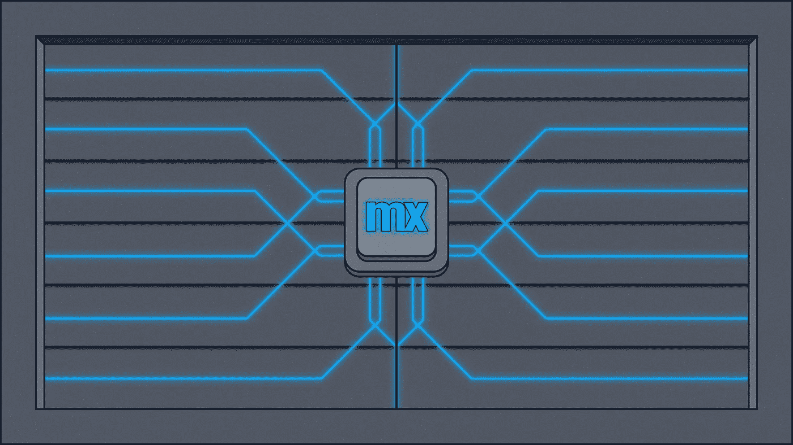
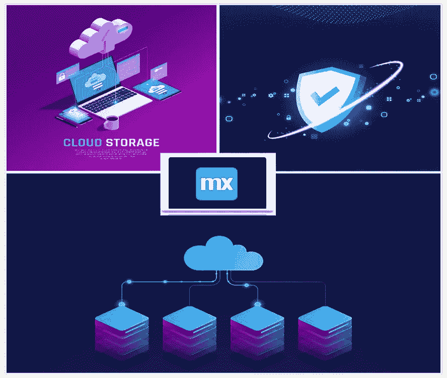
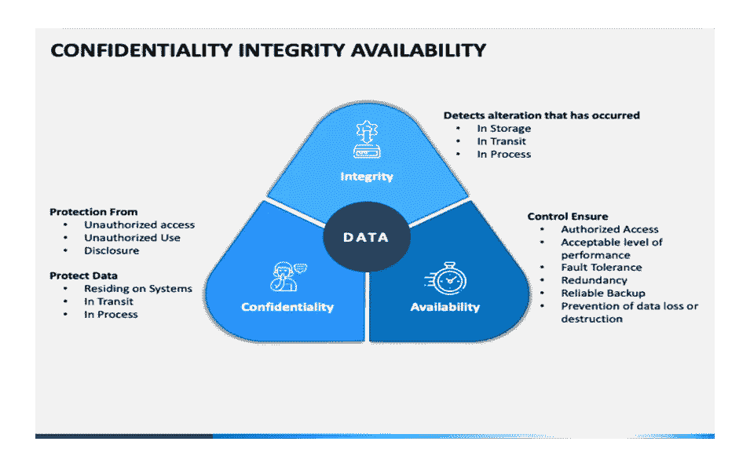
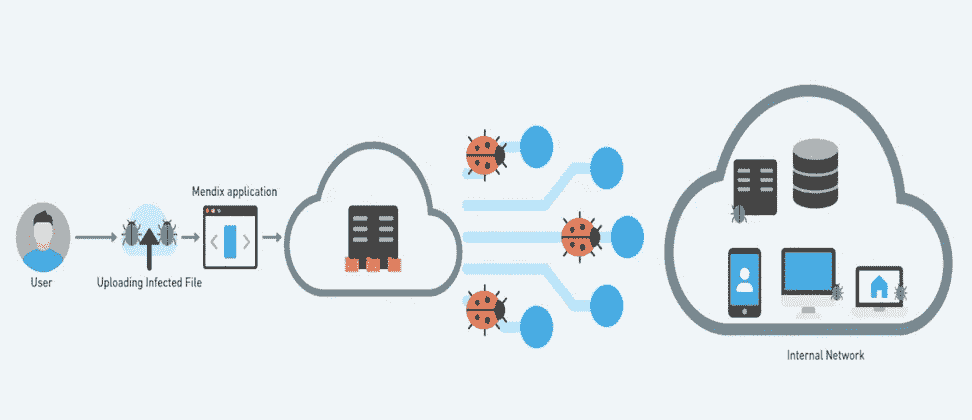
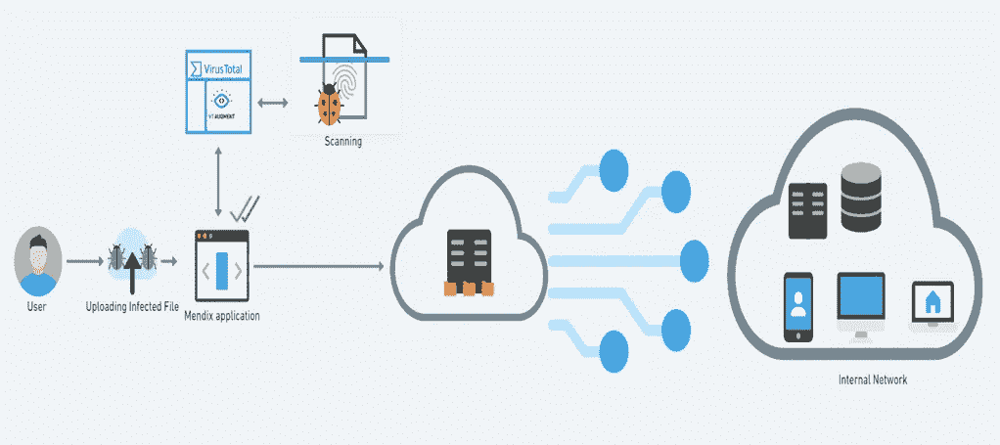

# 如何保护免受恶意软件，使用病毒总和 Mendix

> 原文：<https://medium.com/mendix/how-to-protect-from-malware-using-virus-total-and-mendix-5591065c9ac5?source=collection_archive---------3----------------------->



How to Secure Our Premises using Mendix(Banner Image)

# 在过去的几年里，你可能在网上看到过警告信息。最常见的是“这个网站被黑了”或者“你的账户被黑了”。其他的一些是“系统处于危险中”，“你下载的文件是有害的”等等。每当我们遇到这样的消息，我们都会惊慌失措，并试图立即恢复我们的数据。在其他时候，我们倾向于忽略这些信息。

# 不幸的是，在此期间，入侵者可以完全访问我们所有的机密数据。入侵者利用这些窃取的数据以许多不道德的方式赚钱。



## ***什么是黑客？***

*黑客是一门可疑的艺术，黑客足够聪明来利用我们的弱点。黑客行为是通过未经授权访问任何帐户或计算机系统来危害数字设备和网络的行为。最常见的情况是，这个漏洞是由缺乏有效的代码造成的。一旦利用完成，CNC(命令和控制)是通过全球网络与最终用户通信的机制之一。*

要考虑的最重要的事情是，黑客本身可能是有经验的程序员。因此，克服这一挑战的唯一选择是拥有深厚的编码知识，以避免所有情况下的漏洞，并且代码必须非常强大和高效。

## 如何防止这些恶意软件绑定攻击？

*让我们看看如何使用 Mendix 保护我们的场所。*

最近，我开始为我们的客户开发 Mendix 应用程序。在大多数情况下，客户端要求最终用户上传文档。前段时间看了一篇关于恶意软件绑定的文档。***我本能地产生了一个疑问 Mendix 是否防止了终端用户无意中实施的这些攻击？***

我开始思考各种可能性，并想出了一个防止这类袭击的机制:中央情报局-三合会。

## **CIA- triad(机密性、完整性和可用性)**



***例如:***

**隐写术**(在图像内部绑定恶意代码)。

数据或信息最重要的元素是完整性。完整性意味着您系统中的 ***数据或信息得到维护，不会被未授权方修改*** *。* ***诚信是信息可信和准确的保证。***

这里，我们将重点关注最终用户上传的数据的完整性。

## 这次攻击什么时候会发生？



用户共享他们的个人资料图片或文档，这是进一步处理所需的。最终用户上传文件，但他们可能不知道文件已经被感染。我们的 windows 机器(Defender)大部分时间都会删除被感染的文件。否则，正在上传的数据将影响整个网络，并可能导致违规。


为了防止这种攻击，我们将使用第三方 API(病毒总数)来识别恶意软件和潜在的病毒。等等。

 [## VirusTotal API v3 概述

### 正在寻找您的 VirusTotal API 密钥吗？登录 VirusTotal 时跳转到以下链接…

developers.virustotal.com](https://developers.virustotal.com/reference/overview) 

集成 API 后，上传文件，检查文件是否被感染。如果文件被恶意软件感染，我们的 Mendix 应用程序将从服务中获得响应，它将删除文件并向用户显示警告消息。

如果没有这种机制，我们的 Mendix 应用程序将允许被感染的文件，这可能会导致漏洞，从而将整个网络暴露给入侵者。

**看看我做的这个视频做参考:**

如有任何疑问，请在评论中或通过电子邮件联系我

(*)*

***注:***

***病毒总 API 对所有注册用户免费开放。基于我们的应用程序会发出的请求数量，我们选择了高级订阅。下面是公共计划和保费计划的比较:***

```
***Public API vs Premium API**· *The Public API is limited to 500 requests per day and a rate of 4 requests per minute.*· *The Public API must not be used in commercial products or services.*· *The Public API must not be used in business workflows that do not contribute new files.***Premium API**· *The Premium API does not have request rate or daily allowance limitations, limits are governed by your licensed service step.*· *The Premium API returns more threat context and exposes advanced threat hunting and malware discovery endpoints and functionality.*· *The Premium API is governed by an SLA that guarantees the readiness of data.**
```

 *[## 公共与高级 API

### 尽管 VirusTotal API 提供的许多端点和功能对所有注册用户都是免费的…

developers.virustotal.com](https://developers.virustotal.com/reference/public-vs-premium-api)* 

## *阅读更多*

*[](https://developers.virustotal.com/reference/getting-started) [## 入门指南

### 为了使用 API，您必须注册 VirusTotal 社区。一旦您拥有有效的 VirusTotal 社区帐户…

developers.virustotal.com](https://developers.virustotal.com/reference/getting-started)  [## 安全性

### 1 简介 Mendix 中的安全性有两个方面:您希望不同的人看到您的应用程序的不同部分…

docs.mendix.com](https://docs.mendix.com/refguide/security/)  [## 应用安全性

### 1 应用安全简介在应用安全中，你可以打开或关闭整个应用的安全。您还可以配置安全性…

docs.mendix.com](https://docs.mendix.com/refguide/app-security/)* 

**来自发布者-**

**如果你喜欢这篇文章，你可以在我们的* [*中页*](https://medium.com/mendix) *找到更多喜欢的。对于精彩的视频和直播会话，您可以前往*[*MxLive*](https://www.mendix.com/live/)*或我们的社区*[*Youtube PAG*](https://www.youtube.com/c/MendixCommunity/community)*e .**

**对于希望入门的创客，您可以注册一个* [*免费账户*](https://signup.mendix.com/link/signup/?source=direct) *，并通过我们的* [*学院*](https://academy.mendix.com/link/home) *获得即时学习。**

**有兴趣加入我们的社区吗？加入我们的* [*松弛社区频道*](https://join.slack.com/t/mendixcommunity/shared_invite/zt-hwhwkcxu-~59ywyjqHlUHXmrw5heqpQ) *。**