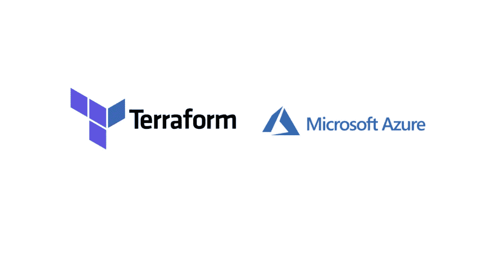

# 如何使用 Terraform 在 Azure 上提供基础设施

> 原文：<https://medium.com/bb-tutorials-and-thoughts/how-to-provision-infrastructure-on-azure-with-terraform-4065430a3d72?source=collection_archive---------0----------------------->

## 带有示例项目的初学者指南

Terraform 是一种基础设施，作为一种代码工具，可以轻松地在任何云或内部部署基础设施。Terraform 是一个安全有效地构建、更改和版本控制基础设施的工具。Terraform 可以管理现有的和受欢迎的服务提供商，以及定制…