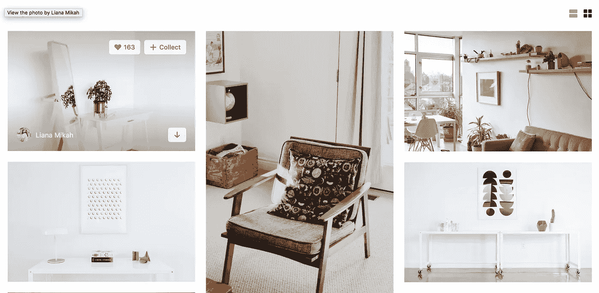

# 如何在不使用 API 的情况下，用 javascript 从 unsplash 集合中快速生成一个随机的图像库

> 原文：<https://medium.com/quick-code/how-to-quickly-generate-a-random-gallery-of-images-from-an-unsplash-collection-in-javascript-4ddb2a6a4faf?source=collection_archive---------2----------------------->

有很多免费的图片占位服务，但总的来说，它们包括插入无用的猫 gif，或者尼古拉斯凯奇。如果你需要一些对客户端更友好的东西——我最近发现 [unsplash](http://unsplash.com) 能够从特定的集合中生成随机的图像。更好的是，它会以您指定的尺寸返回这些图像。以下是如何用 javascript 创建一个随机图库:

首先，找到一个你喜欢的 unsplash 系列，并确保它有足够多的图像适合你。我想要家具，发现了这个系列:

```
[https://unsplash.com/collections/1163637/furniture](https://unsplash.com/collections/1163637/furniture)
```

这里可以看到收藏 ID 是`1163637`。为了生成一个 480x480 格式的正方形随机图像，您需要如下切换 url:

```
https://source.unsplash.com/collection/1163637/480x480
```

请注意，我们是在 unsplash 之前添加源，将`collections`更改为`collection`，删除图库名称(`furniture`，并添加我们想要的尺寸(`480x480`)。换句话说，您的模板是:

```
https://source.unsplash.com/collection/[collection_id]/[width]x[height]
```

现在，要让 javascript 呈现您的图像:

您需要确定要渲染多少幅图像，并且您需要一个用于图库项目的模板。我将把样式留给您，并演示最简单的实现:

```
const numItemsToGenerate = 20; //how many gallery items you want on the screen
const imageWidth = 480; //your desired image width in pixels
const imageHeight = 480; //desired image height in pixels
const collectionID = 1163637; //the collection ID from the original urlfunction renderGalleryItem(){
  fetch(`[https://source.unsplash.com/collection/${](https://source.unsplash.com/collection/1163637/480x480/?sig=${randomNumber}`)collectionID}[/${](https://source.unsplash.com/collection/1163637/480x480/?sig=${randomNumber}`)imageWidth[}x${](https://source.unsplash.com/collection/1163637/480x480/?sig=${randomNumber}`)imageHeight[}/`](https://source.unsplash.com/collection/1163637/480x480/?sig=${randomNumber}`)).then((response)=> {    
    let galleryItem = document.createElement('div');
    galleryItem.classList.add('gallery-item');
    galleryItem.innerHTML = `
      
    `
    document.body.appendChild(galleryItem);
  }) 
}for(let i=0;i<numItemsToGenerate;i++){
  renderGalleryItem();
}
```

上面的代码指定了您想要生成多少个随机项，您想要它们以什么宽度和高度生成，以及您想要从哪个集合中提取。从编程社区推荐的[最佳 Vue.js 教程](https://blog.coursesity.com/best-vuejs-tutorials/)在线学习 Vue.js。

给定这些变量，它遍历您想要生成的项目数，并调用一个函数来创建一个包含随机 unsplash 图像的`div`，并将每个`div`追加到您的 html 的`body`中。但是有一个问题——所有的图像都是相同的随机图像。

要解决这个问题，您需要告诉 unsplash 选择图像的索引，为此，您需要注意集合中有多少图像。在写作的时候，我的收藏有 242 张照片。所以我需要为此设置一个变量:

```
const numImagesAvailable = 242;
```

但是为了保持随机性，您需要一种方法来随机分配 242 个图像中的一个:

```
let randomImageIndex = Math.floor(Math.random() * numImagesAvailable);
```

然后，我们需要将该图像索引传递给我们的`renderGalleryItem`函数，因此我们将如下修改该函数:

```
function renderGalleryItem(randomNumber){
  fetch(`[https://source.unsplash.com/collection/${](https://source.unsplash.com/collection/1163637/480x480/?sig=${randomNumber}`)collectionID}[/${](https://source.unsplash.com/collection/1163637/480x480/?sig=${randomNumber}`)imageWidth[}x${](https://source.unsplash.com/collection/1163637/480x480/?sig=${randomNumber}`)imageHeight[}/](https://source.unsplash.com/collection/1163637/480x480/?sig=${randomNumber}`)[?sig=${randomNumber}`](https://source.unsplash.com/collection/1163637/480x480/?sig=${randomNumber}`)) .then((response)=> {    
    let galleryItem = document.createElement('div');
    galleryItem.classList.add('gallery-item');
    galleryItem.innerHTML = `
      
    `
    document.body.appendChild(galleryItem);
  })
}
```

在这里，我们将参数`randomNumber`添加到了`renderGalleryItem`函数中。在我们的`fetch`调用中，我们将`randomNumber`传递给 unsplash 给我们的一个 url 参数，名为`sig`。所以在这种情况下`?sig=${randomNumber}`。

所以现在整个代码如下:

```
const numItemsToGenerate = 20; //how many gallery items you want on the screen
const numImagesAvailable = 242; //how many total images are in the collection you are pulling from
const imageWidth = 480; //your desired image width in pixels
const imageHeight = 480; //desired image height in pixels
const collectionID = 1163637; //the collection ID from the original urlfunction renderGalleryItem(randomNumber){
   fetch(`[https://source.unsplash.com/collection/${collectionID}/${imageWidth}x${imageHeight}/?sig=${randomNumber}`](https://source.unsplash.com/collection/${collectionID}/${imageWidth}x${imageHeight}/?sig=${randomNumber}`)) 
  .then((response)=> {    
    let galleryItem = document.createElement('div');
    galleryItem.classList.add('gallery-item');
    galleryItem.innerHTML = `
      
    `
    document.body.appendChild(galleryItem);
  })
}for(let i=0;i<numItemsToGenerate;i++){
  let randomImageIndex = Math.floor(Math.random() * numImagesAvailable);
  renderGalleryItem(randomImageIndex);
}
```

这样做，你的页面上就会出现一堆随机的图片。现在剩下的就是按照你想要的方式摆放它们。



如果你需要的话，这里有支笔: