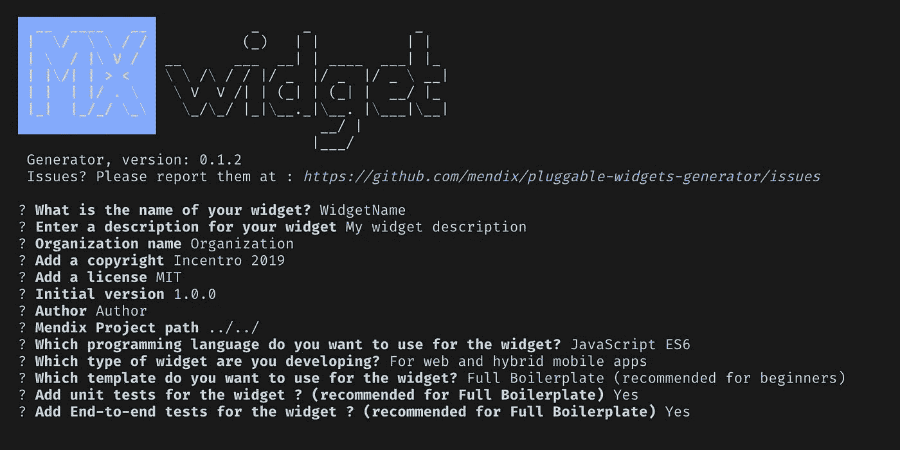

# 如何应对构建 Mendix 小部件的新方式

> 原文：<https://medium.com/mendix/how-to-react-to-the-new-way-mendix-widgets-are-be-build-675e43599925?source=collection_archive---------2----------------------->


低代码平台 Mendix 带来了很多东西，但最终，一旦你开始开发更复杂的应用程序，你可能会处于一种开箱即用的情况。这就是定制小部件的用武之地。

# 可插拔部件

定制小部件以前是在 Dojo 框架中开发的。不用深入细节，我很高兴地说现在已经改变了。 [Mendix Studio Pro 8.0.0](https://docs.mendix.com/releasenotes/studio-pro/8.0#800) 版本引入了一种构建定制小工具的新方法。

现在所谓的可插拔部件是用 [React](https://reactjs.org/) 库构建的。Mendix 已经声明，这些小部件使用更简单、更强大的 Mendix APIs。这也带来了使用外部依赖项并使用 [npm](https://www.npmjs.com/) 安装它们的强大功能。

# 反应

在我看来，另一个巨大的好处是 React 的学习曲线比 Dojo 框架更短。React 有一个小的 API 需要学习，至于其他的，它只是 JavaScript。编写自定义小部件与任何 React 组件非常相似。由于 Mendix 本身现在正在使用 React 库，所以对于任何低代码前端开发人员来说，学习 React 都是一项不错的投资。

在学习 React 的过程中，我确实对这个消息感到兴奋，并相信这为制作更快的小部件提供了更多的可能性。过去，我在 Mendix 外部开发 JavaScript 函数，而不是在 Dojo 小部件内部。对我来说，这将花费太多额外的开发时间和 Dojo 学习曲线。React 是一个帮助更快创建组件的库，就像 Mendix 一样。在我看来，这两种技术是相辅相成的。

# 开始构建可插拔的小部件

Mendix 提供了一个[如何自己创建一个简单的小部件的](https://docs.mendix.com/howto/extensibility/create-a-pluggable-widget-one)。在编写本报告时，似乎没有进一步的文件。由于 how-to 有助于一步一步地开发一个简单的小部件，我打算列出一个非常紧凑的步骤列表。

# 首次设置

在实现这些之前，您需要一些工具和知识来开始。建议有一些 Mendix、JavaScript (React、Typescript)和 HTML/CSS 的经验。此外，你还需要一些工具:集成开发环境(IDE)，Visual Studio 代码。最后，您必须安装以下软件:

1.  [node . js](https://nodejs.org/en/)(手动)
2.  [npm](https://www.npmjs.com/)
3.  [约曼](https://yeoman.io/)
4.  [Mendix 可插拔小工具生成器](https://github.com/mendix/generator-mendix)

第 2 点到第 4 点可以通过 Visual Studio 代码的内置命令行直接下载。

```
npm install npm@latest -g
npm install yo -g
npm install @mendix/generator-widget -g
```

# 创建新的

现在你已经做了所有这些，是时候创造一些新的东西了。您需要下载的最后一个程序是 Pluggable Widget Generator，它有助于从现有 Mendix 项目的根文件夹进行构建。用 Visual Studio 代码打开项目文件夹。从根目录，使用内置命令行:

```
mkdir CustomWidgets
cd CustomWidgets
yo @mendix/widget TextBox
```

该代码创建一个包含一个或多个小部件的文件夹。小部件(文本框)的名称可以是任何名称。该脚本会问一些 Mendix 会推荐 TypeScript 的问题，而我今天的首选是 JavaScript ES6。



# 发展

打开 VSCode 中的 widget 文件夹，使用以下命令启动开发过程:

```
npm run dev
```

现在，您已经准备好使用 React 开发可插拔小部件了。

# 工作进展

可插拔部件是全新的。文档会不断更新，最新的 studio 版本会提供新的功能。随着 Mendix 8.7 的最新[发布，现在可以加载您自己的数据列表。创建你自己的自定义旋转木马，列表视图，数据网格，…这是令人兴奋的！](https://docs.mendix.com/releasenotes/studio-pro/8.7)

# 外卖食品

这是开始学习如何开发可插拔小部件的好时机。关于 Mendix 部分的文档随着每个 studio 版本而变化，并且有大量关于使用 React 进行开发的文档。这将比 Dojo 小部件更容易学习。Mendix 约曼发电机提供了一个很好的起点。