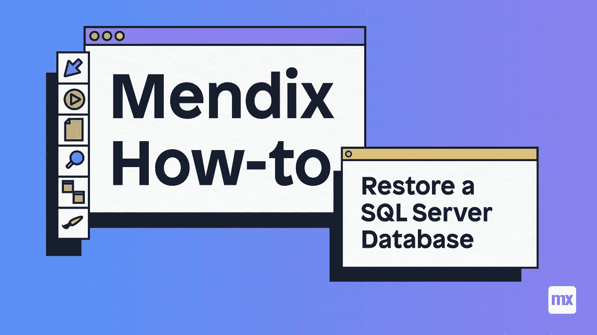
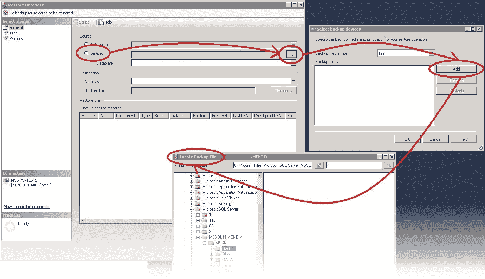

# 如何使用 SQL Server 还原数据库

> 原文：<https://medium.com/mendix/how-to-restore-a-database-using-sql-server-6f18f472f3a0?source=collection_archive---------0----------------------->

## 我是 Postgres 的忠实粉丝，我很少使用任何其他数据库类型来开发 Mendix。但是，有许多公司更喜欢 SQL Server。由于 SQL Server 不是我最喜欢的数据库管理系统，有几次我希望有一个如何使用它们的指南。这就是我现在写这篇文章的原因，这样如果你需要恢复备份，你就知道该怎么做了。

# 开始之前

开始前最好做好准备，所以在开始前请仔细检查以下事项:

*   您需要对数据库拥有足够的权限(创建数据库和恢复)——您可以在这里阅读关于这些权限的更多信息
*   Mendix 数据库使用由 Mendix 在这里描述的[计划来维护](https://docs.mendix.com/developerportal/deploy/mendix-sql-maintenance-plans)
*   您拥有该数据库的有效数据库备份文件
*   对于要还原的数据库，存在有效的日志文件

# 现在我们走吧！

首先，您需要**将**连接到**微软 SQL Server 数据库引擎**的适当实例。您可以点击服务器名称，在**对象浏览器**中展开服务器树。

打开可用数据库，您可以**选择**一个用户数据库，或者展开系统数据库并选择一个系统数据库。

**右击数据库上的**，选择**任务**、**恢复**，然后选择数据库，这将打开恢复数据库窗口。

在“General”页面的“Source”部分，您必须**指定要恢复的备份**集的源和**位置，方法是选择“Device ”,然后添加“add ”,然后找到备份文件:**

在“常规”页的“目标”部分中，“数据库”字段会自动填充要还原的数据库的名称。可以更改数据库的名称，所以如果需要，可以在此字段中输入新名称。

之后，在“General”页面的“Restore plan”部分，将默认值保留为上次备份的**或仅当您需要时，单击“Timeline”以访问“Backup Timeline”对话框。在这里，您可以手动选择一个时间点来停止恢复操作。**

**接下来，我们得到**备份集来恢复**网格。此网格显示指定位置的可用备份。选择要恢复的备份。**

**默认情况下，会建议一个恢复计划。为了覆盖建议的恢复计划，请更改网格中的选择。如果您取消选择早期备份，任何依赖于早期备份恢复的备份都将被忽略。**

**如果需要，您可以单击选择页面窗格中的**文件**来访问文件对话框。从此处，您可以通过在“将数据库文件还原为”网格中为每个文件指定新的还原目标，将数据库还原到新的位置。**

**点击**确定**执行恢复工作。**

****

**[https://bit.ly/MXW21](https://bit.ly/MXW21)**

# **最后的想法**

**虽然大多数人只需要学习一个数据库管理系统就可以了，但是你永远不知道什么时候你会被要求做一些你不熟悉的事情。尝试新的和不同的技术并找到最适合你的总是一个好主意。**

****

## **阅读更多**

** [## Mendix World 2021 |召集您的应用开发团队 2021 年 9 月 7 日至 9 日

### 好像你需要说服…在一个全球制造商社区，他们想通过探索什么来相互学习…

bit.ly](https://bit.ly/MXW21)** 

***来自出版商-***

***如果你喜欢这篇文章，你可以在我们的* [*媒体页面*](https://medium.com/mendix) *或我们自己的* [*社区博客网站*](https://developers.mendix.com/community-blog/) *找到更多类似的内容。***

***希望入门的创客，可以注册一个* [*免费账号*](https://signup.mendix.com/link/signup/?source=direct) *，通过我们的* [*学苑*](https://academy.mendix.com/link/home) *即时获取学习。***

**有兴趣更多地参与我们的社区吗？你可以加入我们的 [*Slack 社区频道*](https://join.slack.com/t/mendixcommunity/shared_invite/zt-hwhwkcxu-~59ywyjqHlUHXmrw5heqpQ) *或者那些想要更多参与的人，看看加入我们的*[*meetups*](https://developers.mendix.com/meetups/#meetupsNearYou)*。***