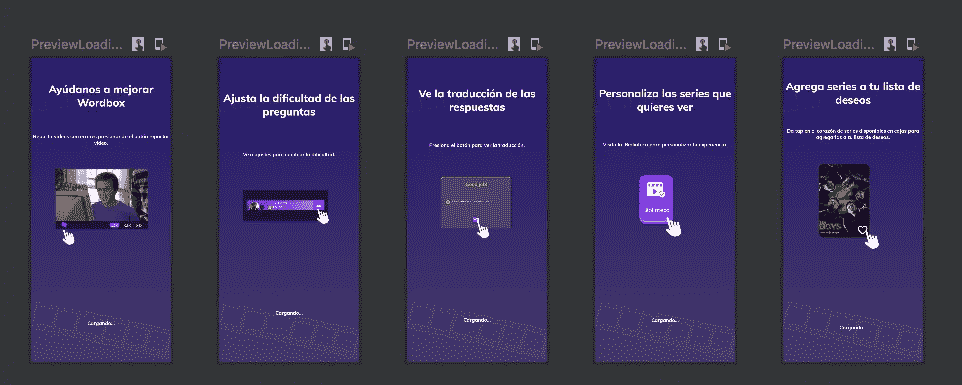

# 如何在 Jetpack Compose 中重用预览数据

> 原文：<https://medium.com/google-developer-experts/how-to-reuse-data-for-previews-in-jetpack-compose-3868ea2c53a?source=collection_archive---------1----------------------->

Jetpack Compose 是一个较新的 UI 工具包，用于在 android native 上构建奇妙的屏幕。这个工具包简化并加速了 UI 开发，因为它 100%使用 Kotlin，重用 UI 组件，并且有许多强大的工具。最了不起的工具之一是，你可以在开发组件时预览它们。

当您使用预览时，它需要在设计视图中显示数据。有时可组合预览有很多数据，你必须写一个巨大的代码，用一个对象列表来填充所需的数据，这是一个很大的工作量，这就是为什么许多开发人员没有可组合预览。

有一种简单的方法来集中可组合预览中使用的数据，并在任何地方重用它。你只需要使用 jetpack compose tools 提供的 **PreviewParameterProvider** 接口即可。

**我们来做一个例子。**我们有以下屏幕，但根据某些应用需求，数据可能会有所不同，因此我们分别开发了多个预览。我们有一个可组合的和许多这样的预览:

Composable

您有许多预览，因为您希望看到这个可组合的多个数据，如果有人也需要这个数据，他们会复制它，而不重用它。 **PreviewParameterProvider 救援接口…**

让我们来看看这方面的最佳实践。首先，您需要创建一个数据提供者，如下所示:

Building custom preview parameter provider

上述数据可以在任何可组合的预览中重用，然后您可以在预览中使用提供者作为参数，如下所示:

Preview method using the provider as parameter

因此，由于提供程序中定义的值，您可以在设计视图中看到多个预览，如下所示:

Previews

我希望这些信息对你有用，记得分享这篇博文，欢迎你的评论。

访问我的社交网络:

*   [https://twitter.com/jggomezt](https://twitter.com/jggomezt)
*   [https://www.youtube.com/devhack](https://www.youtube.com/devhack)
*   [https://devhack.co/](https://devhack.co/)

# 资源

*   [https://foso . github . io/Jetpack-Compose-Playground/general/preview/preview parameter/](https://foso.github.io/Jetpack-Compose-Playground/general/preview/previewparameter/)
*   [https://developer . Android . com/reference/kot Lin/Android x/compose/ui/tooling/preview/PreviewParameterProvider](https://developer.android.com/reference/kotlin/androidx/compose/ui/tooling/preview/PreviewParameterProvider)