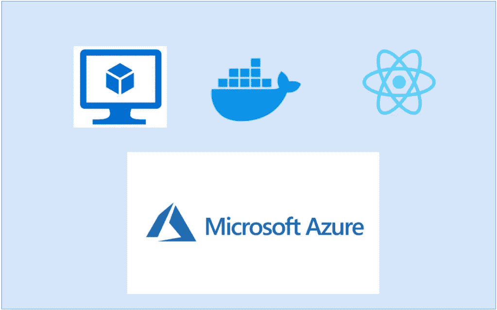

# 如何在 Azure VM 上将 React 应用作为容器运行

> 原文：<https://medium.com/bb-tutorials-and-thoughts/how-to-run-a-react-app-as-a-container-on-azure-vm-b73094fdc28a?source=collection_archive---------0----------------------->

## 包含示例项目的逐步指南

现在有很多方法可以运行你的应用程序。将应用程序容器化并在 Docker 运行时运行是非常常见的。你在微软 Azure 里有几个选项，比如 App Service，AKS 等等。但是，当您使用这些工具时，您对底层架构的控制是有限的…