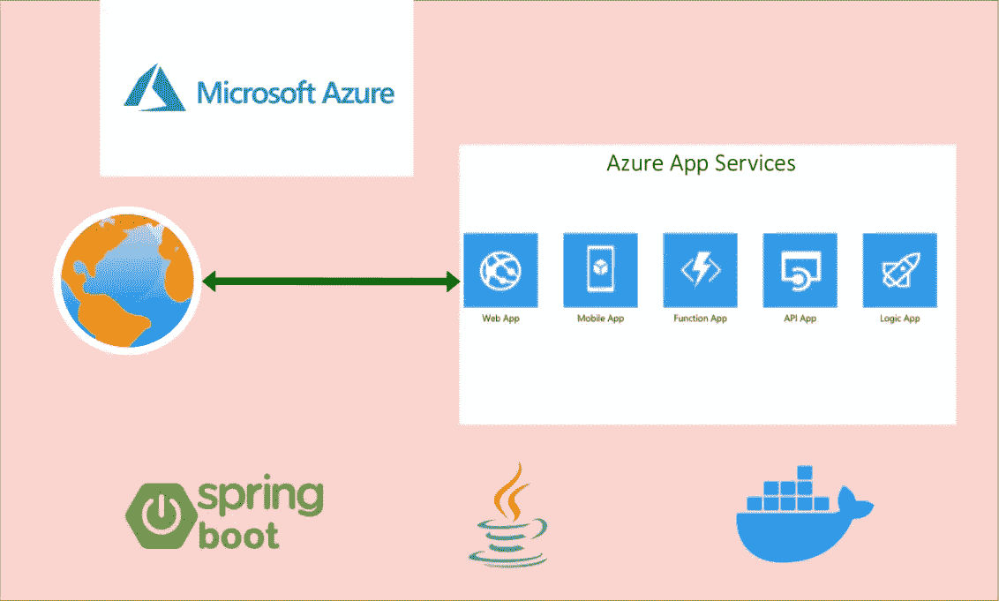

# 如何在 Azure 应用服务上运行和部署 Java REST API

> 原文：<https://medium.com/bb-tutorials-and-thoughts/how-to-run-and-deploy-java-rest-api-on-azure-app-services-4c824781ce9f?source=collection_archive---------0----------------------->

## 在应用服务 Docker 运行时上部署的分步指南

如果您希望通过选择运行时在托管平台上部署应用程序，应用程序服务是正确的选择。可以在 Azure app Services 下创建功能 app、web app、逻辑 App 等。说到 Java REST API，您可以构建并…