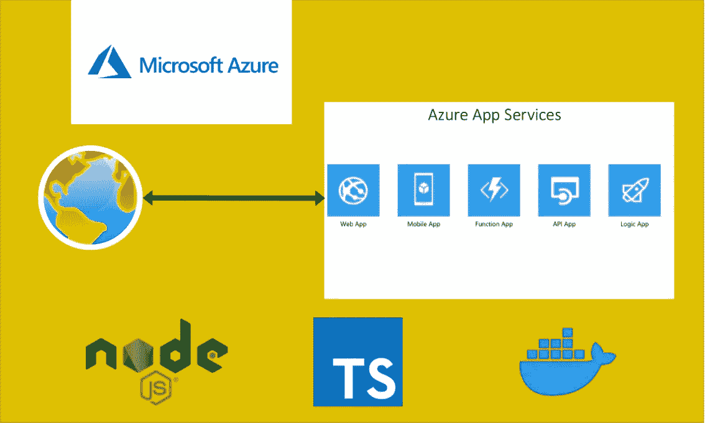

# 如何在 Azure App Services 上运行和部署 NodeJS REST API

> 原文：<https://medium.com/bb-tutorials-and-thoughts/how-to-run-and-deploy-nodejs-rest-api-on-azure-app-services-8a183f5b5b43?source=collection_archive---------0----------------------->

## 包含示例项目的逐步指南

如果您希望通过选择运行时在托管平台上部署应用程序，应用程序服务是正确的选择。可以在 Azure app Services 下创建功能 app、web app、逻辑 App 等。谈到 NodeJS REST API，您可以用多种方式构建和部署，并且…