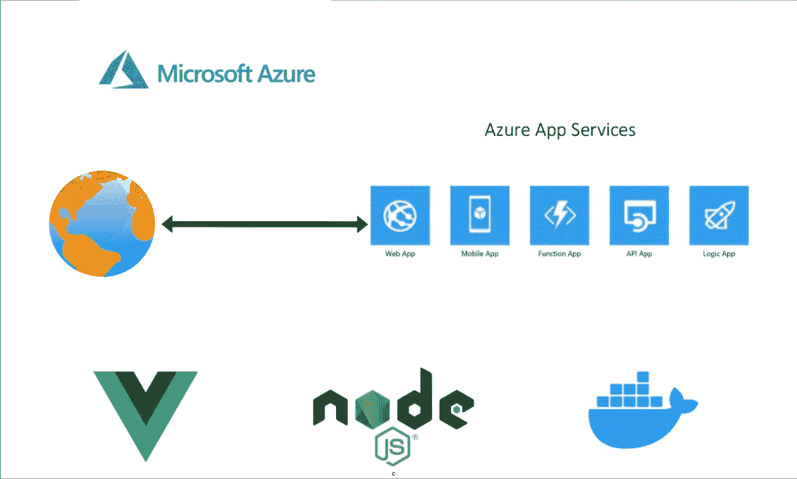

# 如何在 Azure 应用服务上运行和部署带有 NodeJS 后端的 Vue

> 原文：<https://medium.com/bb-tutorials-and-thoughts/how-to-run-and-deploy-vue-with-nodejs-backend-on-azure-app-services-af4885420890?source=collection_archive---------0----------------------->

## 带有 Docker 运行时的示例项目

如果您希望通过选择运行时在托管平台上部署应用程序，应用程序服务是正确的选择。可以在 Azure app Services 下创建功能 app、web app、逻辑 App 等。当涉及到带有 NodeJS 后端的 Vue 时，您可以在许多…