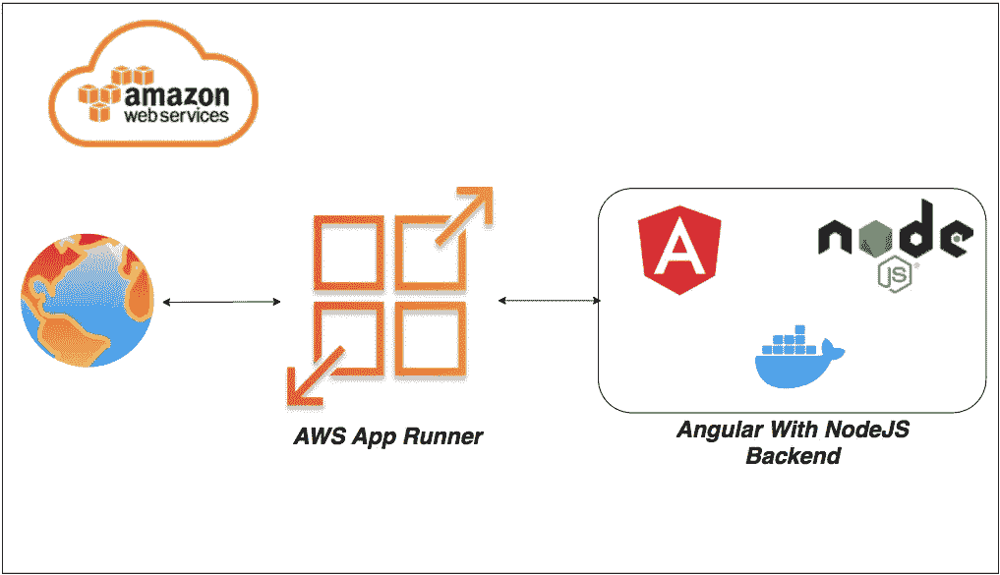

# 如何在 AWS App Runner 上使用 NodeJS 后端运行 Angular

> 原文：<https://medium.com/bb-tutorials-and-thoughts/how-to-run-angular-with-nodejs-backend-on-aws-app-runner-4a4a0264c354?source=collection_archive---------0----------------------->

## 使用 Docker 运行时的示例项目的逐步指南

如果您希望通过选择运行时在托管平台上部署应用程序，AWS App Runner 是正确的选择。你可以用 Docker runtime 运行整个 ***WebApp*** 而不用担心你这边的配置。AWS App Runner 是一款 AWS…