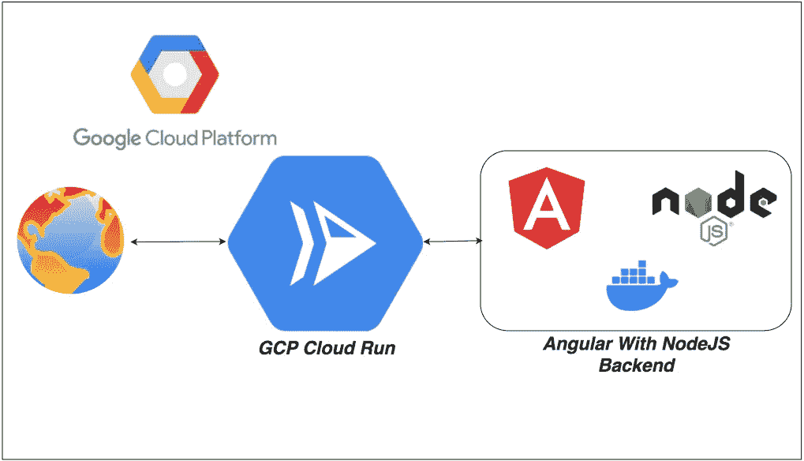

# 如何在 GCP 云上用 NodeJS 后台运行 Angular

> 原文：<https://medium.com/bb-tutorials-and-thoughts/how-to-run-angular-with-nodejs-backend-on-gcp-cloud-run-f741b1418fbf?source=collection_archive---------0----------------------->

## 使用 Docker 运行时的示例项目的逐步指南

如果你想在一个完全托管的无服务器平台上开发和部署高度可扩展的容器化应用，GCP 云运行是正确的选择。你可以用 Docker runtime 运行整个 WebApp，而不用担心你这边的配置。GCP…