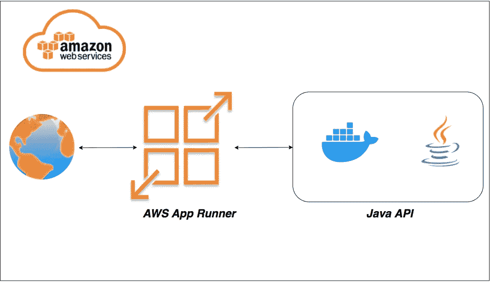

# 如何在 AWS App Runner 上运行 Java APIs

> 原文：<https://medium.com/bb-tutorials-and-thoughts/how-to-run-java-apis-on-aws-app-runner-a1763ba2a76d?source=collection_archive---------0----------------------->

## 使用 Docker 运行时的示例项目的逐步指南

如果您希望通过选择运行时在托管平台上部署应用程序，AWS App Runner 是正确的选择。您可以使用 Docker runtime 运行整个 API，而不用担心您这边的配置。AWS App Runner 是一项 AWS 服务，提供快速、简单的…