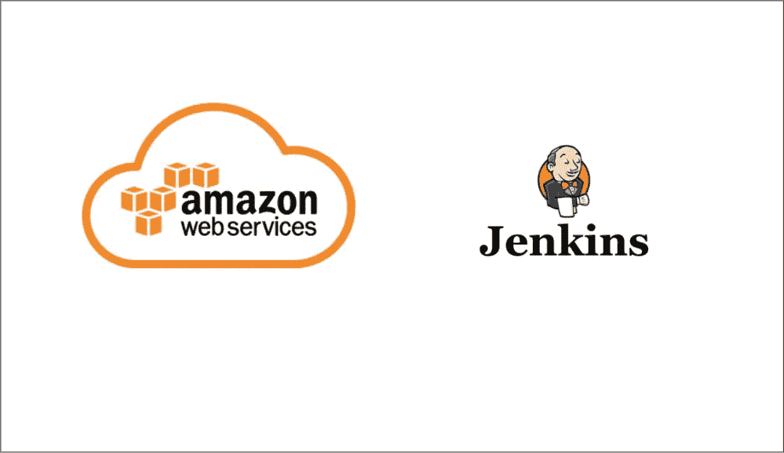

# 如何在 AWS EC2 上运行 Jenkins

> 原文：<https://medium.com/bb-tutorials-and-thoughts/how-to-run-jenkins-on-aws-ec2-dfb38a2e1dec?source=collection_archive---------0----------------------->

## AWS 上的 Jenkins 入门指南

Jenkins 是任何公司的 DevOps 战略中常见的工具之一。如果你真的喜欢 DevOps，作为代码的管道是你需要学习的热门技能之一。从构建您的应用程序到将它们部署到不同的环境中，Jenkins 可以负责端到端的流程。你甚至可以设计一个管道…