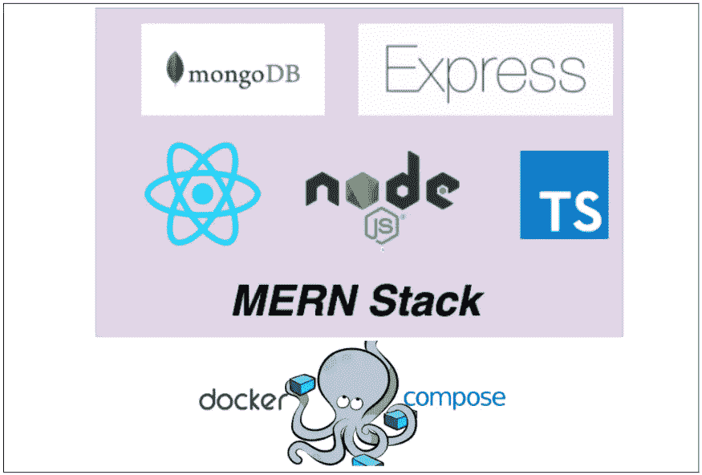

# 如何在 Docker Compose-Typescript 版本上运行 MERN 堆栈

> 原文：<https://medium.com/bb-tutorials-and-thoughts/how-to-run-mern-stack-on-docker-compose-typescript-version-4d9ff44c1280?source=collection_archive---------0----------------------->

## 包含示例项目的逐步指南

当我们没有在本地机器上设置开发环境来运行应用程序的所有部分进行测试，或者我们想要用一个命令运行应用程序的所有部分时，Docker Compose 非常有用。例如，如果您想在…上运行 NodeJS REST API 和 MongoDB 数据库