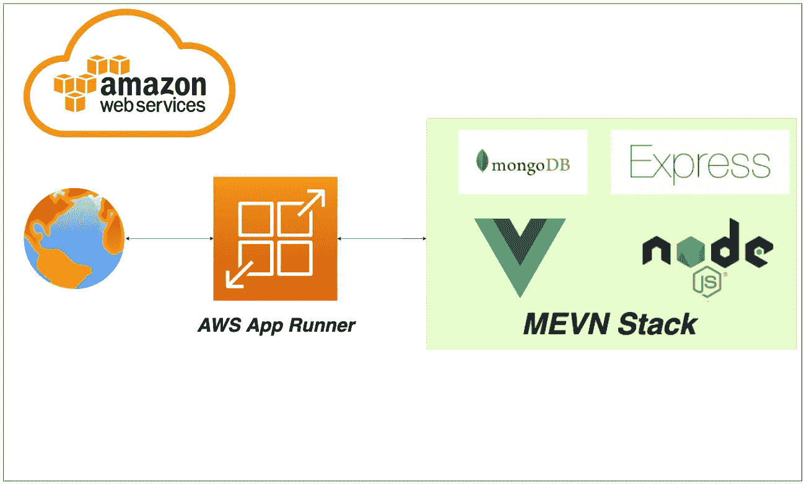

# 如何在 AWS App Runner 上运行 MEVN 栈

> 原文：<https://medium.com/bb-tutorials-and-thoughts/how-to-run-mevn-stack-on-aws-app-runner-ce8f2dc08a72?source=collection_archive---------8----------------------->

## 使用 Docker 运行时的示例项目的分步指南

如果您希望通过选择运行时在托管平台上部署应用程序，AWS App Runner 是正确的选择。您可以使用 Docker runtime 运行整个 API，而不用担心您这边的配置。AWS 应用程序运行程序是一个 AWS 服务，它提供了一个快速的…