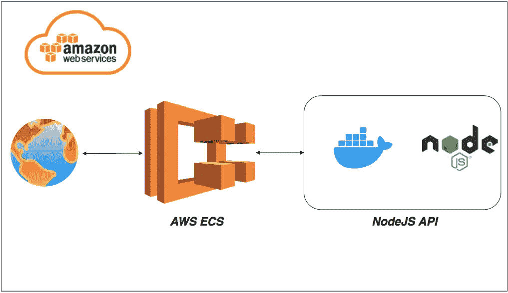

# 如何在 AWS ECS 上运行 NodeJS APIs

> 原文：<https://medium.com/bb-tutorials-and-thoughts/how-to-run-nodejs-apis-on-aws-ecs-f50c003b6921?source=collection_archive---------0----------------------->

## 包含示例项目的分步指南

AWS 提供 100 多种服务，了解您应该根据自己的需求选择哪种服务非常重要。Amazon Elastic Container Service(Amazon ECS)是一个高度可伸缩的、快速的容器管理服务，它使得在 Amazon EC2 实例集群上运行、停止和管理 Docker 容器变得很容易。亚马逊 ECS 让…