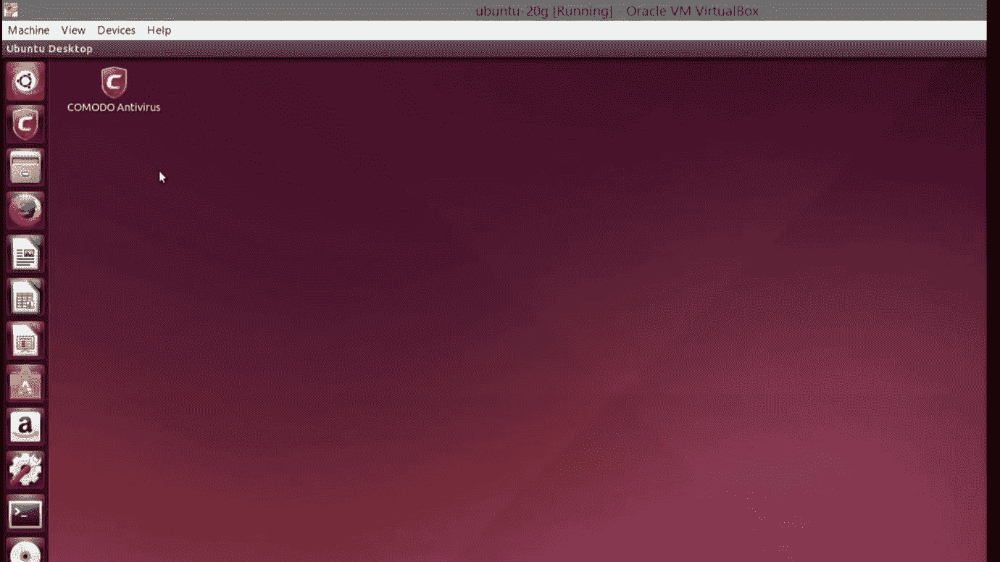
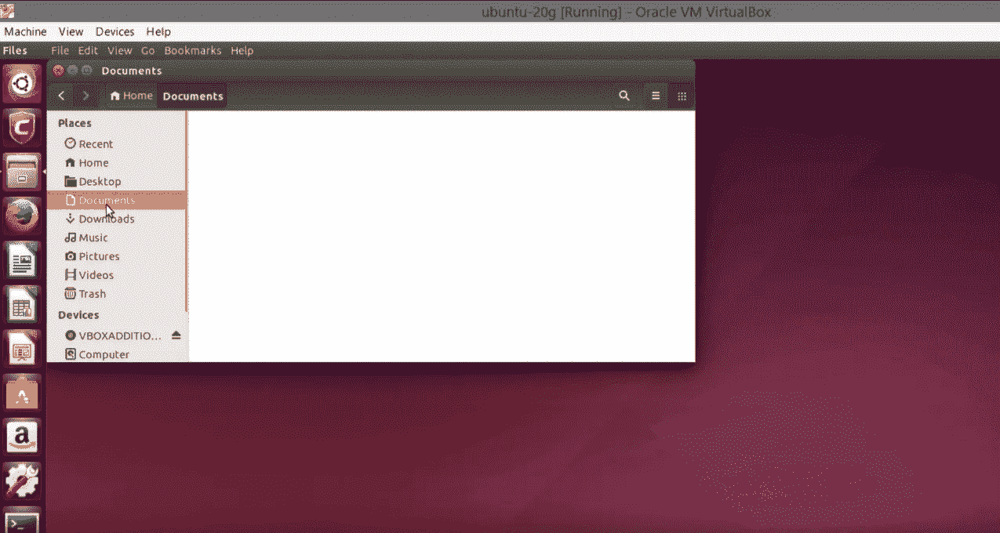
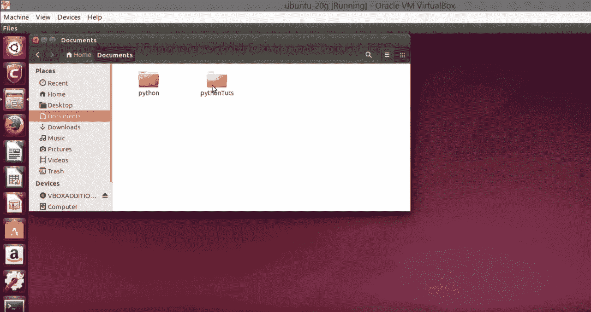
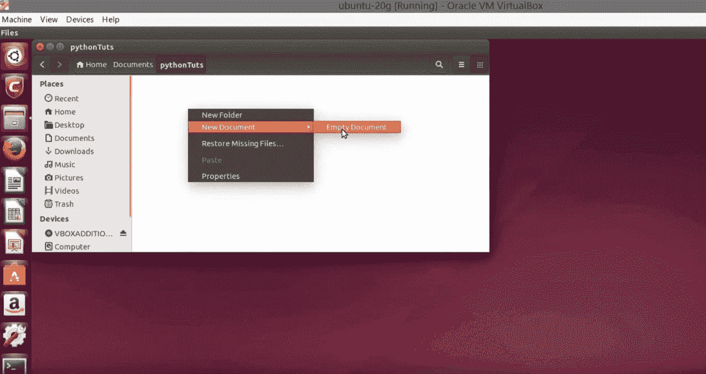
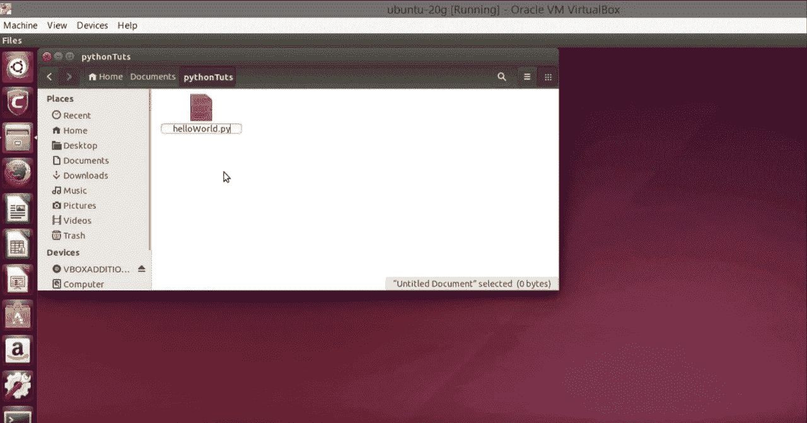
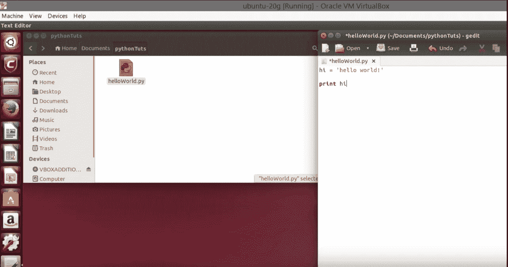
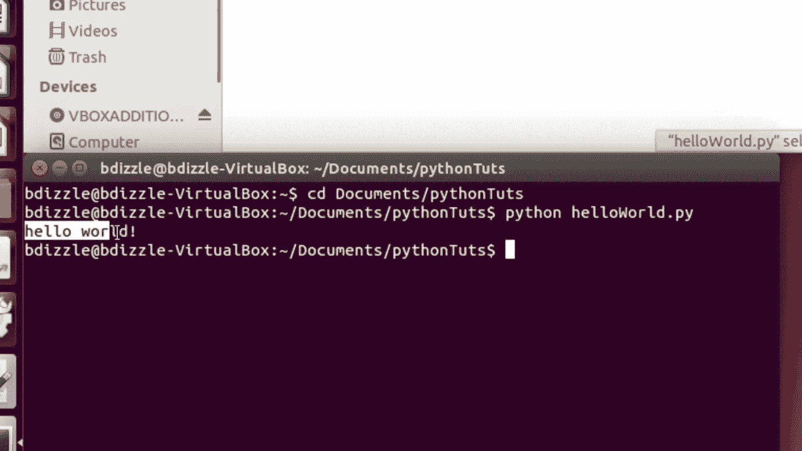
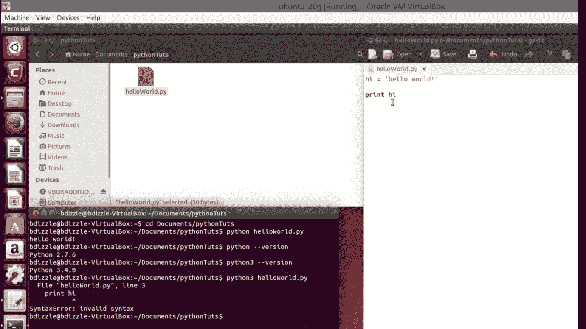
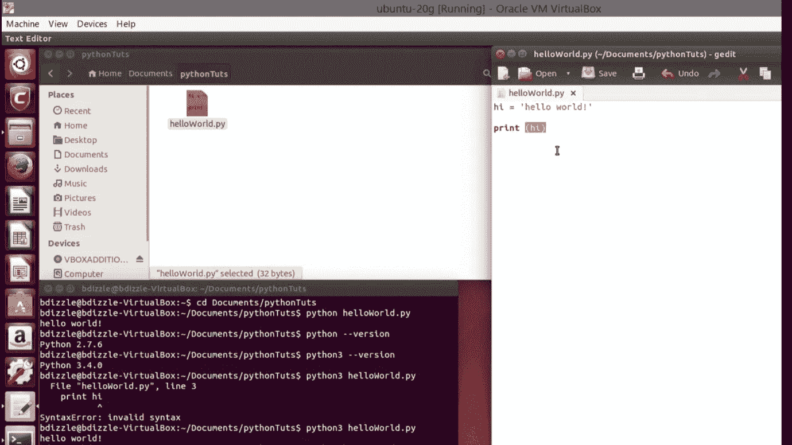

# 如何在 Ubuntu (Linux)中运行 Python？

> 原文：<https://medium.com/edureka/how-to-run-python-in-ubuntu-3fa7a7aaed72?source=collection_archive---------4----------------------->

本文将介绍一个非常简单但有趣且重要的概念，即*如何在 Ubuntu (Linux)中运行 Python？*用详细的实际演示。那么让我们开始吧，

# 如何在 Ubuntu (Linux)中运行 Python

如果你对如何在 Ubuntu 中运行 Python 感到好奇，这里有一篇文章可以帮助你。我们这里用的是 Ubuntu 版本。它支持 Python 2 和 Python 3 版本。

这是第一步。

**第一步:**像这样打开你的桌面。

**第二步:**去拿文件>左手边的文件。

在文档中，你可以选择一个文件夹来保存你的程序，或者直接在那里创建一个程序。

**第四步:**右键点击该区域，选择一个新文档>空文档。

**步骤 5:** 用. py 扩展名命名您的文件，以便系统可以检测到它是一个 python 文件。

**第六步:**打开你的文件，你会发现文件在‘gedit’中打开。

在给定区域写下你想要的程序并保存。

**步骤 7:** 打开左手边下角的端子。

**第 8 步:**一旦完成，我们必须更改目录，以便我们可以方便地获取代码。

**步骤 9:** 为此，Linux 命令是 cd Documents */无论你的文件保存在哪里。*

第十步:一旦完成，输入，你就进入了那个特定的目录。

**步骤 11:** 现在要运行你的 Python 文件，你所要做的就是命令' *python yourfilename.py '。*

**第 12 步:**基本就是告诉终端运行 python 文件。

**第十三步:**万一你想查你用的是哪个版本的 Python，可以写 *python -version。*

**第 14 步:**不使用 Python 2 版本，如果使用 Python 3 版本，通过编写 *'python3 yourfilename.py '即可轻松执行。*

**步骤 15:** 确保在 Python 3 版本中执行您的 Python 代码时，您使用的语法符合 Python 3。示例:Python 2 的 print 语句可能有也可能没有()with print 语句，但在 Python 3 中，print 语句应该有()。

我希望你很好地学习了这些概念，并因此尝试更准确。这是不是把我们带到了这篇关于如何在 Ubuntu (Linux)中运行 Python 的文章的结尾？如果你想查看更多关于人工智能、DevOps、道德黑客等市场最热门技术的文章，你可以参考 [Edureka 的官方网站。](https://www.edureka.co/blog/?utm_source=medium&utm_medium=content-link&utm_campaign=how-to-reverse-a-number)

请留意本系列中的其他文章，它们将解释 Python 和数据科学的各个方面。

> *1。*[*Python 中的机器学习分类器*](/edureka/machine-learning-classifier-c02fbd8400c9)
> 
> *2。*[*Python Scikit-Learn Cheat Sheet*](/edureka/python-scikit-learn-cheat-sheet-9786382be9f5)
> 
> *3。* [*机器学习工具*](/edureka/python-libraries-for-data-science-and-machine-learning-1c502744f277)
> 
> *4。* [*用于数据科学和机器学习的 Python 库*](/edureka/python-libraries-for-data-science-and-machine-learning-1c502744f277)
> 
> *5。*[*Python 中的聊天机器人*](/edureka/how-to-make-a-chatbot-in-python-b68fd390b219)
> 
> *6。* [*Python 集合*](/edureka/collections-in-python-d0bc0ed8d938)
> 
> *7。* [*Python 模块*](/edureka/python-modules-abb0145a5963)
> 
> *8。* [*Python 开发者技能*](/edureka/python-developer-skills-371583a69be1)
> 
> *9。* [*哎呀面试问答*](/edureka/oops-interview-questions-621fc922cdf4)
> 
> *10。* [*一个 Python 开发者的简历*](/edureka/python-developer-resume-ded7799b4389)
> 
> *11。*[*Python 中的探索性数据分析*](/edureka/exploratory-data-analysis-in-python-3ee69362a46e)
> 
> *12。* [*蛇与蟒蛇的游戏*](/edureka/python-turtle-module-361816449390)
> 
> *13。* [*Python 开发者工资*](/edureka/python-developer-salary-ba2eff6a502e)
> 
> *14。* [*主成分分析*](/edureka/principal-component-analysis-69d7a4babc96)
> 
> 15。[*Python vs c++*](/edureka/python-vs-cpp-c3ffbea01eec)
> 
> *16。* [*刺儿头教程*](/edureka/scrapy-tutorial-5584517658fb)
> 
> *17。*[*Python SciPy*](/edureka/scipy-tutorial-38723361ba4b)
> 
> 18。 [*最小二乘回归法*](/edureka/least-square-regression-40b59cca8ea7)
> 
> 19。 [*Jupyter 笔记本小抄*](/edureka/jupyter-notebook-cheat-sheet-88f60d1aca7)
> 
> 20。 [*Python 基础知识*](/edureka/python-basics-f371d7fc0054)
> 
> *21。* [*Python 模式程序*](/edureka/python-pattern-programs-75e1e764a42f)
> 
> *22。* [*网页抓取用 Python*](/edureka/web-scraping-with-python-d9e6506007bf)
> 
> *23。* [*Python 装饰器*](/edureka/python-decorator-tutorial-bf7b21278564)
> 
> *24。*[*Python Spyder IDE*](/edureka/spyder-ide-2a91caac4e46)
> 
> *25。*[*Python 中使用 Kivy 的移动应用*](/edureka/kivy-tutorial-9a0f02fe53f5)
> 
> *26。* [*十大最佳学习书籍&练习 Python*](/edureka/best-books-for-python-11137561beb7)
> 
> *27。* [*机器人框架与 Python*](/edureka/robot-framework-tutorial-f8a75ab23cfd)
> 
> *28。*[*Python 中的贪吃蛇游戏*](/edureka/snake-game-with-pygame-497f1683eeaa)
> 
> *29。* [*Django 面试问答*](/edureka/django-interview-questions-a4df7bfeb7e8)
> 
> *30。* [*十大 Python 应用*](/edureka/python-applications-18b780d64f3b)
> 
> *31。*[*Python 中的哈希表和哈希表*](/edureka/hash-tables-and-hashmaps-in-python-3bd7fc1b00b4)
> 
> *32。*[*Python 3.8*](/edureka/whats-new-python-3-8-7d52cda747b)
> 
> 33。 [*支持向量机*](/edureka/support-vector-machine-in-python-539dca55c26a)
> 
> 34。 [*Python 教程*](/edureka/python-tutorial-be1b3d015745)

*原载于 2019 年 9 月 6 日*[*https://www.edureka.co*](https://www.edureka.co/blog/run-python-in-ubuntu-linux/)*。*