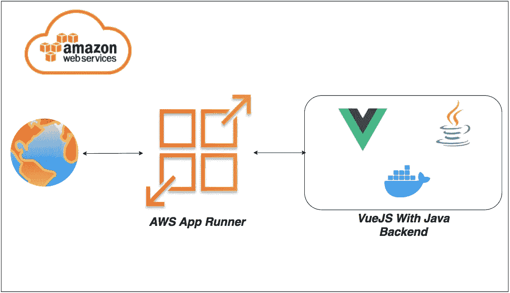

# 如何在 AWS App Runner 上运行带有 Java 后端的 VueJS

> 原文：<https://medium.com/bb-tutorials-and-thoughts/how-to-run-vuejs-with-java-backend-on-aws-app-runner-efba623e8583?source=collection_archive---------0----------------------->

## 使用 Docker 运行时的示例项目的逐步指南

如果您希望通过选择运行时在托管平台上部署应用程序，AWS App Runner 是正确的选择。你可以用 Docker runtime 运行整个 ***WebApp*** 而不用担心你这边的配置。AWS App Runner 是一项 AWS 服务，它…