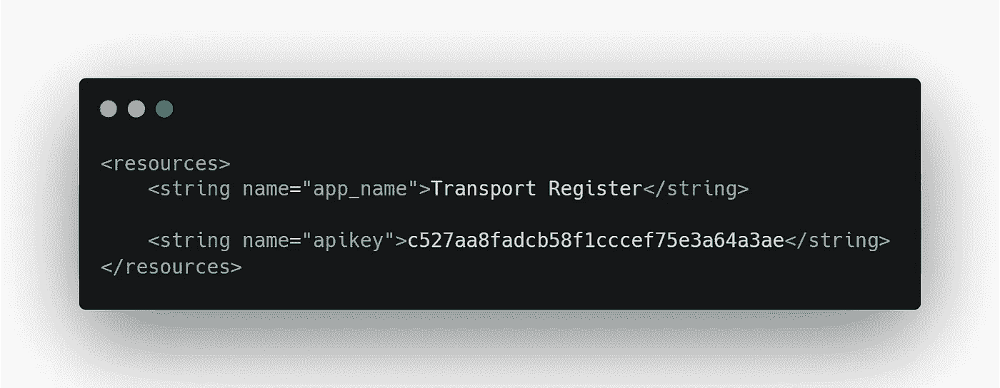
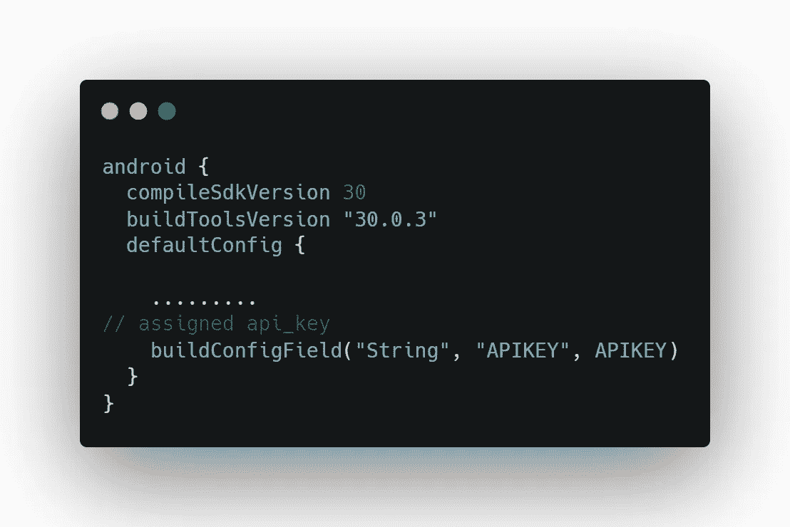
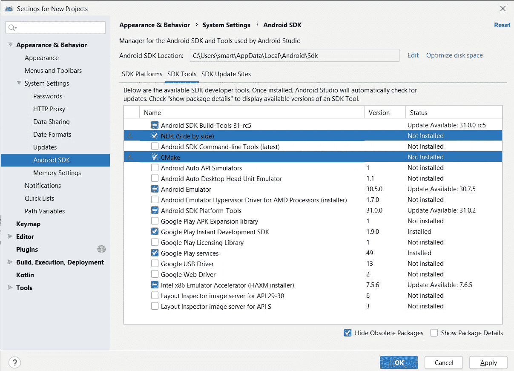
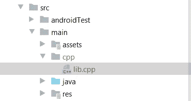
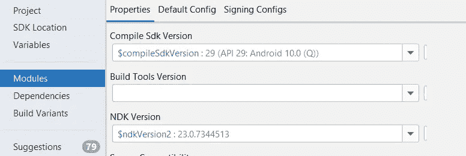

# 如何保护机密🔑在 Android 中— Android Security-01

> 原文：<https://blog.kotlin-academy.com/how-to-secure-secrets-in-android-android-security-01-a345e97c82be?source=collection_archive---------0----------------------->

在构建处理 API、从服务器接收的令牌、在本地数据库中存储凭证、将安全数据发送到网络上以及许多其他场景的应用程序时，安全性是一个关键要求。


Image from FreePik

> 绝对安全是不存在的。安全是一套措施，被堆积和组合，试图减缓不可避免的。

> 社区参与

[](https://dormoshe.io/newsletters/ag/android/67?utm_source=twitter&utm_campaign=twitter) [## Android 趋势# 67-2021 年 8 月 3 日- Dor Moshe 的博客

### 订阅时事通讯，享受每周学习新知识的最新动态。

dormoshe.io](https://dormoshe.io/newsletters/ag/android/67?utm_source=twitter&utm_campaign=twitter) 

# 介绍

无论是移动应用、web 应用还是桌面应用，安全性都是关键概念。开发人员尽最大努力构建一个安全的应用程序来防止它被黑客绕过，这是一项复杂的任务。谷歌和其他一些组织正在不知疲倦地提供最好的安全工具。

**来说说我们的主要话题:*安卓***

问题出现了:我们是否可以通过使用本地**硬编码密钥**加密我们的秘密/数据，并将加密的数据保存在**首选项、本地数据库中，并轻松共享给网络**来轻松保护我们的秘密/数据？

**答案是**黑客可以轻松反编译我们的代码，获取你的硬编码密钥，破坏你的 app 安全。

> **注意:**我们无法创建完全安全的系统，但我们的主要目标是构建不太复杂、但黑客更难绕过的系统。

**第二个答案**，如果是 API 密匙那么黑客很容易就可以:

*   扰乱你的数据，
*   生成大量的 API 调用，这会极大地增加您的成本。

在构建应用程序时，我们尝试保护多个端点，包括:

*   API-Key
*   代币
*   共享偏好
*   文件
*   本地数据库数据

几十年来，许多开发人员使用多种算法来保护他们的应用程序，但所有这些方法都有自己的局限性。实现加密的几种算法列举如下:

*   [密码加密](https://en.wikipedia.org/wiki/Cipher)
*   [维吉尔加密](https://github.com/VirgilSecurity/virgil-crypto.git)
*   [AES 加密](https://www.tutorialspoint.com/cryptography/advanced_encryption_standard.htm)

本文将介绍加密所有上述端点的传统方法和当前首选方法。

# 从保护最重要选项(即 API-Key)的传统方法开始

*   **字符串|资源文件**



Store api_key in resource file

在过去，我们试图使用这种方法，但它并不安全。为什么？这是因为如果你在一个字符串或资源文件中定义关键字，把它放在一个环境变量中，并生成一个`apk`，Gradle 把这些关键字放在一个字符串文件中，这个字符串文件可以通过**逆向工程过程**轻松访问。

*   格雷德。通过 BuildConfig 的属性和访问

> gradle.properties 文件

```
APIKEY = "c527aa8fadcb58f1cccef75e3a64a3ae"
```

> build.gradle 文件



Call key in build. gradle file

> 访问任何。KT|。JAVA 文件

```
val API_KEY = BuildConfig.APIKEY;
```

也许你认为这个过程是安全的，因为我们把我们的 **api_key** 放在了已经被添加到`**.gitignore**`列表中的`**gradle.properties**`文件中？不，这个过程只是保护它不被 GitHub 窃取，而不是从应用程序中窃取🤔。当我们通过 BuildConfig 文件和**逆向工程过程**获取密钥时，黑客将获得所有 java 类和`.dex`文件中的 Buildconfig 类。所以，你只是在保护密钥不被破坏 GitHub 库的人破坏，这种情况很少发生，而不是防止更容易发生的逆向工程。

> 上面定义的传统方法没有涵盖我们的主要用例，即安全性。我得到的唯一解决方案是，开发人员将**密钥**放在服务器上，并使用令牌化场景来获得那个**密钥**。但是如果我们的应用程序离线工作呢？在这种情况下，我们如何管理它？*🤷‍♀️*

我们认识到我们需要一个安全的密钥管理框架来处理所有的安全问题，然后我们得到了这两个有用的方法:

1.  [CMake —带有 NDK](https://developer.android.com/ndk) *的本地库(在某些情况下，我们称之为模糊键)*
2.  [安卓 Jetpack 安全](https://developer.android.com/topic/security/data)

# CMake—NDK 的本地图书馆

根据 android 指南

> Android NDK 是一个工具集，可以让你使用 C 和 C++等语言，用本机代码实现应用程序的一部分。对于某些类型的应用程序，这可以帮助您重用用这些语言编写的代码库。

在这个方法中，我们将在本机 **NDK C++** 代码中定义我们的`api_key`，与`resource.file`或`gradle.properties`相比，它很难被任何黑客反编译，因为 NDK 在`**.so**` 文件中编译代码，而这个文件只包含原始数据和少数几个字符串，所以在**逆向工程过程之后，**黑客将很难识别密钥的位置，因为它的位置相对于 PC 发生了变化。

> **注意:**当你使用离线应用程序存储数据并在一天结束时将数据上传到服务器时，NDK 过程也是受支持的。在这种方法中，你不能实现任何标记化概念，所以这里 NDK 闪耀。

要使用 NDK(本地开发工具包)方法，您必须遵循以下步骤来保护您的密钥:

*   **使用 NDK (C++模板)** →提供一种在 Android 中使用 C/C++代码的方法。
*   **使用 ndk.build (CMAKE)** →构建您的本机 c++库

> 这是一个痛苦的事实，但我们也可以说这种方法模糊了密钥，也没有保护密钥。

## 如何配置 NDK:

> 首先，通过 SDK 工具安装这些:



Install NDK and CMAKE

> 其次，创建一个`*CMakeLists.txt*`文件

在`app/`目录下创建一个 CMakeLists 文件，并将下面的要点复制到其中。

CMakesList file

> 第三，在 cpp 文件中保护你的密钥

在`app/src/main/`的根目录下创建一个文件夹`cpp`，然后在同一个文件夹下创建`lib.cpp`文件*(可以使用自己的命名约定)*。



Explorer view of cpp file

> **注意**:不要在 git 中包含这个文件夹。或者您可以添加该文件夹路径，即`*app/.gitignore.*`中的`*/src/main/cpp/lib.cpp*`

然后在您的`main/java/`包中定义另一个文件`Keys.kt`并获取您的 **api_key。**该文件用于加载 **lib.cpp** 文件中您定义的 C++代码:

Keys.kt file

现在，打开您的 cpp 文件并保护您的 **api_key:**

.cpp file

您将要在这个文件中编写的代码是至关重要的，因为这个文件将为您提供密钥，所以您必须确保正确地生成函数。

让我来定义上述函数的分解:

`edu_practice` - >包名(也要确保你的模块是 **app** ，否则你必须连接它)

`utils_shared_Keys` - >是 **Keys.kt** 文件路径即`java/package/utils/shared/`

`apiKey` - >是我们在 **Keys.kt** 文件中定义的外部乐趣

> 最后一档

我们已经完成了几乎所有的功能路径，剩下的唯一配置就是在`app.gradle`中定义我们的`CMakesList`文件:

```
android{
      .........
   externalNativeBuild **{** cmake **{** path "CMakeLists.txt"
          **}
    }****}**
```

现在，您可以通过在代码中引用 **Keys.kt** 文件来获取 API_Key。

> 在 Java 中

```
Keys.*INSTANCE*.apiKey()
```

> 在科特林

```
Keys.apiKey()
```

当你只能选择在应用程序中本地存储密钥时，通过 NDK 保护`api_key`是非常有趣和有用的。

如果它不工作或给你一个错误，然后检查 ndk 路径是否填写在项目结构中:



ndk-project structure

# Android Jetpack 安全性

在 Google I/O 2019 中，谷歌推出了新的安全功能，这些功能以 Jetpack security 的名义组合在一起，以确保上述所有问题都需要克服。

Jetpack security 提供以下主要功能:

*   万能钥匙
*   EncryptedSharedPreferences
*   加密文件

目前，我们正在讨论存储 **api_key** ，这可以通过**主密钥/密钥库**来完成。

密钥库提供:

*   安全地存储密钥和
*   随机生成密钥

它使用公钥和对称加密技术对秘密进行加密。现在，它们之间有什么区别，我们如何使用它们？对于这一点，你已经读过我的第二篇文章《 [**如何保密》🔑在安卓(深入)——安卓安全——02**](/secure-secrets-in-android-using-jetpack-security-in-depth-android-security-02-4026b8e012f4)

我希望这篇文章对解决 android 安全性的基本问题有所帮助。我们还讨论了传统方法与当前方法的比较，并探讨了它们背后的优势。在 Twitter 上关注我，了解更多更新:

[](https://twitter.com/AliAzazAlam1) [## 阿里·阿扎兹·阿拉姆

### 阿里·阿扎兹·阿拉姆的最新推文(@AliAzazAlam1)。🇵🇰.企业家👱🏻‍♂️安卓应用开发者📱开源…

twitter.com](https://twitter.com/AliAzazAlam1) 

感谢您花时间阅读这篇文章。如果你喜欢它，请分享！

# 点击👏说“谢谢！”并帮助他人找到这篇文章。

了解卡帕头最新的重大新闻。学院，[订阅时事通讯](https://kotlin-academy.us17.list-manage.com/subscribe?u=5d3a48e1893758cb5be5c2919&id=d2ba84960a)，[观察 Twitter](https://twitter.com/ktdotacademy) 在 Medium 上关注我们。

如果您需要 Kotlin 工作室，请查看我们如何帮助您: [kt.academy](https://kt.academy/) 。

[](https://kotlin-academy.us17.list-manage.com/subscribe?u=5d3a48e1893758cb5be5c2919&id=d2ba84960a)