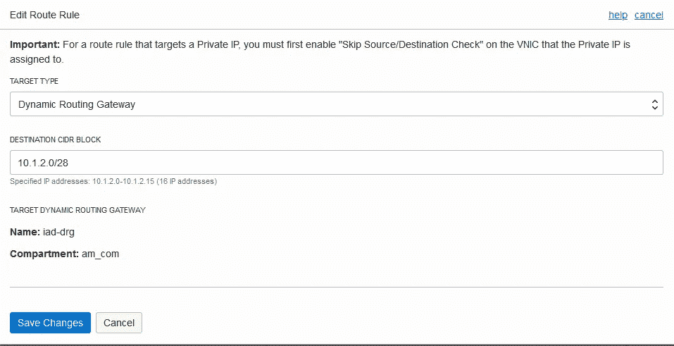

# 如何通过服务网关安全地连接跨区域的 OCI 服务

> 原文：<https://medium.com/oracledevs/how-to-securely-connect-cross-regional-oci-services-via-the-service-gateway-61646b470a20?source=collection_archive---------0----------------------->

我们希望在两个 OCI 地区之间创建一个主动-被动 Oracle RAC 数据库部署，目标如下:

1.  在两个区域(菲尼克斯和阿斯本)创建 Oracle RAC 集群
2.  一个地区被指定为主要地区(菲尼克斯)，另一个地区被指定为次要地区(阿什本)
3.  使用 Data Guard 实现复制
4.  使用对象存储的数据库备份

更重要的是，我们希望所有跨地区的网络流量都使用 OCI 的主干网，而不是公共互联网。

为此，我们需要设置以下内容:

1.  2 个 vcn，每个区域 1 个
2.  2 个 RAC 集群，每个区域 1 个
3.  两个 RAC 集群之间的 Data Guard 复制

下图说明了我们想要实现的目标:


Active-Passive Clusters in 2 regions

为了简洁起见，我们将对凤凰城地区使用 **phx** ，对阿什本地区使用 **iad** 。在本帖中，我们将看看如何通过服务网关安全地连接跨区域的 OCI 服务。

## 建立基本的基础设施

让我们首先在这两个地区建立基本的基础设施。我们将使用可重用的 [terraform-oci-base](https://github.com/oracle-terraform-modules/terraform-oci-base) 模块来完成这项工作。

```
git clone [https://github.com/oracle-terraform-modules/terraform-oci-base.git](https://github.com/oracle-terraform-modules/terraform-oci-base.git) phxgit clone [https://github.com/oracle-terraform-modules/terraform-oci-base.git](https://github.com/oracle-terraform-modules/terraform-oci-base.git) iad
```

通过在每个文件夹中复制 terraform.tfvars.example 来创建一个变量文件，并输入必要的参数。

```
cd phx
cp terraform.tfvars.example terraform.tfvars
```

在根文件夹中创建提供程序:

```
#provider.tfprovider "oci" {
  tenancy_ocid = var.oci_base_identity.tenancy_id
  user_ocid = var.oci_base_identity.user_id
  fingerprint = var.oci_base_identity.api_fingerprint
  private_key_path = var.oci_base_identity.api_private_key_path
  region = var.oci_base_general.region
  disable_auto_retries = false
}
```

编辑 terraform.tfvars 并执行以下操作:

1.  输入身份值，如指纹、api 密钥路径、用户 id 等。
2.  在两者中设置区域。美国凤凰一号和美国阿什本一号。如果您愿意，也可以使用其他区域。
3.  确保 vcn _ cidrs 不重叠，例如对 **phx** 使用 10.1.0.0/16，对 **iad** 使用 10.2.0.0/16
4.  在两个区域中启用堡垒主机。您可以稍后关闭 1。

```
# terraform.tfvarsoci_base_identity = {
  api_fingerprint = "<api_fingerprint>"
  api_private_key_path = "/path/to/api_private_key"
  compartment_id = "compartment_id"
  tenancy_id = "tenancy_id"
  user_id = "user_id"
}oci_base_general = {
  label_prefix = "**phx**" //replace with iad for ashburn
  region = "**us-phoenix-1**" //replace with us-ashburn-1 for iad
}# networkingoci_base_vcn = {
  create_nat_gateway = true
  create_service_gateway = true
  vcn_cidr = "**10.1.0.0/16**" //replace with 10.2.0.0/16 for iad
  vcn_dns_label = "phx"
  vcn_name = "vcn"
}# bastionoci_base_bastion = {
  availability_domains = 2
  bastion_access = "ANYWHERE"
  bastion_image_id = "NONE"
  bastion_shape = "VM.Standard.E2.1"
  bastion_upgrade = true
  create_bastion = true
  enable_instance_principal = false
  enable_notification = false
  newbits = 13
  netnum = 32
  notification_endpoint = ""
  notification_protocol = "EMAIL"
  notification_topic = "bastion"
  ssh_private_key_path = "~/.ssh/id_rsa"
  ssh_public_key_path = "~/.ssh/id_rsa.pub"
  timezone = "Australia/Sydney"
  use_autonomous = true
}
```

运行 terraform apply 以创建基础架构:

```
terraform apply -auto-approve
```

通过改变上面突出显示的值，对 **iad** 区域重复上述操作。

## 设置远程对等连接

由于这两个 vcn 位于两个不同的区域，我们需要建立一个远程对等连接。

1.  登录 OCI 控制台，导航到网络>动态路由网关，在 **phx** 中创建一个动态路由网关。

2.创建 DRG 后，单击资源下的虚拟云网络，将 DRG 连接到 VCN。


Attaching a DRG to a VCN

3.单击资源下的远程对等连接(RPC)来创建远程对等连接。

4.重复步骤 1-3，在 **iad** 中创建一个 RPC。

5.将鼠标悬停在垂直省略号上，并单击以复制 **iad** RPC OCID:


6.导航到 phx-rpc 的详细信息页面，点击“建立连接”

7.将区域设置为“us-ashburn-1 ”,粘贴您在步骤 5 中复制的 iad-rpc ocid，然后单击“建立连接”

一旦连接建立，您应该会看到对等状态设置为“对等”,对等区域为 us-ashburn-1。


## 创建数据库系统

我们现在将在每个地区创建一个 RAC 集群。

为专用子网创建一个安全列表(称之为数据库)。您需要以下入口规则:


PHX Ingress rules


PHX Egress rules

接下来，创建一个专用数据库子网，并使用上面的安全列表:


导航到数据库并创建数据库系统。确保您至少选择了一台虚拟机。Standard2.2，因此您可以创建多个节点。


Selecting a shape for the database system

然后，将节点总数设置为 2，将群集名称设置为“phx ”,并上传您的公共 ssh 密钥。

选择 VCN (phx-vcn)和子网(db)。

将主机名前缀设置为“phxdb”。

单击末尾的“显示高级选项”，选择至少 2 个故障域。您可以遵循上面的体系结构图，也可以选择您自己的 2 个首选故障域。

单击“下一步”并设置以下参数:

数据库名称: **dbha** (两地区需相同)
数据库版本:19.0.0.0
PDB: pdb1

设置您的密码，并选中“启用自动备份”。

在 **iad** 中，使用以下入口和出口规则创建安全列表:


IAD Ingress rules


IAD Egress rules

现在，创建一个私有数据库子网，其参数与 **phx** 相同，但 CIDR 块为 10.2.2.0/28。

然后，像在 **phx** 一样创建一个数据库。将所有“phx”值替换为“iad”。

*确保您设置的数据库名称与您在 **phx** 中设置的*相同，例如在上面，我们将数据库的名称设置为“ **dbha** ”。

## 为数据保护配置路由表

现在，远程连接对等已经建立，并且我们有了子网，我们需要确保将在这些子网中创建的数据库 RAC 集群能够通过远程对等连接相互通信。为此，我们需要配置路由表。

在 **phx** 中编辑 nat 路由表，并添加路由表:


同样，在**和**中也要这样做:



## 测试路由和端口连接

一旦 RAC 集群启动并运行，我们需要测试 3 件事:

1.  IP 路由
2.  通过 1521 的端口连接
3.  (1)、(2)双向，即 **phx** - > **iad** 和**IAD**->phx

ssh 到 **phx** 中的一个数据库节点:

```
ssh -J opc@<phx_bastion_public_ip> opc@10.1.2.2 
```

您可以在数据库的节点页面上找到 IP 地址/主机名:


测试前，在**和**中找到其中一个节点的 IP 地址:


使用 [Ncat](https://nmap.org/ncat/) 测试到**和**节点的路由和端口连接:

```
nc -v 10.2.2.2 1521                                                                                                                                                            
Ncat: Version 7.50 ( https://nmap.org/ncat )                                                                                                                                                  
**Ncat: Connected to 10.2.2.2:1521.**
```

通过 ssh 对 **iad** 中的数据库节点 1 重复上述测试:

```
ssh -J opc@<iad_bastion_public_ip> opc@10.2.2.2
```

并测试到 **phx** 节点的路由和端口连接:

```
nc -v 10.1.2.2 1521                                                                                                                                                             
Ncat: Version 7.50 ( [https://nmap.org/ncat](https://nmap.org/ncat) )                                                                                                                                                  
**Ncat: Connected to 10.1.2.2:1521.**
```

如果您通过上述两种方式进行了连接，就差不多可以配置 Data Guard 了。如果没有，请验证您的安全列表和路由规则。

## 为备份配置网络路由

当您选择“启用自动备份”时，数据库会自动备份到 OCI 对象存储。因此，我们还需要能够从远程区域恢复备份。由于 OCI 对象存储可通过区域内的服务网关访问，并且我们还希望所有跨区域的网络流量使用 OCI 的主干网，因此我们需要向远程区域添加 2 个以上的路由和路由规则。

1.  导航到网络> phx-vcn >路由表，然后点击“创建路由表”。单击“+附加路线规则”以添加以下规则:


phx-drg-rt

该路由表的目的是在 **phx** 到 **iad** 宣传甲骨文服务网络(OSN)。

2.如上创建第二个路由表，并添加以下规则:


phx-sgw-rt

该路由表的目的是创建一条从 OSN 的 **phx** 到 **iad** 的返回路由。

3.在不同的选项卡中打开 [OSN IP 地址范围](https://docs.cloud.oracle.com/iaas/tools/public_ip_ranges.json)，找到**IAD的 IP 地址数组。编辑 phx-nat-route 路由表，并为 iad 中的每个 CIDRs 添加路由规则:**


Adding IAD CIDR to phx-nat-route (truncated list)

这些规则的目的是通过远程对等连接(而不是互联网)上的动态路由网关，将所有流量从 **phx** 路由到 **iad** 的 OSN 中的服务。

4.单击 VCN 下的动态路由网关，将鼠标悬停在右侧的垂直省略号上，并关联一个路由表。选择' **phx-drg-rt** '。这将使 phx 中的计算机能够访问 iad 中的服务。

5.单击服务网关，将鼠标悬停在右侧的垂直省略号上，并关联一个路由表。选择' **phx-sgw-rt** '。这将使 **iad** 中的服务能够响应来自 **phx** 中的计算机的请求。

在 iad-vcn 中重复上述步骤 1–5:

1.  创建路由表 iad-drg-rt:


iad-drg-rt

2.创建路由表 iad-sgw-rt:


iad-sgw-rt

3.打开 iad-nat-route 路由表，为来自 [OSN IP 地址范围](https://docs.cloud.oracle.com/iaas/tools/public_ip_ranges.json)的 **phx** 中的每个 CIDRs 添加路由规则:


Adding PHX CIDR to iad-nat-route (truncated list)

这些规则的目的是通过远程对等连接(而不是互联网)上的动态路由网关，将来自 IAD T1 的所有流量路由到 T2 phx T3 OSN 中的服务。

4.单击 VCN 下的动态路由网关，将鼠标悬停在右侧的垂直省略号上，并关联一个路由表。选择' **iad-drg-rt** '。这将使 iad 中一台计算机能够访问 OSN phx 中的一项服务。

5.单击服务网关，将鼠标悬停在右侧的垂直省略号上，并关联一个路由表。选择' **iad-sgw-rt** '。这将使 **phx** 中的服务能够响应来自 **iad** 中的计算机的请求。

## 测试 OSN 路线

既然我们已经完成了从 **phx** 到 **iad** 的 OSN 路由配置，反之亦然，我们需要测试流量是否确实通过远程对等连接。

1.  在 OCI 控制台的 **phx** 中，导航到对象存储并创建一个桶
2.  编辑 bucket 并上传一个简单的测试文件


3.单击预认证请求并为文件创建 1。


Creating a Pre-authenticated request for phx

4.复制屏幕上提供的 url 并保存。

在 iad 区域重复 1-4。


Creating a pre-authenticated request for iad

测试从 **phx** 对 **iad** 服务的访问:

1.  ssh 到 **phx** 中的一个数据库节点:
2.  使用 curl 和 **iad** 预认证请求 url 获取您在 **iad 中上传的文件。**这应该是成功的:

```
curl -v -O
[https://objectstorage.us-ashburn-1.oraclecloud.com/p/xbPRiyOnLLc_GxTZ8qWGdhEhw97fjBx24iqtVlC86yw/n/tenancy/b/testbucket/o/](https://objectstorage.us-ashburn-1.oraclecloud.com/p/eZV-AlzUAQRhAE6TTc6C5WF_4VgZ2TqTQcv50eefW0s/n/apaciaas/b/testbucket/o/iad.txt)..
..
..
***   Trying 134.70.35.189...
* Connected to objectstorage.us-ashburn-1.oraclecloud.com (134.70.35.189) port 443 (#0)**
> GET /p/eZV-AlzUAQRhAE6TTc6C5WF_4VgZ2TqTQcv50eefW0s/n/tenancy/b/testbucket/o/iad.txt HTTP/1.1
> User-Agent: curl/7.29.0
> Host: objectstorage.us-ashburn-1.oraclecloud.com
> Accept: */*
>
**< HTTP/1.1 200 OK**
< Date: Mon, 18 Nov 2019 04:48:51 GMT
< Content-Type: text/plain
< Content-Length: 3
< Connection: keep-alive
< accept-ranges: bytes
..
..
..
<
{ [data not shown]
100     3  100     3    0     0      6      0 --:--:-- --:--:-- --:--:--     6
* Connection #0 to host objectstorage.us-ashburn-1.oraclecloud.com left intact
```

2.导航到 **iad** -vcn >服务网关。将鼠标悬停在垂直省略号上，然后单击“阻止流量”来阻止返回流量。

3.重复卷曲测试，这应该会失败。这个故障证实了从 **phx** 到 **iad** OSN 的流量确实是通过远程对等连接，而不是通过公共互联网。

4.将鼠标悬停在垂直省略号上，然后单击“允许流量”以允许返回流量。

测试从 **iad** 对 **phx** 服务的访问:

1.  ssh 到 **iad** 中的一个数据库节点:
2.  使用 curl 和 **phx** 预认证请求 url 来获取您在 **phx 中上传的文件。**这应该与之前的测试一样成功:

```
curl -v -O [https://objectstorage.us-phoenix-1.oraclecloud.com/p/U-rzrTUV6xWcr0YvDSTl2ZPSTqGueiQMwQm2Ee0gr7Y/n/tenancy/b/testbucket/o/phx.txt](https://objectstorage.us-phoenix-1.oraclecloud.com/p/U-rzrTUV6xWcr0YvDSTl2ZPSTqGueiQMwQm2Ee0gr7Y/n/tenancy/b/testbucket/o/phx.txt)
curl -v -O [https://objectstorage.us-phoenix-1.oraclecloud.com/p/U-rzrTUV6xWcr0YvDSTl2ZPSTqGueiQMwQm2Ee0gr7Y/n/tenancy/b/testbucket/o/phx.txt](https://objectstorage.us-phoenix-1.oraclecloud.com/p/U-rzrTUV6xWcr0YvDSTl2ZPSTqGueiQMwQm2Ee0gr7Y/n/tenancy/b/testbucket/o/phx.txt)
..
..
..
***   Trying 134.70.8.3...**
*** Connected to objectstorage.us-phoenix-1.oraclecloud.com (134.70.8.3) port 443 (#0)**
..
..
..
> GET /p/U-rzrTUV6xWcr0YvDSTl2ZPSTqGueiQMwQm2Ee0gr7Y/n/tenancy/b/testbucket/o/phx.txt HTTP/1.1
> User-Agent: curl/7.29.0
> Host: objectstorage.us-phoenix-1.oraclecloud.com
> Accept: */*
>
< **HTTP/1.1 200 OK**
< Date: Mon, 18 Nov 2019 05:05:07 GMT
< Content-Type: text/plain
< Content-Length: 3
< Connection: keep-alive
< accept-ranges: bytes
..
..
..
<
{ [data not shown]
100     3  100     3    0     0      5      0 --:--:-- --:--:-- --:--:--     6
* Connection #0 to host objectstorage.us-phoenix-1.oraclecloud.com left intact
```

2.导航到 **phx** -vcn >服务网关。将鼠标悬停在垂直省略号上，然后单击“阻止流量”来阻止返回流量。

3.重复卷曲测试，这应该和前面的测试一样失败。这个故障证实了从 iad 到 T2 phx OSN 的流量确实是通过远程对等连接，而不是通过公共互联网。

4.将鼠标悬停在垂直省略号上，然后单击“允许流量”以允许返回流量。

## 状态检查

我们现在已经完成了必要的网络配置。此时，我们已经准备好为主动-被动复制配置 Data Guard。敬请关注下一篇帖子。

## 更新

要配置 Oracle DataGuard，请阅读 [Alex Blyth](https://medium.com/u/66c5a05ce51a?source=post_page-----61646b470a20--------------------------------) 的[帖子](/@alexblyth/oracle-oci-cross-region-database-dr-96b3a98f4996)。

## 特约作者

我非常感谢我的同事 Alex Blyth、C.K. Kong 和 Vinay Rao 在配置和测试上述环境方面提供的帮助。