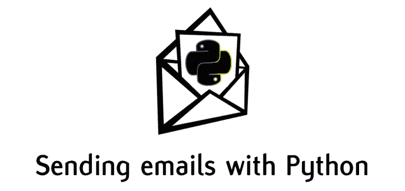
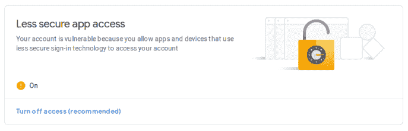
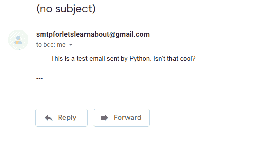
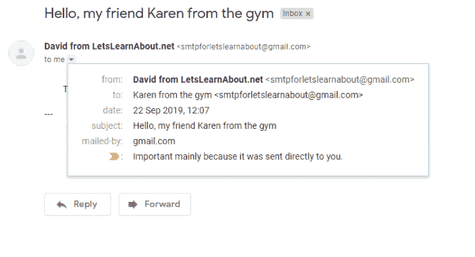
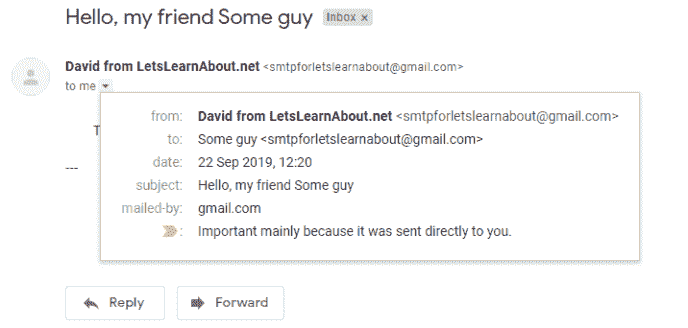
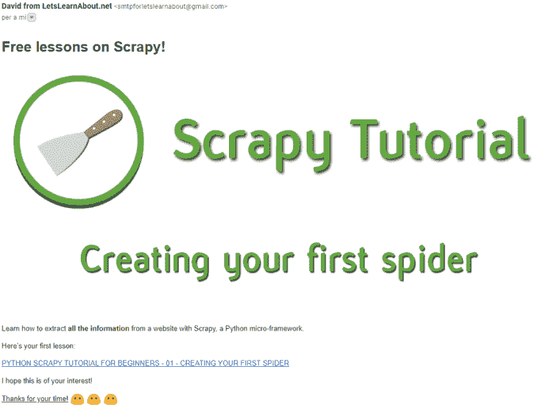
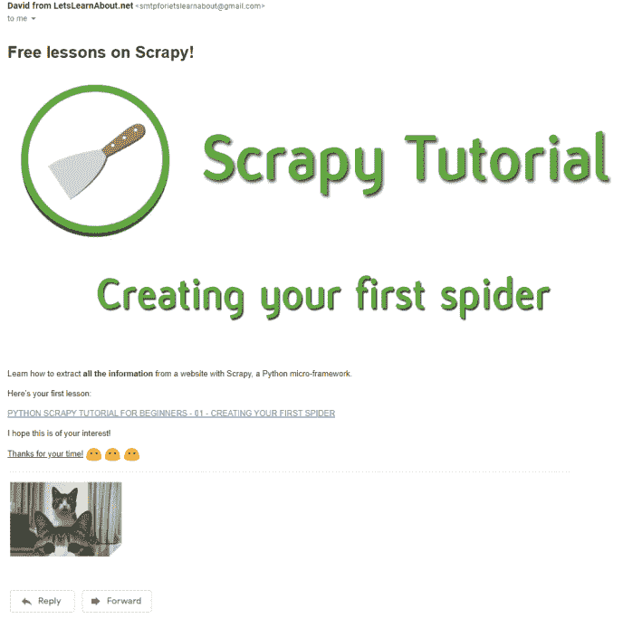

# 如何只用 Python 发送带有附件的漂亮电子邮件(是的，还有猫的照片)

> 原文：<https://medium.com/quick-code/how-to-send-beautiful-emails-with-attachments-yes-cat-pics-too-using-only-python-4857ad5dab2a?source=collection_archive---------0----------------------->

你知道你可以用 Python 发邮件吗？不仅如此，您还可以发送附加文件！

除了大多数人使用的黑白背景纯文本，你还可以用 HTML 文件发送电子邮件，给你的电子邮件添加一些味道，就像这样:

在短短几分钟内，您将学习如何创建一个 SMTP 服务器，使用 Python 向一系列客户、学生、朋友发送电子邮件

在本课中，您将学习如何:

*   向一个人发送一封电子邮件
*   添加信息，如您的姓名、收件人姓名或主题，使其更像人类
*   向多人发送一封电子邮件
*   使用 HTML 制作一封漂亮的电子邮件
*   在我们发送的电子邮件中附加文件

# 设置一切

我们将使用 Gmail 帐户发送电子邮件。首先，创建一个 gmail 帐户(或使用您自己的帐户)，并在您的帐户中启用“不太安全的应用程序访问”。你可以在这里做:

https://myaccount.google.com/u/0/security?hl=en&pli = 1

之后，你就大功告成了！用 Python 创建一个环境(我用 pipenv，所以 *pipenv shell)* 就万事俱备了！

# 简单，一对一的电子邮件发送者

让我们从创建一个简单的脚本开始，该脚本从您的帐户向其他人发送一封文本电子邮件(我使用 pipenv，所以我用 *pipenv shell* 创建了一个):

创建一个 python 文件，例如 *email_server.py* ，并编写:

smtp 是一个 Python 模块，我们将使用它来创建一个 smtp(简单邮件传输协议)会话对象，它将发送我们想要的任何电子邮件。 *ssl* 模块提供对 TLS(传输层安全性)的访问，帮助我们提高安全性。

然后，我们将添加一些变量，如发件人和收件人的电子邮件，提示用户输入电子邮件密码和电子邮件正文。将大写的值替换为您的值。出于测试的目的，我使用相同的电子邮件。

完成配置后，让我们编写发送电子邮件的函数:

该功能将:

*   创建 smtplib。SMTP 实例。我们使用 gmail，所以我们使用主机*smtp.gmail.com*和端口 *587* 发送邮件。您可以通过使用其他提供商(如 hotmail)的主机和端口来使用它们。
*   使用 *starttl* s 方法加密电子邮件。
*   登录我们的谷歌电子邮件账户
*   使用发件人电子邮件向收件人电子邮件发送电子邮件，而邮件只是一个纯文本。
*   使用 try，除了捕捉所有的错误和最后关闭 SMTP 实例。

现在运行代码，您将收到您的电子邮件！

但是我们在这里不仅仅是发送一封电子邮件。我们可以自己做！

现在，让我们向一个列表发送多封电子邮件。

# 向一组人发送电子邮件

要发送多封电子邮件，我们只需要在这里和那里做一些调整。让我们的电子邮件更加个性化，在邮件中添加主题和发件人信息:

首先，让我们写更多类似人类的电子邮件:

添加带有“# New line”注释的行。我们正在导入 MIMEText(多用途互联网邮件扩展)来配置我们的电子邮件和一个 *formataddr* helper 方法。

在第一次打印之后，在*尝试*之前，添加以下配置:

现在，我们创建一个 MIMEText 实例，email_body 作为纯文本，我们将“收件人”文本设置为收件人姓名和电子邮件，“发件人”文本设置为我们的姓名和电子邮件，主题设置为“你好，我的朋友姓名”。

最后，将 *sender.sendmail* 方法修改为:

*server . sendmail(sender _ email，receiver_email，msg.as_string())*

再次发送电子邮件:

很好，现在有更少的*垃圾信息。让我们把这封 100%正常的、非伪造的电子邮件发给一组人:*

因为我们要迭代接收者的电子邮件和姓名，所以在 *receiver_names* 变量下面的代码前面加上这个 for-loop，并标记代码，使其属于该循环:

这应该是您现在的代码:

运行代码，你的电子邮件将被发送到 3 个不同的电子邮件地址！

在这里，我们向 3 个不同的人发送一封电子邮件，但是你可以把它发送给成百上千的学生、追随者、博客读者等等！还有…

…他们会收到一封难看的电子邮件。

我答应你用 Python 发送漂亮的电子邮件，可以吸引人们到任何你想要的地方。所以我们走吧！

# 用 HTML 发送漂亮的电子邮件

这很简单。现在我们发送一个字符串作为 *email_body，*对吗？

相反，我们将发送一个包含 HTML 代码的字符串。

首先，让我们创建我们的 HTML 文件。使用代码编辑器如 VS Code 或 Atom，或者用在线编辑器如[https://html5-editor.net/](https://html5-editor.net/)创建它。

保存成 HTML 文件(我的是*email.html*)。

现在，将 *email_body* 替换为:

用新线路替换旧线路:

运行代码，结果如下:

很酷，对吧？

但是，如果我们还想发送发票、pdf、excel 文件、视频或其他文件呢？

# 将文件添加到您的电子邮件中—强制性的 cat.gif 示例

为了添加文件，我们将发送多个部分，而不是发送一个对象，即 HTML。一个是 HTML，另一个是 gif。为此，请添加以下内容:

记得在文件夹中添加一个名为“cat.gif”的文件，或者用自己的文件替换它。

将 *msg = MIMEText(email_body，' html')* 创建替换为:

这将创建正文的第一部分，带有 HTML 的部分，现在让我们添加附件:

这将:

*   加载附加的文件
*   编码它
*   将其作为附件添加到标题中
*   将该部分添加到 MIMEMultipart
*   如果找不到文件，抛出一个错误。

用我的代码检查你的代码:

运行代码…现在附件在邮件里了！

# 结论

编写代码，让你发送一封电子邮件到你的电子邮件列表，有附件文件，比枯燥的纯黑色文本白色背景的公式更有吸引力，是很容易的。

虽然这是一个只有一个文件的脚本，但是你可以很容易地将它合并到一个实际的 Python 框架中(Flask，Django…)web app，你实际在用的另一个程序或者改进当前的一个来执行更多的功能。

使用 Python 创建和发送电子邮件从未如此简单！

[我的 Youtube 教程视频](https://www.youtube.com/channel/UC9OLm6YFRzr4yjlw4xNWYvg?sub_confirmation=1)

[Github 上的最终代码](https://github.com/david1707/automated_emails)

[在推特上联系我](https://twitter.com/DavidMM1707)

[阅读更多教程](https://letslearnabout.net/category/tutorial/)

*原载于 2019 年 9 月 25 日*[*letslearnabout.net*](https://letslearnabout.net/tutorial/how-to-send-beautiful-emails-with-attachments-using-only-python/)*。*