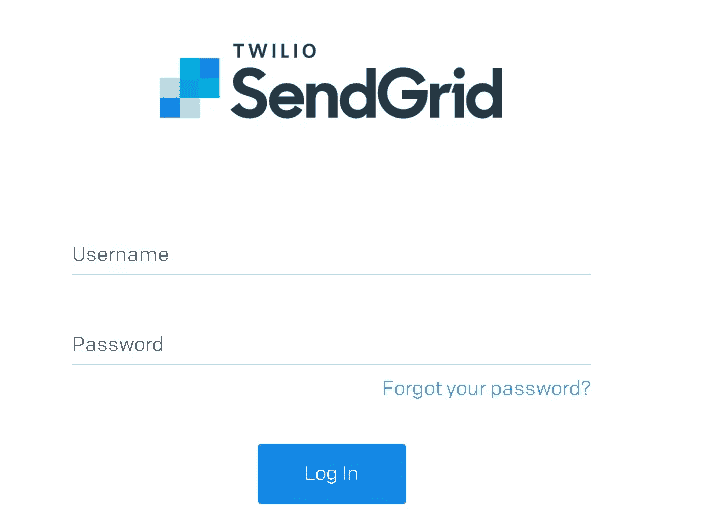
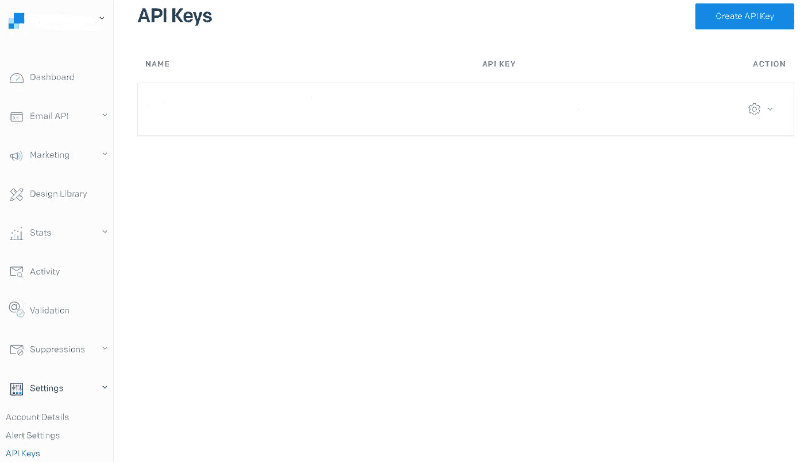
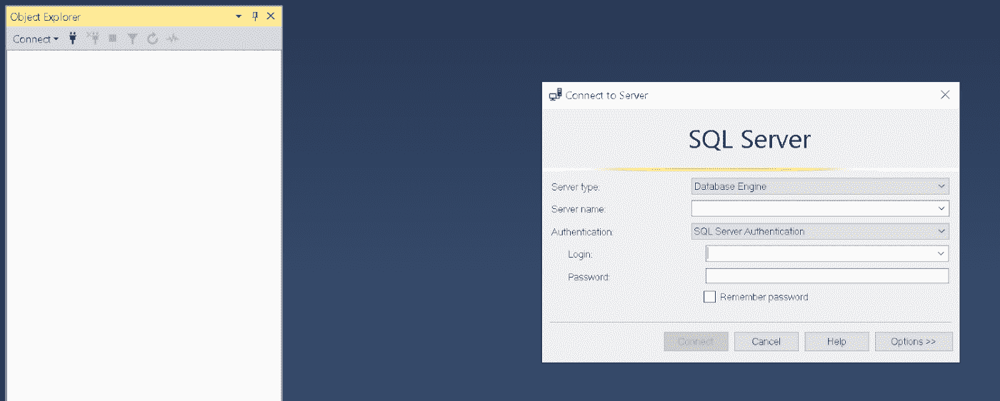
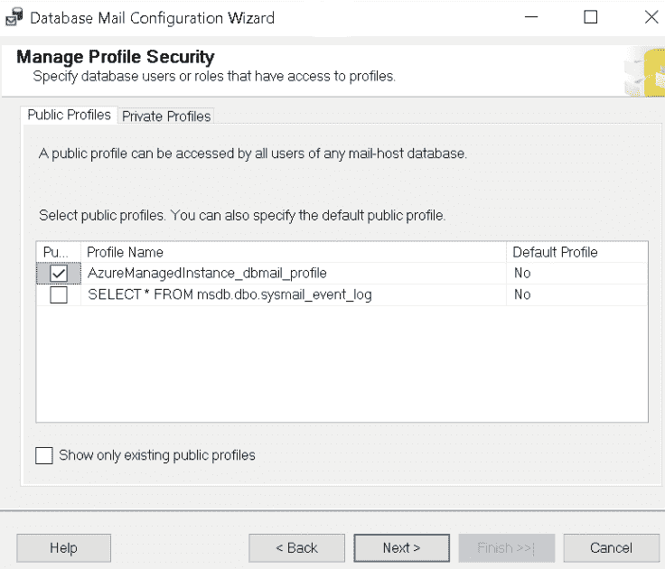
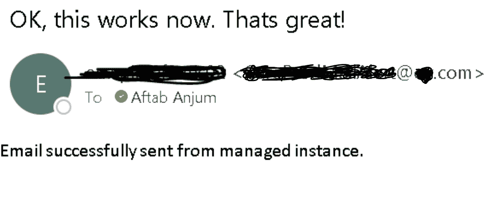

# 使用 Sendgrid 通过 SQL Server 发送电子邮件

> 原文：<https://medium.com/globant/how-to-send-email-through-sql-server-using-sendgrid-8851bfa02578?source=collection_archive---------1----------------------->

## 一种无需 SMTP 服务器的 Azure cloud 邮件发送方式


Photo by [Brett Jordan](https://unsplash.com/@brett_jordan?utm_source=medium&utm_medium=referral) on [Unsplash](https://unsplash.com?utm_source=medium&utm_medium=referral)

在本文中，我将向您展示如何在 SendGrid 帐户和 SQL 定义的存储过程的帮助下，从您的 [Azure SQL 托管实例](https://docs.microsoft.com/en-us/azure/azure-sql/managed-instance/sql-managed-instance-paas-overview)发送电子邮件。

为了从本地服务器的自动流程发送电子邮件，我们需要一个 [SMTP](https://www.techtarget.com/whatis/definition/SMTP-Simple-Mail-Transfer-Protocol#:~:text=SMTP%20(Simple%20Mail%20Transfer%20Protocol)%20is%20a%20TCP%2FIP,sending%20and%20receiving%20e%2Dmail.) 服务器。在 azure 中，我们根本不需要 SMTP 服务器，SMTP 服务器已经被 [SendGrid](https://sendgrid.com/) 所取代，SendGrid 将用于来自 web 应用程序或 SQL server 的各种电子邮件发送活动。

Azure SQL Managed Instance 是智能的、可扩展的云数据库服务，它结合了最广泛的 SQL Server 数据库引擎兼容性和全面管理的常青平台即服务的所有优势。SQL 托管实例允许现有的 SQL Server 客户将其内部应用程序或数据库提升并转移到 azure，只需对应用程序和数据库进行最少的更改。

在我继续之前，我假设您对 Azure SQL 托管实例有中级理解。

# **问题陈述**

我们有一个 SQL 托管实例，它通过部署在 Azure SQL 托管实例上的 ETL 工具[SSIS](https://docs.microsoft.com/en-us/sql/integration-services/integration-services-ssis-packages?view=sql-server-ver15)(SQL Server Integration Services)包从各种数据源消费数据。在完成所有 SSIS 包之后，如果当天没有加载任何表，就会运行 SQL 代码并向客户机发送警报。为了发送电子邮件和通知客户端，我们没有 SMTP 服务器，因此我们需要一个 SendGrid 帐户，可以在 Azure SQL 托管实例中使用。

要继续从 Azure SQL 托管实例发送电子邮件的端到端实现，我们需要遵循以下步骤:

1.获取 SendGrid API 密钥

2.创建数据库邮件帐户

3.创建数据库邮件配置文件

4.选择公共配置文件

5.发送测试电子邮件

## 第一步。获取 SendGrid API 密钥

我们需要首先生成 API 密钥。要生成，请遵循以下步骤:

前往'**https://app.sendgrid.com/login**'并使用您的凭证登录。



展开**设置**并点击 **API 键。**



点击右上角的**创建 API 密钥**按钮，并按照步骤操作。

现在您将拥有一个 API 密钥。把它保存在记事本或安全的地方。

## 第二步。创建数据库邮件帐户

使用您的凭证连接到您的 **Azure** **SQL 托管实例**到[SSMS](https://docs.microsoft.com/en-us/sql/ssms/download-sql-server-management-studio-ssms?view=sql-server-ver16)(SQL Server Management Studio)，一旦您打开 SSMS，您将会看到这样的屏幕。



您必须运行一些`t-sql`代码来在您的托管实例上启用数据库邮件。这批代码将实现启用数据库邮件:

```
use MSDB
EXEC sp_configure 'show advanced options', 1
RECONFIGURE
EXEC sp_configure 'Database Mail XPs', 1
RECONFIGURE
```

现在，您应该创建数据库邮件帐户。这行代码将实现它:

```
-- In below line, You can give any meaningful name at place of 'DBA SendGrid Account'
IF NOT EXISTS (SELECT 1 FROM msdb.dbo.sysmail_account WHERE [name] = 'DBA SendGrid
Account')
BEGIN
DECLARE [@servername](http://twitter.com/servername) NVARCHAR(255) = @@servername
SET [@servername](http://twitter.com/servername) = substring([@servername](http://twitter.com/servername), 1, charindex('.', [@servername](http://twitter.com/servername))-1)
EXECUTE msdb.dbo.sysmail_update_account_sp
[@account_name](http://twitter.com/account_name) = 'DBA SendGrid Account',
[@description](http://twitter.com/description) = 'DB account for DBAs and SQL Agent',
-- Here in below line, you need to provide email address who want to receive mail:
[@email_address](http://twitter.com/email_address) = '[Email@domain.com](mailto:Email@domain.com)',
[@display_name](http://twitter.com/display_name) = [@servername](http://twitter.com/servername),
[@mailserver_name](http://twitter.com/mailserver_name) = 'smtp.sendgrid.net',
[@mailserver_type](http://twitter.com/mailserver_type) = 'SMTP',
[@username](http://twitter.com/username) = 'apikey',
-- In below line, under single quotes, you need to provide API Keys which you have generated in step 1 of this article
[@password](http://twitter.com/password) = 'SG.*********************************',
[@port](http://twitter.com/port) = 587,
[@enable_ssl](http://twitter.com/enable_ssl) = 1;
END
ELSE
PRINT 'sysmail_account already configured'
```

## 第三步。创建数据库邮件配置文件

如果您想使用 SQL 代理作业发送电子邮件，应该有一个数据库邮件配置文件配置文件，必须称为'**AzureManagedInstance _ dbmail _ profile**'，您可以在这里找到更多详细信息。执行这个脚本，它将为您创建一个数据库邮件配置文件。

```
-- Create a database mail profile (Profile must be called AzureManagedInstance_dbmail_profile)
IF NOT EXISTS (SELECT * FROM msdb..sysmail_profile WHERE name =
'AzureManagedInstance_dbmail_profile')
BEGIN
EXECUTE msdb.dbo.sysmail_add_profile_sp
[@profile_name](http://twitter.com/profile_name) = 'AzureManagedInstance_dbmail_profile',
[@description](http://twitter.com/description) = 'Main profile for sending database mail';
-- Associate account with profile
EXECUTE msdb.dbo.sysmail_add_profileaccount_sp
[@profile_name](http://twitter.com/profile_name) = 'AzureManagedInstance_dbmail_profile',
-- Give the same name which you created above in Point 2 of Step 1
[@account_name](http://twitter.com/account_name) = 'DBA SendGrid Account',
-- This is the sequence number of the account within the profile.
[@sequence_number](http://twitter.com/sequence_number) = 1 ;
END
ELSE
PRINT 'DBMail profile already configured'
```

## 第四步。选择公共配置文件

由于我们已经在上面的步骤 3 中创建了一个配置文件，我们需要选择这个配置文件，以便它可以用于电子邮件发送活动。要了解更多关于个人资料的信息，您可以参考链接[邮件个人资料](https://www.mssqltips.com/sqlservertip/6015/enable-sql-server-agent-mail-profile/)。

简档可以是默认简档。在这种情况下，用户或角色可以使用配置文件发送电子邮件，而无需显式指定配置文件。如果发送电子邮件的用户或角色具有默认的专用配置文件，数据库邮件将使用该配置文件。如果用户或角色没有默认的私有配置文件，`sp_send_dbmail`将为`msdb`数据库使用默认的公共配置文件。如果没有用户或角色的默认私有配置文件，也没有数据库的默认公共配置文件，`sp_send_dbmail`将返回一个错误。只能将一个配置文件标记为默认配置文件。请按照以下步骤选择配置文件:

从 SSMS 连接到 Azure SQL 托管实例。

进入'**管理>数据库邮件**'。

右键点击**数据库邮件**和**T21 点击**配置数据库邮件。****

点击**下一步。**

选择**管理配置文件安全性**并点击**下一步。**

选择您在上面第 3 步的第 1 点中创建的配置文件名的复选框。



点击**下一个**

点击**完成**

## 第五步。发送测试电子邮件

现在我们完成了所有的配置部分。要测试电子邮件是否正在发送，只需使用如下所示的参数运行存储过程:

```
-- Send a test email using stored procedure sp_send_dbmail
EXEC msdb.dbo.sp_send_dbmail
[@profile_name](http://twitter.com/profile_name) = 'AzureManagedInstance_dbmail_profile',
-- Give recipient email address
[@recipients](http://twitter.com/recipients) = '[email@domain.com](mailto:email@domain.com)',
[@body](http://twitter.com/body) = 'Email successfully sent from managed instance.',
[@subject](http://twitter.com/subject) = 'OK, this works now. Thats great!';
```

如果你收到了下面截图中提到的电子邮件，意味着你已经成功地设置好了一切，现在你已经完成了。



# **结论**

通过上述方法，我们已经了解了如何设置一个[数据库邮件帐户](https://docs.microsoft.com/en-us/sql/relational-databases/database-mail/create-a-database-mail-account?view=sql-server-ver15)和[数据库邮件配置文件](https://docs.microsoft.com/en-us/sql/relational-databases/database-mail/create-a-database-mail-profile?view=sql-server-ver15)来使用 Azure SQL 托管实例发送电子邮件。

有关 Azure SQL 托管实例的更多详细信息，请访问此[链接](https://docs.microsoft.com/en-us/azure/azure-sql/managed-instance/sql-managed-instance-paas-overview?view=azuresql)。