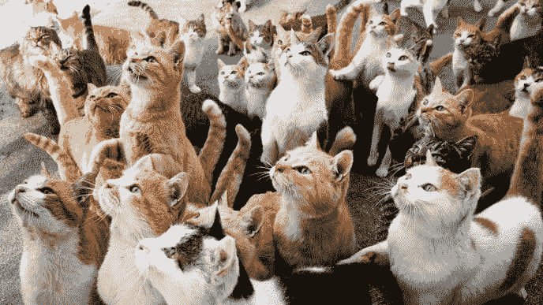

# 如何用 Python 中的 Yagmail 用几行代码发送电子邮件

> 原文：<https://medium.com/quick-code/how-to-send-emails-with-just-a-few-lines-of-code-with-yagmail-in-python-239f261585?source=collection_archive---------0----------------------->

在上一课中，[如何仅使用 Python 发送漂亮的带附件的电子邮件](https://letslearnabout.net/tutorial/how-to-send-beautiful-emails-with-attachments-using-only-python/)，我们构建了一个脚本来发送基于 HTML 的带附件的电子邮件。

如果你使用的是 gmail 账户，我们可以用 Gmail 的 STMP 客户端 [Yagmail](https://pypi.org/project/yagmail/) 大大简化我们的代码。

# 设置一切

我们将使用 Gmail 帐户发送电子邮件。首先，创建一个 Gmail 帐户(或使用您自己的帐户)，并在您的帐户中启用“不太安全的应用程序访问”。你可以在这里做:【https://myaccount.google.com/u/0/security?hl=en】T4&pli = 1

之后，你就大功告成了！用 Python 创建一个环境(我用 pipenv，所以用 *shell* 创建一个)，用 *pip 安装 yagmail 安装 yagmail* 就可以了！

# 我们的基本脚本

当我说 Yagmail 简化了我们的工作时，我不是在开玩笑。让我给你看看。

首先，创建一个 Python 文件。我的是 *yagmail_sender.py* 。

现在，写下以下内容:

这很清楚，不需要解释。

但是万一真的发生了:

*   像往常一样，我们声明我们的发件人和收件人电子邮件。也是用户输入的主题和密码。
*   然后，我们用登录的用户和密码创建一个 yagmail 实例。
*   最后一个变量 *contents* 是一个字符串列表。这是我们电子邮件的正文
*   然后我们向收件人 *receiver_email* 发送主题为 *contents* 中列出的邮件正文。

就是这样。这就是你所需要的:

# 向一组人发送电子邮件

你能想象如何将电子邮件发送到一系列电子邮件地址吗？

用新行替换旧行:

注意从单数到复数的变化。

是时候再次运行代码了:

名单上的每个收件人都收到了电子邮件！

> 声明:即使它是一个列表，它的行为也像 Python 中的集合。重复的邮件不会被发送两次。

# 添加附件

发送附件也非常简单。我不希望人们在评论中争吵，所以在这一张中，我将发送两张图片:一张是猫，另一张是狗。

在程序的同一个根目录下添加所需的文件，并添加绝对路径。以下是我的*内容*:

我使用的是 Windows 操作系统，所以我用反斜杠(' \ ')对路由进行了转义。

这就是我们所需要的。说真的。运行代码，您将在电子邮件中附加两个文件:

万一代码失败(我们失去了互联网连接，我们的密码是错误的，等等)，让我们用一个漂亮的 try/catch 来包装一切:

我们来介绍一个错误的密码:

很好，现在我们收到了一条通知我们出错的消息。

如果您不知道，这条消息与我们在使用:Yagmail 时得到的消息是一样的，正如您刚才看到的，它只是该库的一个包装器，极大地简化了代码。

# 结论

Yagmail 是 smtplib 库的一个包装器，帮助我们编写短小精悍的代码。问题是你只能用 Gmail 地址。

但是因为每个人都在使用它们，所以这不是问题，对吗？

如果您仍在使用 Hotmail 或其他电子邮件服务，您仍可以使用 *smtplib* Python 库。在此了解如何操作:

[如何只用 Python 发送漂亮的带附件的电子邮件(是的，还有猫的照片)](https://letslearnabout.net/tutorial/how-to-send-beautiful-emails-with-attachments-using-only-python/)

是的，我知道在看了邮件附件中的猫和狗的照片后，你想看到整个画面，而不是缩略图。你应得的:

Yagmail 包:【https://pypi.org/project/yagmail/ 

YAG mail docs:[https://build media . readthedocs . org/media/pdf/YAG mail/latest/YAG mail . pdf](https://buildmedia.readthedocs.org/media/pdf/yagmail/latest/yagmail.pdf)

[我的 Youtube 教程视频](https://www.youtube.com/channel/UC9OLm6YFRzr4yjlw4xNWYvg?sub_confirmation=1)[Github 上的最终代码](https://github.com/david1707/yagmail_sender) [在 Twitter 上联系我](https://twitter.com/DavidMM1707) [阅读更多教程](https://letslearnabout.net/category/tutorial/)

*原载于 2019 年 9 月 26 日*[*https://letslearnabout.net*](https://letslearnabout.net/tutorial/how-to-send-easily-emails-with-yagmail/)*。*