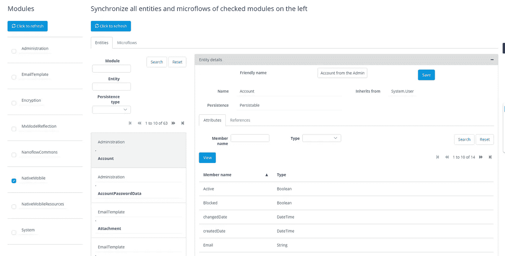
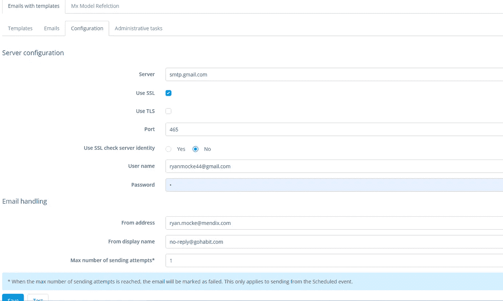
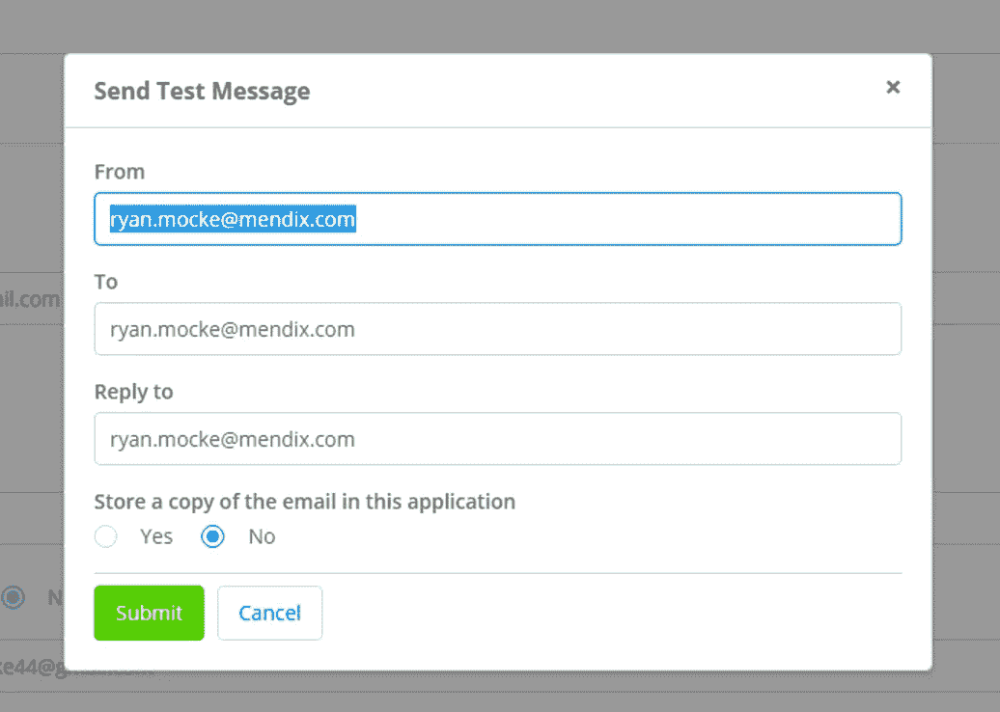
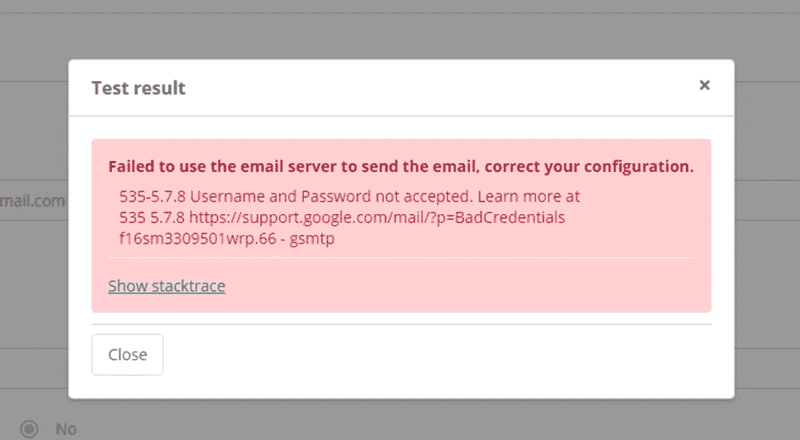
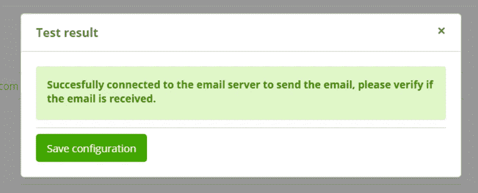
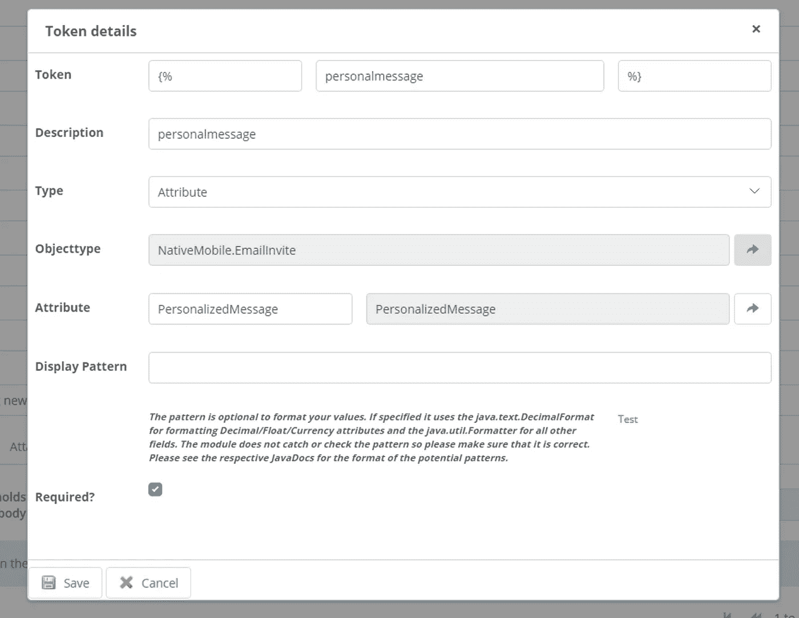

# 如何使用 MxModel 反射和电子邮件模块发送 HTML 电子邮件

> 原文：<https://medium.com/mendix/how-to-send-styled-html-emails-using-email-module-with-templates-and-mxmodel-reflection-mendix-3d80d18019b9?source=collection_archive---------0----------------------->

# 每天我都会收到 100 多封电子邮件。其中一些是重要的工作邮件，一些是我购物网站的广告，很大一部分是我用来注册我不信任的网站的一次性邮件地址。然而，在所有这些没完没了的电子邮件中，总有一些脱颖而出。如果你想让你的应用程序的电子邮件脱颖而出，视觉上吸引人、格式良好的电子邮件是必不可少的。

那么你是如何做到的呢？我发现最好的方法是结合使用带有模板的 Mendix [电子邮件模块](https://marketplace.mendix.com/link/component/259)和 [MxModel 反射模块](https://marketplace.mendix.com/link/component/69)。

# 为什么这样？

上次我检查的时候，在[市场](https://marketplace.mendix.com/)有超过 10 个邮件模块的结果。

那么，为什么我会选择这条路线呢？答案很简单:它快速、简单、可靠，并且带有一个内置概述，可以轻松配置和设计电子邮件。这个模块也消除了任何复杂的字符串处理的需要，以建立您的电子邮件。只需将您的令牌插入到电子邮件模板中，然后使用模型反射，您就可以用您的域模型的属性替换令牌，所有这些都是通过下载模块后提供的预配置示例来完成的。

# 设置依赖关系

将电子邮件模块下载到您想要的 Mendix 应用程序后，您会注意到控制台中出现一些错误。这是因为该模块同时依赖于 MxModel 反射和加密模块。要解决这些错误，只需下载并配置这两个模块。所需要做的就是将 MxModel 反射的代码片段包含在应用程序管理员可以访问的页面中。您还需要设置加密密钥常量，这可以在加密模块中找到。密钥的长度需要是 16 个字符，但除此之外就够了。

# 运行 MxModel 反射

一旦您的应用程序管理员可以访问此功能，他们可以导航到它，他们会看到一个类似这样的屏幕

在这里，您可以检查项目中的所有模块。选择包含您希望包含在电子邮件模板中的数据的模块，选择它并单击页面顶部的同步按钮

没有必要检查每个模块，只检查你需要的模块。将它们全部选中将意味着此操作需要更长的时间来完成，并且还会用不需要的数据填充您的数据库。

[https://bit.ly/MXW21](https://bit.ly/MXW21)

# 设置您的 SMTP 服务器

“SMTP 服务器是负责整个电子邮件发送过程的机器:这就是为什么要使用电子邮件客户端或软件发送邮件，首先需要配置正确的 **SMTP** 设置”

如上所述，如果不配置这一步，将不会发送电子邮件，所以要小心，因为密码或用户名的输入错误将导致每次都失败。

我发现测试这一点最简单的方法是使用 GMAIL 作为你的服务器。有些人不知道这一点，但每个 gmail 帐户都有内置的 SMTP 服务器。您可以通过启用“[不太安全的应用程序](https://support.google.com/accounts/answer/6010255?hl=en)”来利用这一点，如果您不允许这样做，gmail 将阻止任何从该应用程序发送电子邮件的请求，因为它不信任它。

启用后，您可以在电子邮件概述页面中输入 SMTP 服务器设置，如下所示:

> gmail 帐户的设置如下:
> 
> SMTP 服务器地址:**smtp.gmail.com**
> 
> SMTP 用户名:**您的完整 Gmail 地址(如 yourusername@gmail.com)**
> 
> SMTP 密码:**您的 Gmail 密码**
> 
> SMTP 端口(TLS):587
> 
> SMTP 端口(SSL): **465**

输入所有必需的详细信息后，您可以通过单击页面底部的测试按钮来测试您的配置。

这将打开一个弹出窗口，使您能够发送一封测试电子邮件，以检查它是否正常工作。

如果你做错了什么，你会看到这样的东西

如果你做对了，你会看到这样的信息

# 设置模板

既然你已经在发送邮件了，是时候改善它们的外观了。在我看来，有影响力的电子邮件是两件事的结合，数据和设计。再次导航到电子邮件概述，并转到模板选项卡。单击新建，给它一个唯一的名称，并根据需要配置发件人地址、抄送人和密件抄送人。填写主题行，然后我们可以专注于电子邮件正文。

我倾向于使用 HTML 电子邮件，因为你可以添加带有可点击链接的样式和按钮，但如果你愿意，你也可以使用纯文本。

填写你的邮件正文，最后一步是使用占位符将你想要的任何数据添加到你的邮件中。

为了包含数据，您需要创建一些标记或占位符。转到占位符选项卡并单击新建，在这里您可以通过设置标记和描述来构建占位符。

对于类型，您可以在属性或引用之间进行选择，我在这里选择了属性，但这在您实现中可能会有所不同。

接下来，通过使用引用选择器设置该数据来选择对象和属性。

其余的设置是可选的，除非有理由，否则可以跳过这些设置。

我的看起来是这样的:

# 最后一步

现在一切都配置好了，我们实际上可以创建一个微流来将它们发送给用户。该模块附带了一个名为“CreateAndSendEmail”的示例。我复制了它，并将其移动到我的 NativeMobile 模块中，以避免做出任何破坏性的更改。

该示例使用$order 和$customer 作为参数，因此我将它们更改为我的$EmailInfo 实体和$RecipientAccount 实体。

我还删除了作为参数的电子邮件模板，并在此流程中检索它，如果您愿意，可以跳过这一步，将模板作为参数传递。为了检索模板，我执行了一个 XPath 检索，并获得了满足以下条件的第一个模板:

[template name = ' my template name ']

您不需要在这里更改任何其他内容，但是我建议您在这里检查“ReplaceEmailTemplateTokens”Java 操作，因为您的参数可能已经更改。

你现在可以在任何你想要的地方调用这个微流！

## 阅读更多

 [## Mendix World 2021 |召集您的应用开发团队 2021 年 9 月 7 日至 9 日

### 好像你需要说服…在一个全球制造商社区，他们想通过探索什么来相互学习…

bit.ly](https://bit.ly/MXW21)  [## 曲目|门迪克斯世界 2021

### 在今年 Mendix World 开幕之前，手工制作您的议程。浏览专为您量身定制的 8 个专题讲座中的 85 个以上专题讲座…

www.mendix.com](https://www.mendix.com/mendix-world/tracks/) 

*   [https://docs . mendix . com/developer portal/deploy/sending-email](https://docs.mendix.com/developerportal/deploy/sending-email)
*   [https://docs . mendix . com/app store/modules/email-with-templates](https://docs.mendix.com/appstore/modules/email-with-templates)
*   【https://docs.mendix.com/appstore/modules/model-reflection 
*   [https://docs.mendix.com/appstore/modules/encryption](https://docs.mendix.com/appstore/modules/encryption)
*   [https://docs . mendix . com/developer portal/deploy/sending-email](https://docs.mendix.com/developerportal/deploy/sending-email)

*来自发布者-*

*如果你喜欢这篇文章，你可以在我们的* [*媒体页面*](https://medium.com/mendix) *或者我们自己的* [*社区博客网站*](https://developers.mendix.com/community-blog/) *找到更多喜欢的。*

*对于希望入门的创客，您可以注册一个* [*免费账户*](https://signup.mendix.com/link/signup/?source=direct) *，并通过我们的* [*学院*](https://academy.mendix.com/link/home) *获得即时学习。*

*有兴趣加入我们的社区吗？你可以加入我们的* [*懈怠社区频道*](https://join.slack.com/t/mendixcommunity/shared_invite/zt-hwhwkcxu-~59ywyjqHlUHXmrw5heqpQ) *或者想更多参与的人，看看加入我们的* [*遇见 ups*](https://developers.mendix.com/meetups/#meetupsNearYou) *。*