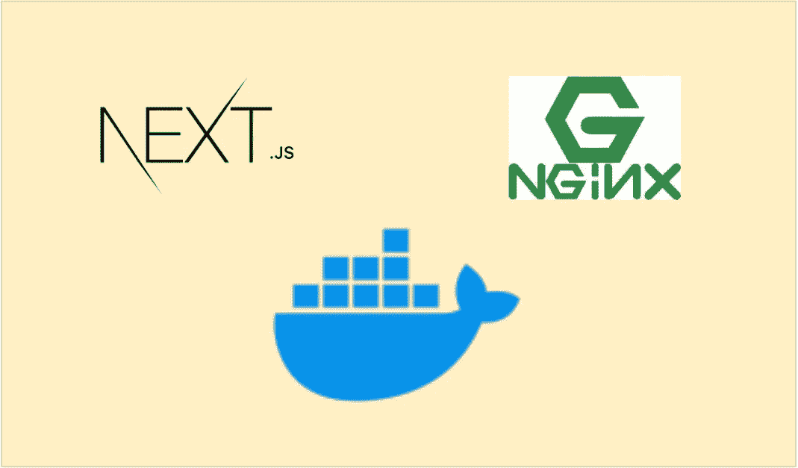

# 如何用 NGINX 和 Docker 服务 Next.js App

> 原文：<https://medium.com/bb-tutorials-and-thoughts/how-to-serve-next-js-app-with-nginx-and-docker-9821c3de72d?source=collection_archive---------0----------------------->

## 了解如何使用示例项目进行构建

我们有很多方法可以构建 Next.js 应用程序并交付生产。一种方法是用 NodeJS 或 Java 构建 Next.js，另一种方法是构建 Next.js 应用程序，并用 NGINX web 服务器提供静态内容。当我们用 NGINX 和 docker 构建时，我们不必处理服务器运行时或服务器…