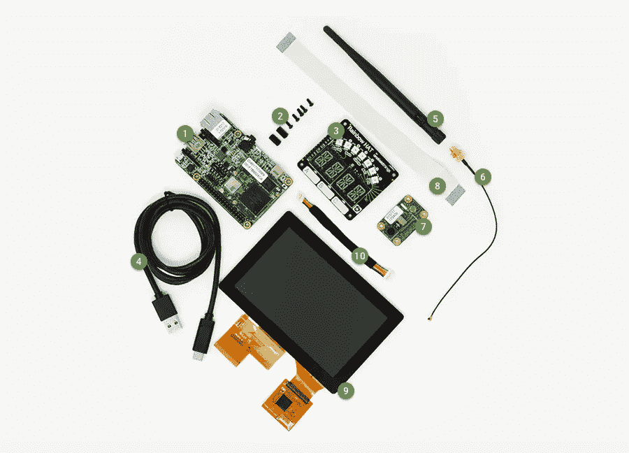

# 如何用 Pico Pro Maker Kit 设置 Android

> 原文：<https://medium.com/google-developer-experts/how-to-setup-android-things-with-pico-pro-maker-kit-d285c6400623?source=collection_archive---------1----------------------->

[Android Things](https://developer.android.com/things/index.html) 让你用现有的 Android 开发知识构建互联设备。

我刚刚在欧洲谷歌开发者日收到了我的 Pico Pro Maker 工具包。

它包括 wifi 功能、触摸屏、摄像头和更多功能！

你可以在网上购买: [technexion](https://www.technexion.com/solutions/iot-development-platform/android-things/) ，或者树莓 pi 3 也支持 Android Things。

下面的视频向你展示了如何在这个特殊的套件上加载 Android 的东西。

更多说明详情你可以在[这里](https://developer.android.com/things/hardware/imx7d-kit.html)找到。