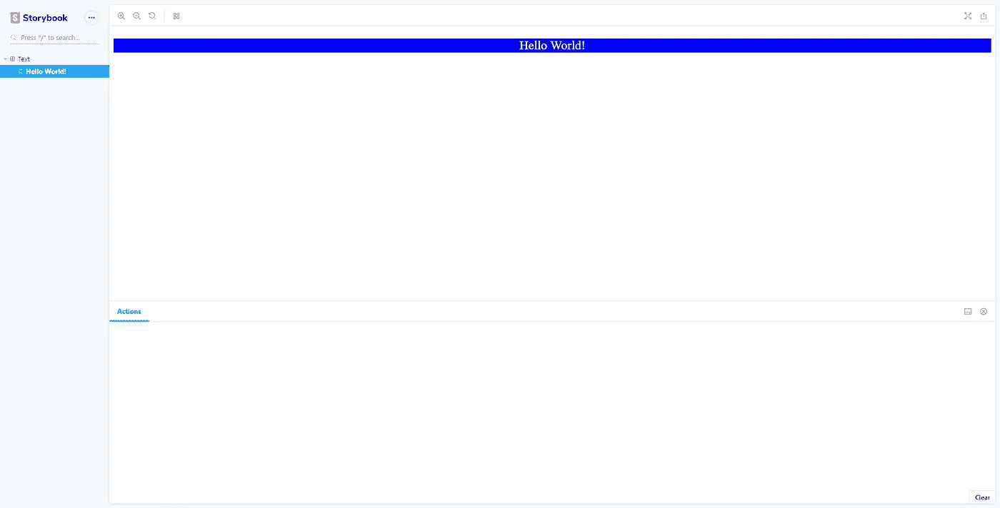

# 如何设置 React 组件开发环境

> 原文：<https://medium.com/quick-code/how-to-setup-environment-for-developing-react-components-a2633e743cac?source=collection_archive---------1----------------------->


## 并将它们发布为 npm 包

在本文中，我将:

*   介绍我在开发 React 组件时使用的特定环境
*   显示如何将组件发布为 npm 包

## 但是首先…

在我们开始之前。让我们看看为什么我们不使用 **create-react-app** 或类似的样板文件生成器。而 **create-react-app** 则提供了一种快速、舒适的方式来启动和运行我们的应用。这不是我们现在需要的。我们不想将我们的组件发布为 web 应用程序。我们希望将其发布为一个文件，任何人都可以通过简单的导入来使用它。换句话说。我们的输出应该是包含运行组件的代码的 javascript 文件。现在让我们一步一步解决所有的挑战吧！

## 对于懒惰的读者

我明白了。不是每个人都对阅读整篇文章感兴趣。如果你想看看最终版本，这里有 [GitHub 回购！](https://github.com/codewithbernard/react-component-dev-env)

## 设置开发环境

正如我提到的，我们需要环境来测试我们的组件是否正常工作。有多种方法可以解决这个问题。在我们的例子中，我们将使用[故事书](https://github.com/storybooks/storybook/tree/next/app/react)。

> React 故事书是 React 组件的 UI 开发环境。有了它，您可以可视化 UI 组件的不同状态，并以交互方式开发它们。

听起来像是我们的工具，不是吗？让我们继续创建我们的项目目录。并安装所有需要的依赖项。

```
mkdir react-component-dev-env
cd react-component-dev-env
npm init
```

为了简化，请按 enter 键，直到您摆脱终端提示符。现在安装依赖项并配置故事书。

```
npx -p @storybook/cli sb init
npm install -D @babel/cli babel-preset-minify
```

这就是我们的依赖。有一点看起来很奇怪，那就是我们没有安装 React。因为既然我们写的是 React 组件。我们希望用户已经安装了 React。我们可以通过在我们的`package.json`中添加对等依赖来做到这一点。结果会是这样的。我知道我们安装了一堆东西，现在可能看起来很混乱，但是相信我。当你继续阅读时，一切都会变得有意义。

是时候编写组件了。既然这是关于如何设置环境的教程，我们将创建一个非常简单的组件。在`src`里面创建这样的`index.js`文件

在同一个目录下创建`style.css`

我们的组件准备好了。现在让我们为它写一个故事来测试它。打开`stories`目录下的`index.stories.js`。为它写一个故事。很明显我们会导入 React。我们将使用`storiesOf`助手函数，将一个故事添加到我们的 storybook 实例中。最后，我们将导入我们的组件。

让我们通过运行下面的命令来测试它。

```
npm run storybook
```

您应该会看到下面的屏幕。现在，如果我们改变我们的组件，我们的改变将立即反映在故事书中。*设置开发环境？* ***检查！***



## 将组件发布为 npm 包

发布组件就像运行`npm publish`一样简单，但是我们需要确保只发布必要的文件。我们不希望`stories`和其他文件或目录被公布。我们可以通过将文件`.npmignore`添加到项目的根目录来实现这一点。并指定我们希望在发布时忽略的所有文件。它可能看起来像这样

你可能会问我们到底要出版什么，我现在就透露。我们想拿下整个`src`目录。将其转换、缩小并保存在`dist`目录中。我们将使用[巴别塔](https://babeljs.io/)来为我们做到这一点。你应该记得。我们三分钟前安装的。来配置巴别塔。我们需要在根目录下创建一个名为`.babelrc`的文件。你可以在这里阅读更多关于预置[的内容！](https://babeljs.io/docs/en/presets)

传输我们的代码现在非常简单。该命令是说获取整个`src`目录，将其转换并把输出放入`dist`目录。也复制文件资产，如 css 或图像。

```
babel src -d dist --copy-files
```

我们希望在发布包之前完成这个操作，所以我们将利用`prepublishOnly`脚本来完成这个任务。我们已经在`package.json`中有了它，但是为了不在这里滚动，它是。

现在我们准备出版。显然，你需要 [npm](https://www.npmjs.com/) 账户来解决这个问题。如果你没有，你可以免费创建一个。创建帐户后，在项目目录中运行`npm login`。使用您的凭证登录并运行`npm publish`。当该命令运行时，它将执行`prepublishOnly`脚本，该脚本将创建带有`index.js`和`index.css`的`dist`。让我们再看一次`package.json`。看我们怎么指定`main`指向`dist/index.js`？这是我们的说法。如果您导入这个包，这就是您将得到的文件。

## 就是这样！

我们成功了！我们配置我们的环境。写了一个简单的组件。并打包出版。现在我知道它非常简单，而且没有人会使用它。但是我想在实际开发组件本身之前展示这个设置。这将在下一篇文章中介绍！

感谢您的关注。如果你喜欢这个故事，并且你学到了新的东西，请鼓掌让世界知道。如果你想看到更多点击“关注”按钮。我每周都在创建这样的教程。如果您不熟悉 react，我有一系列教程可以帮助您入门。你可以在这里查看 https://medium.com/@bernardbad。再次感谢您的关注，下次再见。