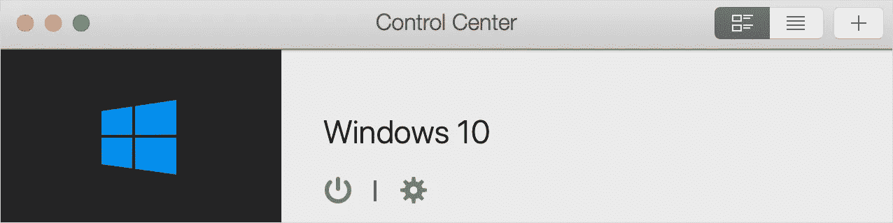
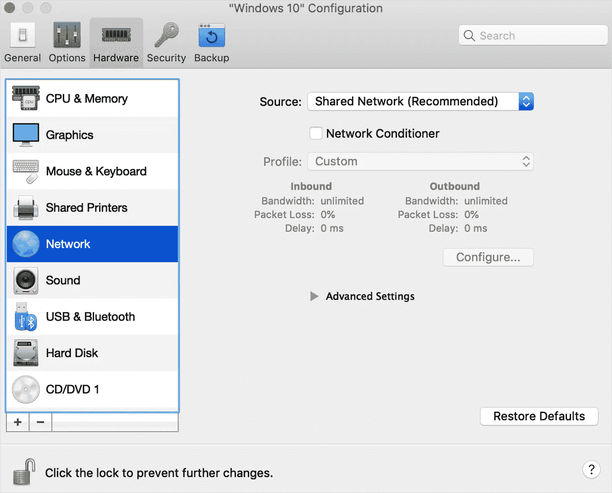
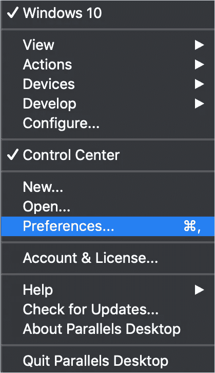
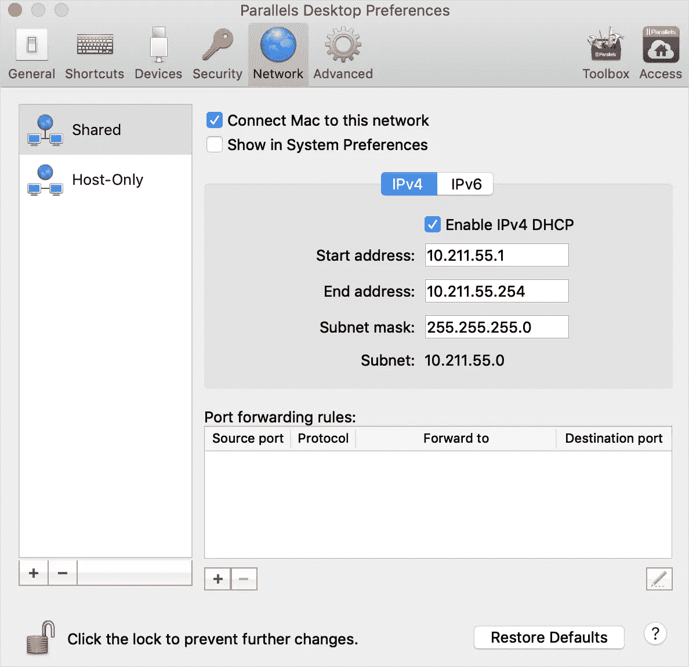
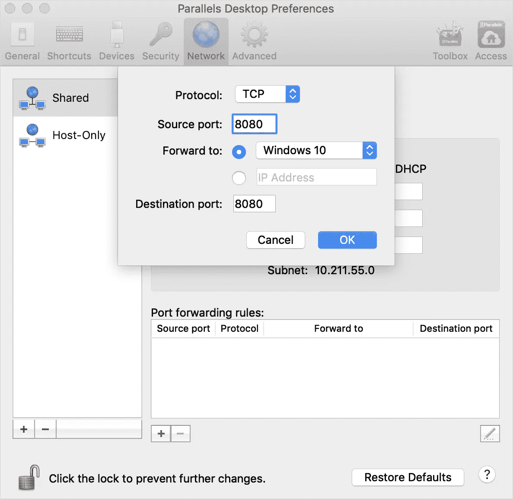
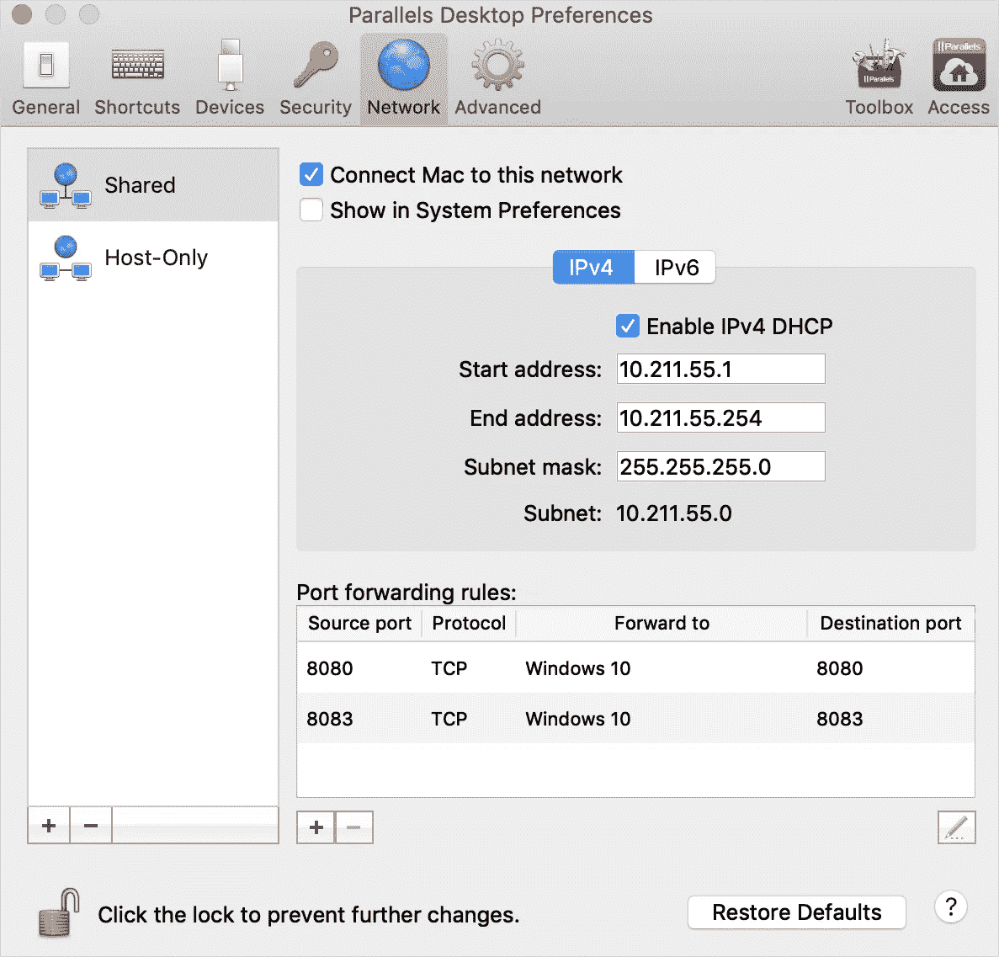

# 如何在 Mac 上设置 Mendix Studio Pro

> 原文：<https://medium.com/mendix/how-to-setup-mendix-studio-pro-on-mac-cc7b8528b2b2?source=collection_archive---------0----------------------->

# 我的一生都是电脑大师赛的一部分。因此，当我第一次得到一台 Mac book 时，我有点不知道如何在上面设置 Studio pro。不幸的是，目前 Studio Pro 没有标准的 Mac 选项。幸运的是，使用像 Parallels 这样的虚拟机，实际上非常容易。

所以，是的，正如你可能已经猜到的，现在还没有 mac 版的 Studio pro 可用，所以现在，低级程序员将不得不使用虚拟机在他们的 Mac 或 Linux 机器上运行 windows。

当谈到运行虚拟机时，有很多选项，但因为它的设置相对简单，我选择使用 [Parallels](https://www.parallels.com/uk/products/desktop/) 。

# 在 Mac 上安装和设置 Parallels。

它可以从 [Mac 应用商店](https://apps.apple.com/gb/app/parallels-desktop/id1085114709?mt=12)获得，或者你可以在上面链接的他们的官方网站上找到它。下载完成后，只需按照提示完成安装。然而，如果出现任何问题或您不确定如何继续，您可以随时参考 Parallels 撰写的本[安装指南](https://www.parallels.com/blogs/install-windows-10-parallels-desktop/)，了解如何从头到尾安装。

需要注意的是，要使其正常工作，您需要 Parallels 的 Pro 版本(因此您可能需要付费),并且一旦 windows 安装在虚拟机上，您将需要使用许可证激活 windows 10 的副本。你可以在这里了解更多信息:[激活 windows 10 许可](https://support.microsoft.com/en-us/windows/activate-windows-10-c39005d4-95ee-b91e-b399-2820fda32227)

[https://bit.ly/MXW21](https://bit.ly/MXW21)

# 在 Parallels for Mendix 中配置端口转发

一旦一切都设置好了，在你可以在 studio pro 中安装并正确运行你的应用程序之前，只需要几个步骤。

以下是从 [Mendix 文档](https://docs.mendix.com/howto/mobile/using-mendix-studio-pro-on-a-mac#3-configuring-your-windows-virtual-machine-for-mendix-studio-pro)中配置端口转发的几个步骤:

1.  打开 Parallels **控制中心**:

2.点击**齿轮**图标打开**配置面板**和导航到**硬件**选项卡，从左侧面板选择**网络**:

3.确保**源**设置为**共享网络**。

4.确保**入站**带宽和**出站**带宽都显示**无限制**。

如果不是这样，要么启用**网络调节器**并将其设置为不限制带宽的配置文件，要么单击**选项**选项卡，然后单击**优化**窗格，以便将**资源使用**设置为**无限制**。

5.在 Parallels 下拉菜单中，选择**首选项**:

6.导航到**网络**选项卡，从左侧面板中选择**共享**:

7.点击 **+** 按钮，**添加两个端口:一个用于 8080，一个用于 8083，都转发到您的 Windows 虚拟机**(8083 端口只在开发原生移动应用时需要):

添加这两个端口后，您的**端口转发规则**应该如下所示:

# 安装 Studio Pro

现在你有了-

*   下载并设置 Parallels✅
*   在虚拟 machine✅中激活您的 windows 许可证
*   已配置端口转发，以便在本地 environments✅上进行测试

剩下的就是安装 Studio pro 本身并开始构建。对于任何也是 Mendix 新手，并且不确定如何继续的人，在本系列的早些时候，我写了一个关于如何安装 studio pro 的指南。

# 最后的想法

现在，你可以拥有两个世界的最佳选择，通过 Mac 的滑动功能和 Window 的通用兼容性轻松导航。诚然，在我尝试之前，我是持怀疑态度的，但一旦它的设置，我给它一个 10/10 的工作机器设置。

需要记住的是，如果您正在使用 [Make it Native](https://play.google.com/store/apps/details?id=com.mendix.developerapp&hl=en&gl=US) 应用测试原生移动应用，您可能需要手动输入本地网络的虚拟机 IP 地址，而不是在 studio pro 中扫描二维码。然而自从我得到 parallels desktop 16 更新后，这个问题似乎已经解决了。

*如果你或你的公司想请求一个专门为你制作的定制指南，请联系我*[*@ Ryan M*](https://medium.com/ep/profile/1gg9uA1iUgdDmqkTo2qowQL4SaAjX9zsQB2MwWT9HmlrDYiKilBr)*或在* [*Mendix 社区 slack 频道*](https://join.slack.com/t/mendixcommunity/shared_invite/zt-hwhwkcxu-~59ywyjqHlUHXmrw5heqpQ) 中寻找我

## 阅读更多

 [## Mendix World 2021 |召集您的应用开发团队 2021 年 9 月 7 日至 9 日

### 好像你需要说服…在一个全球制造商社区，他们想通过探索什么来相互学习…

bit.ly](https://bit.ly/MXW21) 

*来自发布者-*

*如果你喜欢这篇文章，你可以在我们的* [*媒体页面*](https://medium.com/mendix) *或我们自己的* [*社区博客网站*](https://developers.mendix.com/community-blog/) *找到更多类似的文章。*

*希望入门的创客，可以注册一个* [*免费账号*](https://developers.mendix.com/meetups/#meetupsNearYou) *，通过我们的* [*学苑*](https://academy.mendix.com/link/home) *即时获取学习。*

有兴趣更多地参与我们的社区吗？你可以加入我们的 [*slack 社区频道*](https://join.slack.com/t/mendixcommunity/shared_invite/zt-hwhwkcxu-~59ywyjqHlUHXmrw5heqpQ) *或者那些想更多参与的人，看看加入我们的* [*聚会*](https://developers.mendix.com/meetups/#meetupsNearYou) *。*