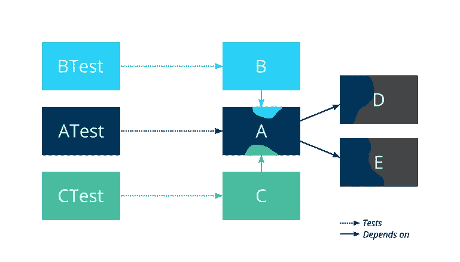
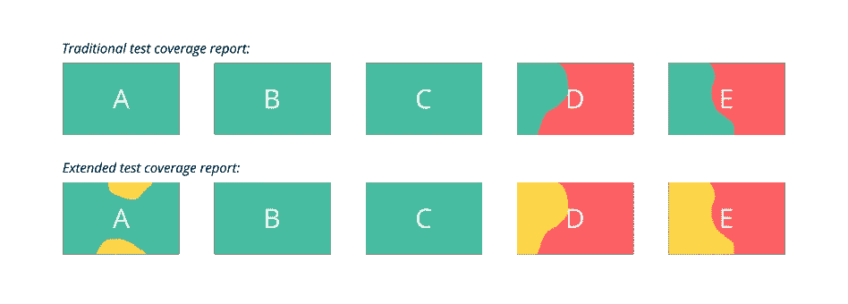

# 如何提高你的单元测试

> 原文：<https://medium.com/compendium/how-to-sharpen-your-unit-tests-58ee01329f15?source=collection_archive---------6----------------------->

当我在做我的爱好项目时，我尽可能地遵循 TDD 的原则。在我实现一个新的特性或者改变一个现有的特性之前编写一个失败的单元测试就是这些原则之一。我还跟踪测试覆盖率以确保没有小故障，尽管我不得不说我不像关心突变覆盖率那样关心行覆盖率。然而，经常发生的是，我的单元测试变得有点“模糊”:类 A 上的单元测试应该驻留在测试类 a test 中，但经常发现类 A 中的一些功能被测试类 BTest 和 CTest 中的单元测试所覆盖，或者说 ATest 中的单元测试只通过类 A，而实际上只测试类 D 或 E 中的功能。

Illustration of how unit tests in ATest test most of A, but also a little bit of D and E, while some parts of A are covered by BTest and CTest. Of course, things are much more complex in real projects.

单元测试变得模糊不清的原因有很多。一个原因可能是类 A 中的一些功能很难直接测试，但通过类 b 测试很容易。另一个原因可能是一些功能需要通过类 c 进行一些设置。结果，单元测试分别在测试类 BTest 和 CTest 中结束，即使它们实际上是类 A 上的单元测试。

这是另一个原因:您在 CTest 中编写了一个单元测试来测试 C 中的一些功能，但是作为副作用，它碰巧也测试了类 A 中的一些功能。结果，类 A 的一部分似乎已经包含在测试覆盖报告中，所以您没有意识到 A 上的一些单元测试现在位于测试类 CTest 中。

最后，一个非常常见的原因，但也是在没有正确工具的情况下处理起来非常棘手的情况:您开始时只有一个类 A，但它变得太大了，所以您提取了两个新的类 D 和 e。幸运的是，您有很好的测试覆盖率，所以源代码的重构，包括两个类的提取，并不是很大的风险。接下来，您还将显然只测试类 D 和 E 中功能的单元测试转移到了新创建的测试类 d test 和 ETest 中。但是并不是所有的单元测试都在 A 类、D 类和/或 E 类之间划分得那么清楚，所以它们仍然处于测试阶段，当然如果它们继续使用 A 类的接口作为它们进入源代码的主要入口的话。

当然，只要您的测试覆盖率足够高，并且您的单元测试足够接近他们正在测试的功能，这就不是一个大问题。测试类 BTest 中的单元测试依赖于类 A 中的源代码也不是问题，因为类 B 依赖于它。在大多数情况下，它就是需要这样。问题是当类 A 中的部分源代码只被测试类 BTest 中的单元测试覆盖时。我喜欢这样，如果我在类 A 中犯了一个错误，比如在重构它的时候，测试类 ATest 中至少有一个单元测试会失败。其他测试类中的单元测试也可能开始失败，因为它们依赖于类 A 中的功能，但是类 A 中的一个 bug 应该总是对测试类 ATest 中的至少一个单元测试产生影响。

如果 A 类是你唯一学习的一个类，那么找出你在哪一个类中犯了错误就不是问题。然而，如果您已经对类 A、B、C 和 D 进行了更改，那么您可以假设类 B 和 D 很可能是好的，因为只有测试类 ATest 和 CTest 有单元测试失败。当然，从理论上讲，您仍然有可能在 B 类中创建了一个偷偷摸摸的问题，它以某种方式绕过了测试类 BTest 中的单元测试，而没有通过测试类 ATest 和 CTest 中的几个单元测试。或者可能真正的问题是测试类 BTest 中的一个单元测试不正确，这也是一种可能性。但那真的应该是极少数的例外。

那么，如何避免您的测试类开始模糊到相邻的类中呢？据我所知，测试覆盖报告工具目前还没有现成的支持来表明 A 类在多大程度上被测试类 ATest 中的单元测试所覆盖。我希望有一个扩展，不仅显示源代码的哪些部分没有被覆盖(红色)，哪些部分被覆盖(绿色)，而且显示哪些部分被“正确的”测试类覆盖(绿色)，哪些部分被其他测试类覆盖(琥珀色)。哪一个单元测试类对哪一个源代码类是“正确的”,这可能取决于惯例、注释或任何最有效的东西。我的简单规则是给源代码类名加上后缀“Test”。

Feature request for an extension to test coverage reports: at the top how a traditional test coverage report would present the situation from the illustration at the beginning of the article, and at the bottom how I would like to see it reported.

但是在缺乏对这种特性的支持的情况下，人们总是可以尝试编写几个脚本来获得相同的结果。当在 Linux 机器上的 Java Maven 项目中使用突变测试工具 [PITEST](https://pitest.org) 时，我已经这样做了。结果可以在 GitHub 上一个名为 [sharpen_pitest](https://github.com/filipvanlaenen/sharpen_pitest) 的存储库中找到。对于我从事的小爱好项目来说，它工作得非常好，并且当我用它运行老项目时，给了我一些惊喜。到目前为止最重要的教训:这是惊人的——也是可怕的——在一个小小的爱好项目中，你可以有多么混乱，即使你正在尽最大努力编写单元测试，并疯狂地检查测试覆盖报告，以确保没有源代码被发现。只要确保所有的单元测试都在正确的测试类中，并且源代码不仅被单元测试覆盖，而且被正确的测试类中的单元测试覆盖，也可以提高单元测试的质量。为什么？我认为这是因为在测试类 ATest 中为类 A 编写单元测试也迫使你根据类 A 的抽象级别来考虑你想要测试的功能。