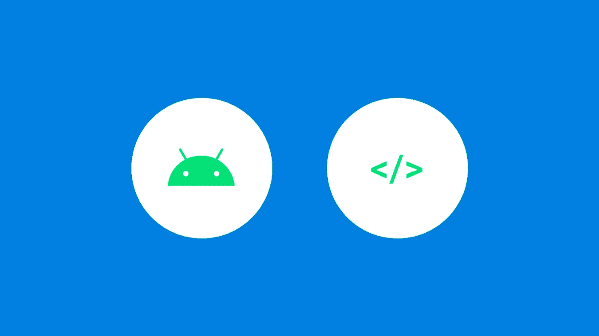

# 如何简化你的 Android 视图绑定委托

> 原文：<https://medium.easyread.co/how-to-simplify-your-android-view-binding-delegation-d07812b2a616?source=collection_archive---------0----------------------->

## 什么是 Android 视图绑定，如何简化其委托？



[*视图绑定*](https://developer.android.com/topic/libraries/view-binding) 是 Android [Jetpack](https://developer.android.com/jetpack) 的一部分。视图绑定是在 Google IO/19 的 Android Talk 上推出的。下面我们来详细了解一下。

# 什么是视图绑定？

正如他们的[开发者页面](https://developer.android.com/topic/libraries/view-binding)上所说，

> *视图绑定*是一个特性，它允许你更容易地编写与视图交互的代码。一旦在模块中启用了视图绑定，它就会为该模块中出现的每个 XML 布局文件生成一个*绑定类*。绑定类的实例包含对在相应布局中具有 ID 的所有视图的直接引用。

在大多数情况下，视图绑定取代了`**findViewById**`。

# 我们为什么需要它？

当我们使用`**findViewById**`时，我们需要声明 x 次我们需要使用的视图变量。它在您的视图活动/片段中生成了许多样板代码。这就是为什么视图绑定提供了一种只需初始化一个变量就能访问所有视图的好方法。

这就是我们如何使用`**findViewById**`:

这就是我们使用视图绑定的方式:

看出区别了吗？

是的，您只从生成的视图绑定类中声明绑定变量。您可以从绑定变量中访问所有的视图 id。使用视图绑定的其他优势包括:

类型安全:视图绑定提供了一个与 XML 布局中定义的类型相同的生成方法。所以不要再打字了。

**空安全:** `**findViewById**`也不是空安全。如果您正在使用 Kotlin，它将省去您检查所有空变量的痛苦。相反，对于 Java 用户来说，这将使他们抓起键盘，对着显示器猛敲:D

# 如何使用视图绑定？

1.  在您的`**app/build.gradle**`上启用`**viewBinding**`功能:

```
android {
    ....
    buildFeatures {
        viewBinding true
    }
}
```

2.之后，只需创建一个 XML 布局。例如，创建一个***activity _ sample . XML .***

3.然后，它将自动生成绑定类，并作为`**ActivitySampleBinding**`类被访问。根据记录，如果您不希望 XML 布局自动生成，您可以将`**tools:viewBindingIgnore="true"**`添加到您的根布局中:

```
<LinearLayout
        ...
        **tools:viewBindingIgnore="true"** >
    ...
</LinearLayout>
```

4.之后，用你的布局充气机给你的`**ActivitySampleBinding**`类充气。

5.在您的片段中，在您的 *onCreateView* 中设置绑定膨胀器，并返回 *binding.root* 。这里 可以看到完整的例子 [**。**](https://github.com/android/architecture-components-samples/tree/b60849d63260fd1d1bca1af8f28791d431644812/ViewBindingSample/app/src/main/java/com/android/example/viewbindingsample)

6.访问您的视图，您可以这样做:

```
**binding.tvTitle.text** = getString(R.string.sample_title)**binding.btnSample.setOnClickListener** {
   showMessage("Sample Button Clicked")
}
```

PS:如果您的视图 id 使用了 *under_score* ，它将被生成为 *camelCase* 变量。

7.仅此而已。使用视图绑定设置视图的工作已经完成。

# 现在，下一个问题是，如何只用一行代码就做出有约束力的委托？

Kotlin 是一种非凡的语言，要用一行代码实现绑定委托，我们需要使用 Kotlin 属性之一。是科特林地产的代表们。[见此处解释](https://jamie.sanson.dev/blog/handing-the-reins-to-kotlin-delegates-part-1-what-and-why/)。

我创建这个库来帮助我实现一行委托，它是使用 Kotlin 属性委托构建的，并与 Kotlin 扩展函数相结合。因此，在您的视图中不再有视图绑定委托的样板文件。看这里的图书馆。

[](https://github.com/yogacp/android-viewbinding) [## yogacp/android-viewbinding

### 一个简单的库来简化你的 Android 应用程序中的视图绑定委托

github.com](https://github.com/yogacp/android-viewbinding) 

# 添加依赖关系:

将此添加到您的构建中。gradle:

```
allprojects {
   repositories {
      ...
      **maven { url 'https://jitpack.io' }**
   }
}
```

在您的 app/build.gradle 中启用 viewbinding:

```
android {
    ....
    buildFeatures {
        viewBinding true
    }
}
```

之后，在您的 app/build.gradle 中添加依赖项:

```
dependencies {
    ....
    **implementation 'com.github.yogacp:android-viewbinding:x.x.x'**
}
```

# 如何使用图书馆

1.  假设我们仍然有上面的 XML 布局，***activity _ sample . XML .***
2.  在您的活动中，只需在绑定变量的末尾添加`**by viewBinding()**`

3.例如，在您的片段中，您创建了一个 XML 布局***Fragment _ sample . XML***。下面是如何委托绑定变量:

仅此而已。您可以通过 view binding()delegation***调用 ***来访问您的视图绑定。******

# 结论

视图绑定会给你的视图提供**无效安全**和**类型安全**。不再需要每次在活动/片段中需要类型转换。

此外，Android ViewBinding 库将为您提供与视图绑定文档中相同的行为，但是在您的活动/片段中使用的代码要少得多。这个图书馆仍在维护中。目前，版本是 **1.0.1** ，里面仍然有一个待办事项列表。我会在不久的将来做这件事。

最后但同样重要的是，一如既往地欢迎评论/建议。不断学习，不断分享。

**保持健康快乐编码:)**

# 参考资料:

[](https://developer.android.com/topic/libraries/view-binding) [## 查看绑定| Android 开发者

### 视图绑定是一个允许您更容易地编写与视图交互的代码的特性。一旦视图绑定被…

developer.android.com](https://developer.android.com/topic/libraries/view-binding) [](https://github.com/android/architecture-components-samples/tree/b60849d63260fd1d1bca1af8f28791d431644812/ViewBindingSample/app/src/main/java/com/android/example/viewbindingsample) [## Android/架构-组件-示例

### 此时您不能执行该操作。您已使用另一个标签页或窗口登录。您已在另一个选项卡中注销，或者…

github.com](https://github.com/android/architecture-components-samples/tree/b60849d63260fd1d1bca1af8f28791d431644812/ViewBindingSample/app/src/main/java/com/android/example/viewbindingsample) [](https://proandroiddev.com/new-in-android-viewbindings-the-difference-from-databinding-library-bef5945baf5e) [## Android 中的新功能:视图绑定。与数据绑定库的区别。

### 不，它们不一样，即使名字听起来很相似。视图绑定是在新特性中引入的…

proandroiddev.com](https://proandroiddev.com/new-in-android-viewbindings-the-difference-from-databinding-library-bef5945baf5e) [](https://medium.com/@Zhuinden/simple-one-liner-viewbinding-in-fragments-and-activities-with-kotlin-961430c6c07c) [## 使用 Kotlin 在片段和活动中进行简单的单行视图绑定

### Android Studio 3.6 中有一个新功能叫做“视图绑定”。这就像数据绑定，除了它所做的只是…

medium.com](https://medium.com/@Zhuinden/simple-one-liner-viewbinding-in-fragments-and-activities-with-kotlin-961430c6c07c)