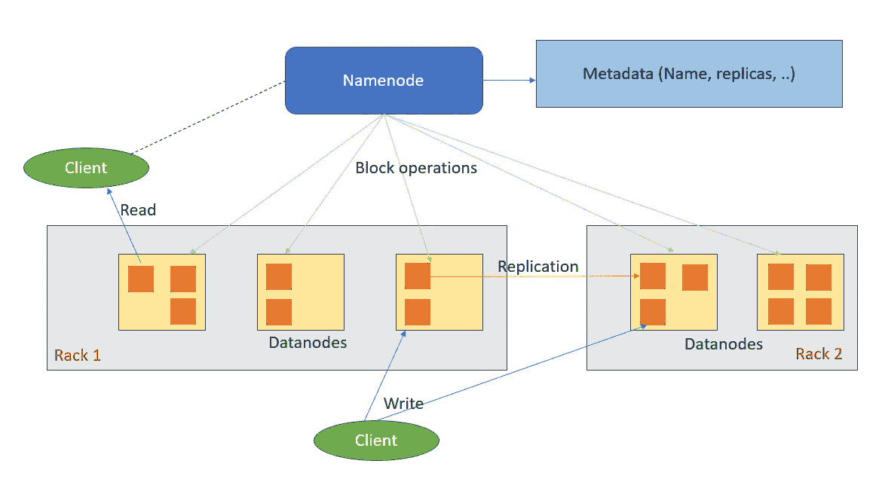
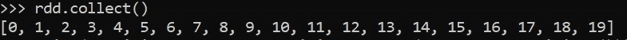
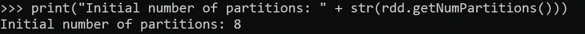
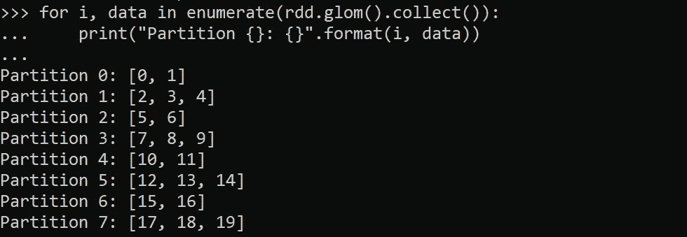
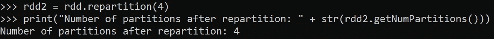
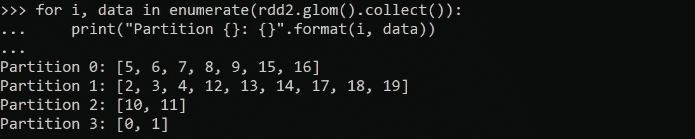
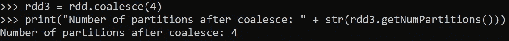
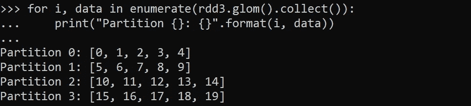
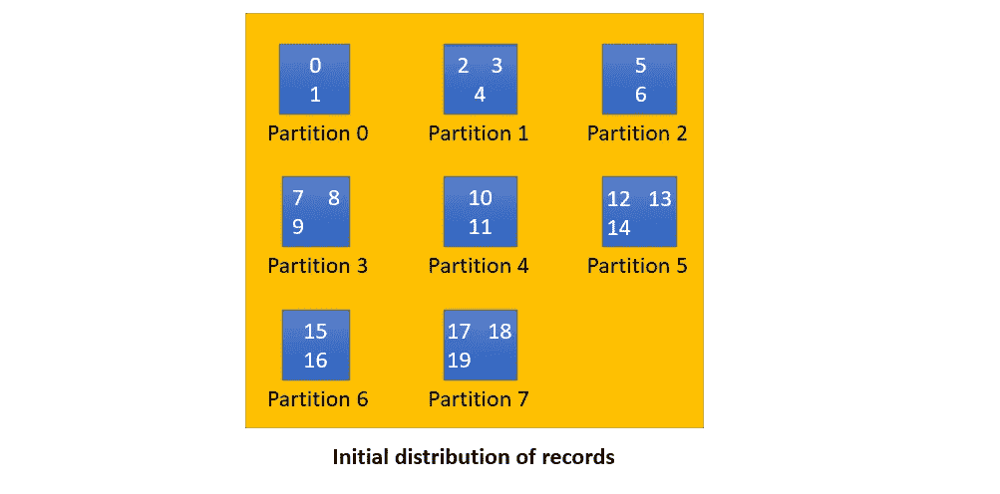
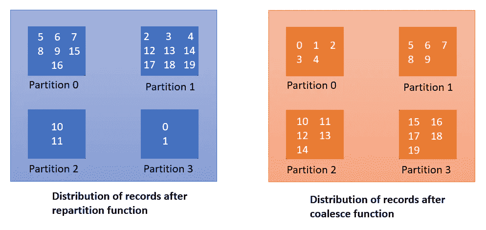

# 如何解决 Spark 中的“大量小文件”问题

> 原文：<https://medium.com/globant/how-to-solve-a-large-number-of-small-files-problem-in-spark-21f819eb36d3?source=collection_archive---------0----------------------->

## “大量小文件”问题的解决方案


Photo by [Tim Wildsmith](https://unsplash.com/@timwildsmith?utm_source=medium&utm_medium=referral) on [Unsplash](https://unsplash.com?utm_source=medium&utm_medium=referral)

B [**ig 数据**](https://en.wikipedia.org/wiki/Big_data) 不再是流行语，因为每个人都知道数据的力量和它能做什么。 [**Spark**](https://spark.apache.org/) 是处理大数据的健壮框架。与传统的数据处理框架相比，它有许多优点，但也有一些局限性。一个最大的限制是，当使用像 HDFS、AWS S3 等对象存储系统时，它将输出存储在许多小文件中。这是因为 Spark 是一个并行处理框架，当并行任务处理数据时，它们将输出存储在跨分区的多个文件中。所以假设你的 Spark 应用有 200 个并行任务和 10 个分区；然后 Spark 应用程序可能会将结果存储到 *200 * 10 = 2000* 文件中。每天多次运行此作业将在对象存储中创建更多文件。这就是 Spark 中所谓的**大量小文件**问题。

在这篇文章中，我将解释解决这个问题的不同方法。本文将帮助数据工程师优化 Spark 应用程序的输出存储。

# 为什么我们认为**【大量小文件】**是个问题？

以下是我们认为“大量小文件”是一个问题的一些原因。

*   [**名称节点**](https://hadoop.apache.org/docs/r1.2.1/hdfs_design.html#NameNode+and+DataNodes) **开销**
    在 [HDFS](https://hadoop.apache.org/docs/r1.2.1/hdfs_design.html) 中，文件被拆分成块存储并复制在[数据节点](https://hadoop.apache.org/docs/r1.2.1/hdfs_design.html#NameNode+and+DataNodes)上。每个块的大小为 128 MB，并且每个块都有与之相关联的元数据。HDFS 命名空间树和相关的元数据作为对象保存在 NameNode 的主内存中，每个对象大约占用 150 个字节。因此，名称节点必须管理这些对象，并为读/写请求提供服务。大量的小块增加了名称节点的开销。当 Spark 应用程序从 HDFS 读取数据时，它必须为更多的块读取请求提供服务。见下图，它很好地说明了 HDFS 建筑。



HDFS Architecture

*   **增加查询执行的元数据开销**
    将小文件写入对象存储非常简单，但是对它们的查询会运行得非常慢或者无法完成。查询许多小文件会导致读取元数据、执行非连续磁盘寻道、打开文件、关闭文件并重复的开销。每个文件的开销只有几毫秒，但是当您查询数百万个文件时，这些毫秒会累积起来。 [Hive](https://hive.apache.org/) 是查询存储在 [HDFS](https://hadoop.apache.org/docs/r1.2.1/hdfs_design.html) 中文件的优秀工具。它是建立在 HDFS 之上的数据仓库解决方案。它支持写模式、分区和索引数据来加速查询，但是当我们在 HDFS 有大量小文件时，这些都不起作用。
*   **查询性能不足是因为** [**数据偏斜**](https://www.unraveldata.com/common-failures-slowdowns-part-ii/#:~:text=the%20application%20increases.-,What%20is%20Data%20Skew%3F,-In%20an%20ideal)
    数据偏斜会妨碍查询性能。当执行一个查询时，Spark 试图将相等的工作负载分配给所有任务。当 Spark 执行一个查询时，特定的任务可能会得到许多小文件，而其余的任务可能会得到大文件。例如，200 个任务处理 3 到 4 个大文件，2 个任务处理 1000 个小文件。这两个任务比其他 200 个任务需要更多的时间来完成处理。这就是查询性能受到影响的原因。

# “大量小文件”问题的解决方案

我们讨论了大量小文件如何影响应用程序的集群和性能。解决这个问题有不同的方法。

*   我们可以降低应用程序的并行性，以减少小文件的数量。
*   此外，我们可以在将数据帧写入对象存储之前对其进行优化。

让我们看看如何实施这些解决方案…

## **减少并行度**

当执行 Spark 应用程序时，它会创建一个 [DAG](https://www.projectpro.io/recipes/what-is-dag-apache-spark) 。然后 [DAG 调度器](https://books.japila.pl/apache-spark-internals/scheduler/DAGScheduler/)创建阶段，这些阶段被进一步分成几个任务。任务是发送给执行者的工作单元。[任务调度器](https://books.japila.pl/apache-spark-internals/scheduler/TaskScheduler/)在执行器上调度任务执行。每个阶段都有一些任务，每个[混洗分区](https://sparkbyexamples.com/spark/spark-shuffle-partitions/#:~:text=What%20is%20Spark%20Shuffle%3F)有一个任务。同样的任务在 RDD 的不同分区完成。每个任务处理每个混洗分区。

随机分区的数量取决于两个属性。

*   `spark.default.parallelism`
*   `spark.sql.shuffle.partitions`

`spark.default.parallelism`房产是用`[RDD](https://spark.apache.org/docs/latest/rdd-programming-guide.html)`引进的，因此该房产只适用于 RDD。此属性定义创建 RDD 时创建的分区的初始数量。此配置的默认值设置为集群中所有节点上所有核心的数量。如果您在本地运行 Spark，它将被设置为系统上的内核数量。您可以按如下方式设置该属性:

`spark.default.parallelism = <<integer value>>`

属性`[spark.sql.shuffle.partitions](https://www.linkedin.com/pulse/always-more-resources-performance-spark-optimization-gaurav-patil)`控制在[宽变换](https://sparkbyexamples.com/apache-spark-rdd/spark-rdd-transformations/#:~:text=of%20narrow%20transformation-,Wider%20Transformation,-Wider%20transformations%20are)后为 RDD 和数据帧创建的洗牌分区的数量。每当宽变换如`join()`、`agg()`等。，由 Spark 应用程序执行，它生成 *N 个*混洗分区，其中 *N* 是由`spark.sql.shuffle.partitions`属性设置的值。Spark 可能会在输出目录中创建 N 个文件。如果在分区表中存储数据帧，文件总数将等于输出目录*中的 ***N * <潜在表分区>*** 。*该属性的默认值是 200。您应该根据集群的数据大小和可用资源来设置随机分区的数量。分区的数量应该是您拥有的执行器数量的倍数，这样分区就可以在任务之间平均分配。您可以按如下方式设置该属性:

`spark.sql.shuffle.partitions = <<integer value>>`

减少 shuffle partitions 值会减少小文件，因为在减少 shuffle partitions 后，相同大小的数据会分布在可用的 shuffle partitions 中。

## **在写入数据帧之前减少混洗分区**

最简单和最常用的技术是在将数据帧保存到表中之前减少数据帧的混洗分区。对于重新分区，Spark 有两个功能— `[repartition()](https://sparkbyexamples.com/spark/spark-repartition-vs-coalesce)`和`[coalesce()](https://sparkbyexamples.com/spark/spark-repartition-vs-coalesce)`。我们可以应用上述任何一个函数来减少分区。当您减少分区的数量时，`coalesce()`功能会工作得更快，因为它将输入分区粘在一起，但`coalesce()`不能保证均匀的数据分布。`repartition()`函数在混洗分区之间重新混洗数据，提供了更好的数据分布，但是与`coalesce()`相比，使用`repartition()`时会涉及很多混洗。向`repartition()`函数提供一个列名和分区计数保证了基于所提供的列值的数据分布。

我们来看看 PySpark `repartition()`和`coalesce()`的区别。

我们将首先创建一个有 20 个整数值的 RDD。

```
rdd = spark.sparkContext.parallelize(range(0,20))
rdd.collect() #show records in RDD
```



让我们使用`getNumPartitions()`函数来检查 RDD 的分区数量。

```
print("Initial number of partitions: " + str(rdd.getNumPartitions()))
```



现在，我们将打印每个分区中的数据。我们可以使用`glom()`函数来检查每个分区中的数据。



在上面的输出中，您可以看到 RDD 的数据是如何分布在不同的分区上的。

让我们在刚刚创建的第一个 RDD 上使用`repartition()`函数。

```
rdd2 = rdd.repartition(4)
print("Number of partitions after repartition: " + str(rdd2.getNumPartitions()))
```



现在，我们将打印每个分区中的数据。



让我们在我们创建的第一个 RDD 上使用`coalesce()`函数。

```
rdd3 = rdd.coalesce(4)
print("Number of partitions after coalesce: " + str(rdd3.getNumPartitions()))
```



让我们打印每个分区中的数据。



Visualization of the output

使用`repartition()`和`coalesce()`函数后，可以看到分区中记录的区别。当我们使用`repartition()`函数时，数据会更加混乱，而`coalesce()`函数则不那么混乱。(它只是将数据移动到最近的分区。)此外，我们可以看到`coalesce()`函数比`repartition()`函数具有更好的数据分布。

## **对派生列进行重新分区**

这只是对上述解决方案的改进。在上面的解决方案中，不能保证记录在混洗分区之间的分布。这里，我们将创建一个派生列，并将其传递给 repartition 函数，以基于该列重新分布数据。这个解决方案适用于我们没有任何数据均匀分布的列的情况。简单地说，我们的数据框架有倾斜的列。

如果您在数据帧上应用`repartition()`函数来减少混洗分区，从而减少小文件的数量，您会发现您的 Spark 应用程序变慢了。因此，要在不影响性能的情况下解决小文件问题，您需要创建一个值高度分布的派生列。您必须将这个派生列和分区计数一起传递给函数。之后，`repartition()`函数将在 shuffle 分区之间平均分配记录。那么您的小文件问题将得到解决，而不会影响性能。

在下面给出的 PySpark 示例中，我正在处理 2GB 的数据。我有一个数据框架叫做`df`。我想将它重新分区，然后存储在一个表上。这可以通过三个步骤实现，如下所示。

1.  创建一个变量`number_of_files`并给它分配一个整数值。根据数据的不同，您需要调整这个变量的值。我已经设定了`number_of_files = 10`。创建一个具有唯一值的列，如下所示。我通过使用`monotonically_increasing_id()`函数创建了具有唯一值的`_unique_id`列。

```
from pyspark.sql import functions as F
number_of_files = 10
df = df.withColumn('_unique_id', F.monotonically_increasing_id())
```

2.之后，应用[加盐技术](https://itnext.io/handling-data-skew-in-apache-spark-9f56343e58e8#:~:text=join%20cost%20itself.-,Key%20Salting)使用一个随机值跨分区分布记录。在 Spark 中，salting 是一种添加随机值来均匀分布 Spark 分区数据的技术。为此，我们需要通过取上面创建的`_unique_id`列的模数值来创建一个派生列；不是一个真正的随机数，但它工作得很好。在这个例子中，我创建了一个名为`_salted_key`的列。

```
df = df.withColumn('_salted_key', \
                           F.col('_unique_id') % number_of_files)
```

3.基于`_salted_key`列重新划分数据帧。

```
df = df.repartition(number_of_files, '_salted_key') \                  
                           .drop('_unique_id', '_salted_key')
```

完成上述三个步骤后，我们将对数据帧进行重新分区。我们可以将这个数据帧保存到目标表中，或者保存为一个文件。

# 结论

在本文中，我介绍了解决 Spark 中“大量小文件”问题的不同技术。在配置 Spark 参数以优化存储或应用性能方面，没有什么灵丹妙药。这完全取决于您的数据和代码。建议事先对源数据进行一些分析，以便更好地理解数据，从而可以尝试不同的技术来优化 Spark 应用程序的存储和性能。

快乐学习！

# 参考

*   [小文件问题](https://blog.cloudera.com/the-small-files-problem/)
*   [在 Apache Spark 中处理数据偏斜](https://itnext.io/handling-data-skew-in-apache-spark-9f56343e58e8)
*   [重新划分与合并](https://blog.rockthejvm.com/repartition-coalesce/)