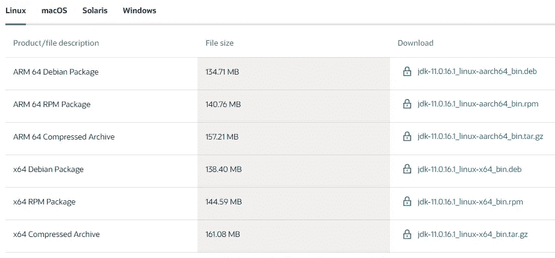
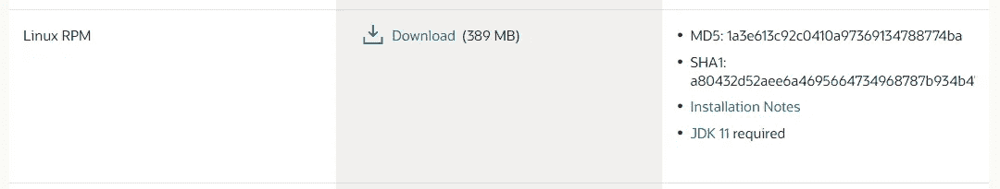
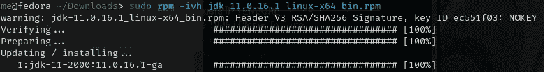
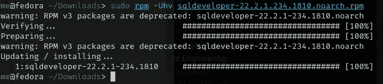
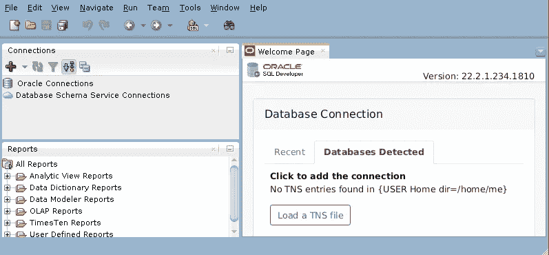

# 如何:在 Linux 上安装 SQL Developer

> 原文：<https://medium.com/oracledevs/how-to-sql-developer-on-linux-c9b60f3273e4?source=collection_archive---------0----------------------->


在 Linux 上安装 SQL Developer 并不困难。即便如此，Java 11 确实需要单独安装，作为 SQL Developer 更高版本的先决条件。

让我们看看它是如何在 Fedora 发行版上实现的。

## 下载 Oracle Java 11

Oracle SQL Developer 的早期版本需要 Oracle JDK 8。那么 Oracle SQL Developer 19.2 和更高版本至少需要 Oracle JDK8 或 Oracle JDK 11。

Oracle SQL Developer 22.2.1 版需要 Oracle Java 11。

Oracle Java 11 可从 Oracle 网站下载:

[https://www.oracle.com/java/technologies/downloads/#java11](https://www.oracle.com/java/technologies/downloads/#java11)



Fedora 是 Red Hat 家族的一部分，他们使用 RPM 包，使用 DNF 包管理器。

## 下载 SQL 开发人员

接下来，下载适用于 Oracle SQL Developer 22.2.1 的 SQL Developer RPM 包。

[https://www . Oracle . com/database/SQL developer/technologies/download/](https://www.oracle.com/database/sqldeveloper/technologies/download/)



## Java 11 的安装

尽管 Fedora 使用 DNF 包管理器，但 Java 11 的安装涉及到使用遗留的 RPM 应用程序:

```
sudo su -rpm -ivh jdk-11.0.16.1_linux-x64_bin.rpm
```



## SQL Developer 的安装

至于安装 Java 11，要安装 SQL Developer，我们将使用 RPM 应用程序:

```
sudo rpm -Uhv sqldeveloper-22.2.1.234.1810.noarch.rpm
```



## 启动 SQL 开发人员

SQL Developer 二进制文件将位于/opt/sqldeveloper 目录中，因此从那里运行二进制文件:

```
cd /opt/sqldeveloper
./sqldeveloper.sh
```

由于之前安装了 Java 11，SQL Developer 的启动应该不会有任何问题。



*Paul Guerin 出席了一些世界领先的甲骨文会议，包括甲骨文 2013 年世界开放大会。自 2015 年以来，他的工作一直是 IOUG 最佳实践技巧小册子以及 AUSOUG、Oracle Technology Network、Quest 和 Oracle Developers (Medium)出版物的主题。2019 年，他被授予 My Oracle 支持社区最有价值贡献者。他将继续参与 Oracle ACE 计划。*