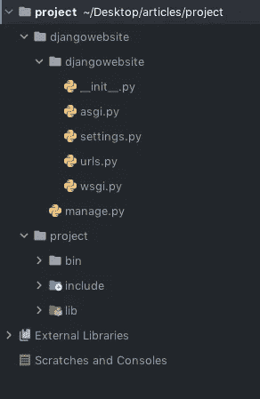
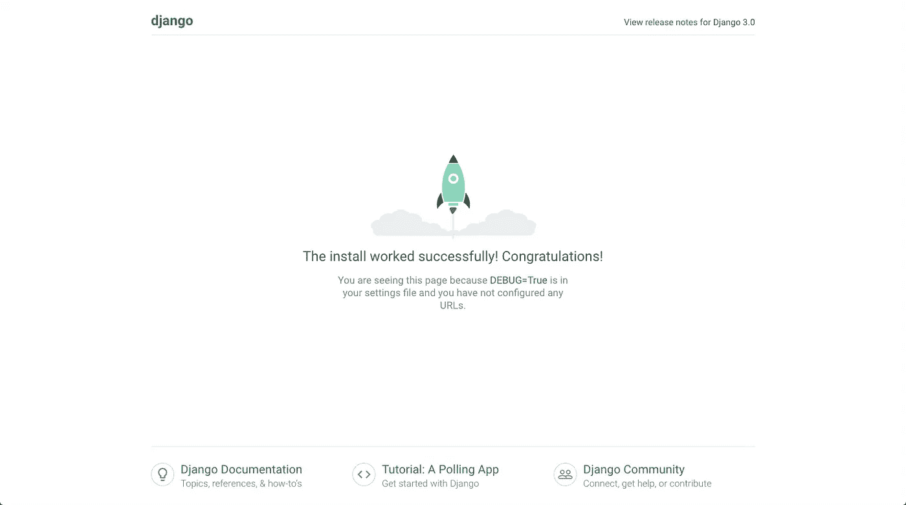
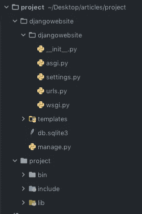

# 如何使用 Django 框架开始使用 Python 进行 web 开发

> 原文：<https://medium.com/quick-code/how-to-start-web-development-with-python-using-the-django-framework-371c4c4794ca?source=collection_archive---------0----------------------->


Photo by [Émile Perron](https://unsplash.com/@emilep?utm_source=medium&utm_medium=referral) on [Unsplash](https://unsplash.com?utm_source=medium&utm_medium=referral)

web 框架是一个工具集合，它允许 web 开发人员克服 web 开发过程中的许多困难和重复。例如，大多数网站需要相同的基本功能:连接到数据库、设置 URL 路由、在页面上显示内容、正确处理安全性等。程序员没有从头开始重新创建所有这些，而是用所有主要的编程语言创建了 web 框架:Python 中的 Django 和 Flask，Ruby 中的 Rails，以及 JavaScript 中的 Express 等等。

Django 继承了 Python 的“内置电池”方法，这意味着该框架拥有开发成熟应用程序所需的一切。这是因为 Django 提供了内置的 HTML 模板、URL 路由、对象关系映射和会话管理，帮助开发人员避免寻找第三方工具的麻烦。此外，它包括对 web 开发中常见任务的现成支持:

*   用户认证
*   模板、路线和视图
*   管理界面
*   强大的安全性
*   支持多数据库后端

Django 也帮助 SEO(搜索引擎优化)，它提供了很多有用的 SEO 工具。使用 Django SEO 框架，开发人员可以通过使用缓存模板和压缩 CSS 和 JavaScript 来减少页面加载时间。

最重要的是，Django 由于其社区而不断发展，社区更新和改进了框架的组件，同时还开发了新的库来解决专业人员在开发 web 应用程序时经常面临的问题。

由于所有这些特性，许多重要的公司，如 Instagram、Spotify、Dropbox 和许多其他公司，都在使用 Django web 开发框架。

我认为 Django 对于任何想要用最少的代码构建现代且健壮的 web 应用程序的开发人员来说都是一个极好的选择。

在这个介绍之后，我们可以开始设置开发环境。

# 设置开发环境


Photo by [RawFilm](https://unsplash.com/@rawfilm?utm_source=medium&utm_medium=referral) on [Unsplash](https://unsplash.com?utm_source=medium&utm_medium=referral)

虚拟环境是一种工具，它通过为不同的项目创建独立的 python 虚拟环境来帮助保持不同项目所需的依赖关系。这意味着每个项目都可以有自己的依赖项，而不管其他项目有什么依赖项。

在 python 中，我们使用 virtualenv 包来构建虚拟环境。

正在为`virtualenv`安装 python 绑定:

```
***pip install virtualenv***
```

然后，我们使用以下命令创建环境:

```
***virtualenv project***
```

这将创建`project` 文件夹，我们用`cd project`移动到其中，我们激活虚拟环境:

```
On UNIX(Mac and Linux): ***source project/bin/activate****On Windows:* ***project\env\Scripts\activate.Bat***
```

我们安装、创建并激活了项目的虚拟环境；现在，轮到姜戈安装和设置了。

要安装 Django 的 python 绑定，我们只需在终端上键入(在激活虚拟环境的项目文件夹中):

```
***pip install Django***
```

# 从姜戈开始

安装好我们需要的一切之后，我们就可以开始用 Django web 框架进行开发了。

首先，我们创建 Django 项目:

```
***django-admin startproject djangowebsite***
```

让我们看看我们项目的文件夹:



不要担心所有这些 python 文件，在本教程中，我们将只使用:

*   管理整个网站。
*   `urls.py`管理网站的网址
*   `settings.py`管理网站的设置

挺直观的:)

现在，我猜你想做的第一件事是运行网站，为此你只需进入`/project/djangowebsite`目录，在你的终端中执行以下命令:

```
***python manage.py runserver***
```

用您的浏览器打开[http://127 . 0 . 0 . 1:8000/](http://127.0.0.1:8000/)URL，您应该会看到以下内容:



恭喜你！你运营了你的第一个 Django 网站！

但是，正如你所看到的，我们的网站不是很有用。这是因为访问 [127.0.0.1:8000/](http://127.0.0.1:8000/) 时显示的 HTML 页面是默认的 Django 的 HTML 页面。让我们看看当访问 [127.0.0.1:8000/](http://127.0.0.1:8000/) 时，如何返回一个定制的 HTML 页面(而不是默认页面)。

我们需要在`/project/djangowebsite`目录下创建一个模板文件夹，我们将在其中保存 HTML 文件。

同样，为了澄清疑问，让我们看一下该项目的目录:



现在，我们在`/project/djangowebsite/templates`文件夹中创建`index.html`文件，并键入:

```
*<!DOCTYPE html>
<html lang="en">
<head>
    <meta charset="UTF-8">
    <title>Title</title>
</head>
<body>
<h1>Hello World!</h1>
</body>
</html>*
```

这段代码只是返回一个大的 Hello World。但这还不是全部:我们需要网站在访问 [127.0.0.1:8000/时返回`index.html`。](http://127.0.0.1:8000/)为此，我们遵循以下两个简单的步骤:

-修改`settings.py`，将我们创建的模板文件夹添加到网站中。

-修改`urls.py`以在进入网站时显示`index.html` 。

## 修改设置. py

要编辑该文件，我们打开它，在第 57 行左右，您应该会看到类似这样的内容:

```
'DIRS': [],
```

我们需要将之前创建的模板文件夹添加到 DIRS:

```
'DIRS': [os.path.join(BASE_DIR, 'templates')],
```

我们已经完成了对`settings.py`文件的修改，让我们更改`urls.py`

## 修改 urls.py

在修改`urls.py`文件之前，我们先来看看。

```
from django.contrib import admin
from django.urls import pathurlpatterns = [
 path('admin/', admin.site.urls),
]
```

在前两行中，它导入所需的模块。`urlpatterns` 是我们要添加网址的列表。

我们想将`'/'` URL(代表 [127.0.0.1 **/**](http://127.0.0.1:8000/) )添加到 URL 模式列表中:

```
from django.contrib import admin
from django.urls import path
from django.shortcuts import renderdef index(request):
 return render(request, 'index.html')urlpatterns = [
 path('admin/', admin.site.urls),
 path('/', index),
]
```

**在第 3 行**，我们导入了 render 函数，它帮助我们让网站返回一个自定义的 HTML 页面。

**在第 6 行和第 7 行**，我们定义了`index()`函数，返回我们之前创建的`index.html,`文件。

**最后(第 12 行)**，我们在访问`'/'`时返回`index.html`函数，正如我已经说过的，T5 代表 [127.0.0.1/](http://127.0.0.1:8000/) 。

# 用 Django 运行您的第一个定制网站

正如我们已经看到的，要运行网站，您只需执行:

```
***python manage.py runserver***
```

这就是你应该看到的:


厉害！

你用 Django web 框架开发了你的第一个定制网站！

正如标题中所说，本教程只是如何开始使用 python 进行 web 开发的一种方式，所以，本教程到此结束，但是不要担心，我正计划发布其他关于 Django web 开发的教程。

顺便说一句，我有一些建议给你，让你在学习完这个教程后，用你应该掌握的知识创建一个简单又好看的网站:

*   更新`index.html` 文件，插入一些用 CSS 和 javascript 实现好的 HTML 模板。如果你没有 HTML、CSS 或 javascript 知识，你可以从网上下载一些不错的 HTML 模板
*   用 [pythonanywhere 服务](https://www.pythonanywhere.com/)免费在线发布你的网站，你可以找到很多解释如何做的教程。

下期帖子见，敬请关注。