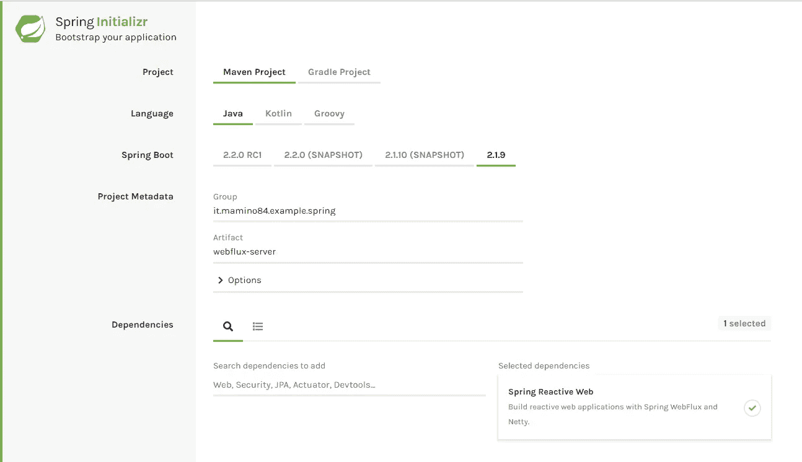
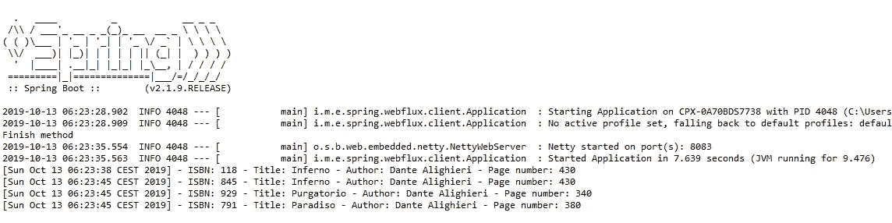

# 如何从 Spring WebFlux 开始

> 原文：<https://medium.com/quick-code/how-to-start-with-spring-webflux-dc79b55271bf?source=collection_archive---------0----------------------->

## Spring 实现的反应式编程简介

Photo by [Caspar Camille Rubin](https://unsplash.com/@casparrubin?utm_source=medium&utm_medium=referral) on [Unsplash](https://unsplash.com?utm_source=medium&utm_medium=referral)

# 介绍

5.x.x 版本实现了 Spring Webflux 项目，并将其包含在 Spring Suite 中。

该框架的目标是促进 Java 反应式编程的发展，减少并发性，减少硬件需求。

在这个故事中，我将通过一个简单的例子来介绍反应式编程的思想，并概述可能使用它的场景。

***走吧！***

# 反应式编程

反应式编程用于实现体系结构的非阻塞模型。决定使用反应式编程的 web 应用需要实现基于**订阅**和**事件**的逻辑。

web 应用程序的流程现在变成了异步的，并在事件响应中做出反应。

架构师和开发人员需要记住这些概念，通过“*标准同步编程*”不同地设计方法或类。

反应式编程通常与功能性编程(*做什么和不做什么*)相关，功能性编程包含在非阻塞流的上下文中，并且是其先决条件。

# 简单的例子

为了表示异步调用，我们将创建一个 REST 控制器来管理 Mono 和 Flux 对象，它包含在 Reactor 框架中，用于传输单个对象(Mono)或对象列表(Flux)。

客户端将由另一个 web 应用程序和一个 WebClient 组成，也包含在 Web Flux 中，允许调用 REST 服务并订阅以等待它们的响应。

为了实现这个利用 Spring Web Flux 的例子，我们开始用 [Spring Initializr](https://start.spring.io/) 创建一个新的 Java Spring Boot 项目，它将包含所需的依赖项:

Configuration of the new Spring Project with the dependency of Spring Reactive Web

将项目导入到 Eclipse 中，我们就可以开始了。第一步是在 Spring 上下文中启用 Web Flux，在控制器上引入注释 *@EnableWebFlux* :

Definition of the root class of the Spring Context

第二步是实现 REST 控制器，它公开了两个示例方法，一个用于单声道，一个用于通量:

Rest Controller class with two examples of method

Mono 类表示在服务器和客户端之间的通信中要交换的单个对象，而 Flux 类表示一个或多个对象的集合，即使有特定的延迟，这些对象也可以被推送给调用者。

这个类的目标，以及公开 REST 服务，是在反应式框架和应用程序较低层开发的软件之间创建一个解耦级别。

事实上，repository 类与 Web Flux 框架或 Reactor 没有任何联系，因此，有可能将此框架也应用于现有项目(如有必要):

Book repository class

在 repository 类中，我们添加了一个 *sleep* 来模拟在测试阶段读取资源的延迟。

最后一步是创建一个客户端 Spring Boot 应用程序，为了简单起见，只使用了一个控制器，在控制器中，我们将包含 Web 客户端和对两个 REST 服务的调用:

Client class with the examples of invocation of the reactive REST services

调用反应式 REST 服务的最少步骤是:

*   **初始化****Web 客户端**传递 URL
*   **执行**对服务的**调用**并预置**检索**响应的**体**
*   **订阅**到**事件**

服务的调用将与方法的执行同时执行，而响应中的事件管理将是异步的。

我们已经执行了实现的软件，我们看到“完成方法”日志是在检索事件之前执行的:

Execution log of the Web Client

根据 repository 类中的超时设置，事件 Mono 和 Flux 在 3 e 10 秒后被推送。

# 利用场景

在 Java 应用程序的环境中，使用 Web Flux 框架是可取的，在 Java 应用程序的环境中，可以设想实现异步信息交换的机制，例如:

*   **移动应用**:在订阅事件时需要接收异步通知的移动应用中
*   Web 应用程序:一般来说，在接收事件通知而不阻塞软件执行的 WEB 应用程序中使用这个框架是明智的
*   **并行和分布式计算**:并行计算的 web 应用中，不需要阻塞主程序的执行，而是在被调用的服务完成后收集通知
*   **消息驱动应用**:在由消息交换驱动执行的应用中
*   **其他？**

这个新框架明显简化了*订阅和通知*的范例，特别是对于 REST web 服务，并且打开了 Java 编程的大门，以一种新的方式来思考和实现 web 应用程序。

***感谢您的宝贵时间！***

**参考**:弹簧网[参考](https://docs.spring.io/spring/docs/current/spring-framework-reference/web-reactive.html)和[电抗器](https://projectreactor.io/)

**GitHub** :项目 [SpringWebFluxExample](https://github.com/Mamix84/medium/tree/master/SpringWebFluxExample) 和[spring web flux client example](https://github.com/Mamix84/medium/tree/master/SpringWebFluxClientExample)