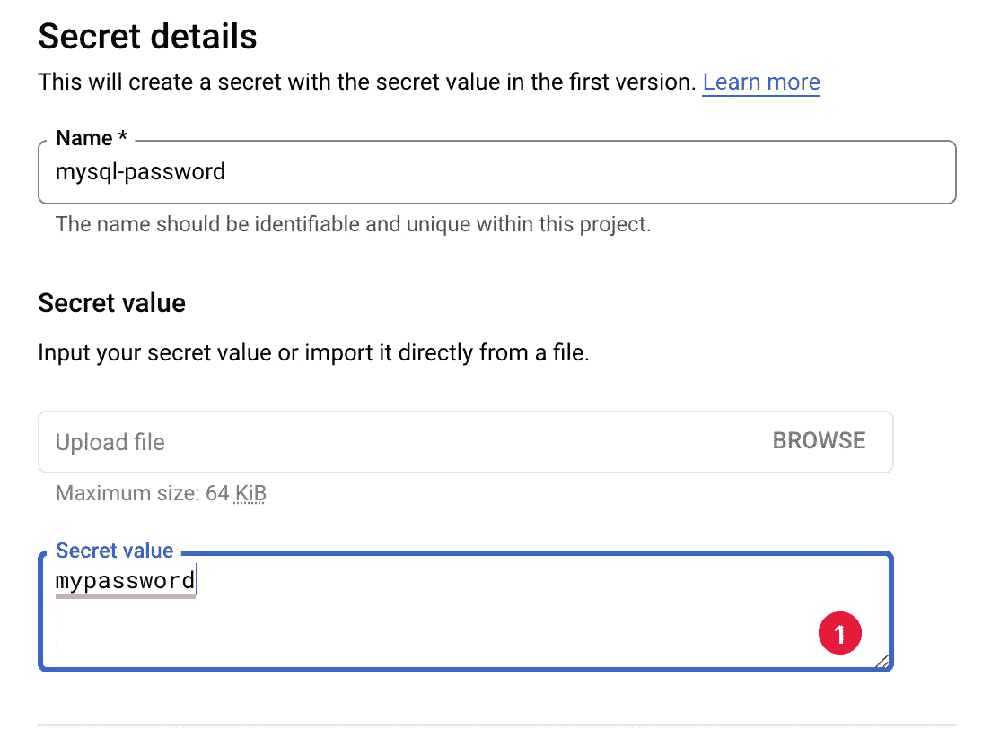

# 如何在 GCP 存储敏感数据:秘密经理

> 原文：<https://medium.com/google-developer-experts/how-to-store-sensitive-data-on-gcp-d96e4e545224?source=collection_archive---------0----------------------->

在许多应用中，安全性总是被推荐并且是重要的。我们的应用程序有一些敏感数据，如密码、IP 地址和凭据。这些敏感数据是如何存储的？你的技术或工具安全吗？此外，当您的微服务中每个都有不同的数据库或存储库时，您可能有大量的敏感数据或多个微服务共享存储库，如何集中这些敏感数据？

谷歌云平台提供了一项服务，允许你集中并安全地保存所有这些敏感数据。这个服务是 Secret Manager，您可以在其中存储 API 密钥、密码、证书和应用程序在运行时需要的其他敏感数据。

一些特征是这样的:

*   机密名称是全局项目资源，但机密数据存储在区域中，因此它会自动处理机密数据的复制。
*   Secret Manager 很容易与您的应用程序、代码和 GitHub 操作集成。
*   秘密数据是不可变的，所以如果你需要改变值，你需要创建一个新的版本。
*   传输时使用 TLS 加密，静态时使用 AES-256 位加密密钥加密。
*   云 IAM 集成。
*   获取其他服务的秘密和与 VPC 的混合环境。
*   您可以自动执行机密的轮换和过期。
*   存储、管理和访问机密，如二进制 blobs 或文本字符串。

# 创造一个秘密

> 注意:机密是一个全局项目对象，包含元数据和机密版本的集合。

让我们开始创造一个秘密。您可以在安全选项中找到此服务，如下所示:

之前，您需要启用秘密管理器 API，以便我们可以创建秘密

Creating a secret

当您创建密码时，您可以手动选择密码的位置，或者 Google 自动为您管理密码。Google 建议选择“自动”复制，除非您有特定的位置要求。

Manually manage locations.

Secret Manager 机密总是加密的。默认情况下，它使用 Google 管理的密钥，但是您也可以配置客户管理的加密密钥(CMEK)来使用您自己的密钥。

Secret Encryption

机密管理器支持关于机密的轮换计划。此功能对于最小化风险或漏洞非常重要。Secret Manager 根据提供的循环频率和循环时间向在 Secret 中配置的发布/订阅主题发送消息。

Rotation

您可以为针对机密的任何操作配置通知。

Notifications

最后，你可以设置一个截止日期。一旦密码过期，就会自动删除。

Set expiration date

完成后，秘密就产生了

A secret with its versions

# 管理秘密

您可以轻松地创建新版本、启用、禁用或删除密码。

> 注:秘密版本**不可变**。

您可以创建一个新版本，如下所示:

Creating a new secret version

然后，您可以启用或禁用或删除某个版本的秘密。

您还可以查看每个交互的审计条目、人员、时间和详细信息。注册信息是这样的:

Audit entries

关于权限，项目负责人可以访问机密，但是其他 Google Cloud 角色不能访问机密(包括编辑角色)。必须明确授予其他用户和服务帐户访问机密的权限。

您可以根据需要添加具有适当角色的帐户，如下所示:

Permissions

# 从 Python 创建和访问机密

可以使用 SDK 和您喜欢的编程语言来创建秘密。

例如，Python 看起来像这样:

代码很简单，它创建 SecretManagerServiceClient 的一个实例，通过它，可以创建、删除、启用或禁用一个秘密，还可以添加新的秘密版本、检索秘密版本等等。

例如，检索秘密的最新版本:

> 关于 python 的更多例子，请访问我的 [GitHub 库](https://github.com/jggomez/demo-gcp-secret-manager)。

# **使用来自云端的秘密运行**

secret manager 可以从各种 Google 云服务中使用，例如，云构建、云代码(我有一个视频)、云功能、云运行、计算引擎等等，甚至可以从 GitHub Actions 这样的外部服务中使用。

云运行可以以三种方式使用这些秘密。首先，创建一个专门的服务[账户](https://cloud.google.com/run/docs/securing/service-identity)。之后，有三种方法可以获取秘密:

*   本地通过 envvars
*   本机通过文件系统
*   直接代码集成

Secrets exposed as environment variables

# 奖励——使用 GitHub 操作中的秘密

有一个由 Google 创建的 [GitHub 动作](https://github.com/google-github-actions/get-secretmanager-secrets)可供使用。先决条件，被授权访问所请求的秘密的 Google Cloud 凭证

当您希望 Secret Manager 成为您组织秘密的真实来源，但您需要在构建步骤中访问这些秘密时，这是非常有用的。成功获得的秘密被设置为输出变量，可以在后续操作中使用，如下所示:

我希望这些信息对你有用，我有一个关于这个的视频。记得分享这篇博文，欢迎你的评论。

访问我的社交网络:

*   [https://twitter.com/jggomezt](https://twitter.com/jggomezt)
*   [https://www.youtube.com/devhack](https://www.youtube.com/devhack)
*   [https://devhack.co/](https://devhack.co/)

# 资源

 [## 秘密经理|谷歌云

### 谷歌云在《Forrester Wave:非结构化数据安全平台，Q2 2021》报告中被评为领导者。去拿…

cloud.google.com](https://cloud.google.com/secret-manager)  [## Secret Manager 概念概述| Secret Manager 文档| Google 云

### 本主题解释了主要的机密管理器概念。Secret Manager 允许您存储、管理和访问机密，如…

cloud.google.com](https://cloud.google.com/secret-manager/docs/overview)  [## 将 Secret Manager 与其他产品配合使用| Secret Manager 文档| Google Cloud

### 本主题提供了将 Secret Manager 与其他 Google 云服务配合使用的资源。访问机密管理器机密…

cloud.google.com](https://cloud.google.com/secret-manager/docs/using-other-products)  [## 使用机密|云运行文档|谷歌云

### 您的服务可能需要依赖 API 密钥、密码或其他敏感信息。对于云…

cloud.google.com](https://cloud.google.com/run/docs/configuring/secrets)  [## GitHub-Google-GitHub-actions/get-Secret manager-secrets:这个动作从 Secret 中获取秘密…

### 该操作从 Secret Manager 中获取机密，并通过输出使它们可用于以后的构建步骤。这是…

github.com](https://github.com/google-github-actions/get-secretmanager-secrets)  [## 谷歌云秘密管理器

### 截至 2020 年 1 月 1 日，本库不再支持最新发布版本的 Python 2。库版本…

googleapis.dev](https://googleapis.dev/python/secretmanager/latest/secretmanager_v1/secret_manager_service.html)