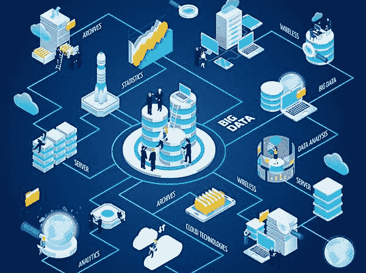
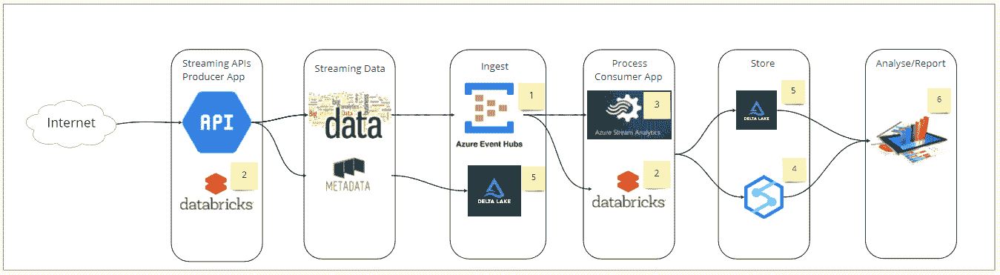

# 如何使用 Azure 传输你的数据

> 原文：<https://medium.com/globant/how-to-stream-your-data-using-azure-1f5086506c70?source=collection_archive---------0----------------------->

## 探索流如何帮助您在数据发布时对其采取行动。

Real-time Data insights using Streaming Data

如今，实时跟踪用户导航在很大程度上得到了利用。电子商务、社交媒体、基于内容的营销、视频流应用等。，是几个例子。它们提供精选选项来改善跨平台的用户体验。这有助于他们改善用户层面的分析。因此，这些应用可以扩大市场覆盖面，增加收入。这篇博客描述了 Azure 流数据管道所需的策略，讨论了点击流分析和通用流数据处理 Azure 架构。

## **什么是点击流数据？**

[点击流数据](https://en.wikipedia.org/wiki/Click_path)是用户在网站上活动的详细日志。它捕获所有的活动，包括访问的页面的顺序和在每个页面上花费的时间。它可以探索哪些区域最吸引人，页面的哪些部分通常会被忽略，以及用户行为的方方面面。点击流分析有两个层次:流量分析和电子商务分析。流量分析在服务器级别运行，并跟踪提供给用户的页面数量。基于电子商务的分析使用点击流来决定网站作为市场渠道的有效性。

细分和分析点击流数据可以改善对客户行为模式的观察。它旨在识别受顾客欢迎的产品。因此，我们可以更专注于生产这种受欢迎的产品。我们可以识别最常访问的网页和高峰日，以确保资源的分配。

Azure Streaming Analytics Architecture

我们假设用户熟悉数据工程背景，能够访问 Azure 资源。Event Hub、Databricks、Delta Lake、Synapse、Azure Stream Analytics、可视化报告工具。用户正在寻找一个用于 Azure 云中数据分析的实时流解决方案，并且他已经实现了它的 API 并正在工作。

## **蔚蓝云上的流媒体设计**

Azure [平台即服务](https://en.wikipedia.org/wiki/Platform_as_a_service) (PaaS)拥有非常强大的基础设施管理。它为应用程序开发和部署云服务提供了构建模块。因此，我们可以说它允许开发者专注于创新。此外，与其他云提供商相比，Azure 提供了有竞争力的价格优势。

## **设计概述**

在这个架构中，我们使用了流处理技术和框架，利用这些技术和框架，处理时间可以以微秒而不是以小时或天来度量。点击流分析收集了大量数据。因此，企业依赖大数据工具和技术。它有助于他们的数据接收、处理、存储和报告生成。在这种架构中，博客从 Databricks 笔记本中开发的 API 获取数据。生产者应用程序代码从 API 请求的响应中获取数据，并捕获它们的元数据。从流数据中，元数据组件存储在 Delta Lake 表中。数据组件被摄取到 Azure Event Hubs，这是 Azure 中的一个大数据流平台。流分析或数据块对接收的数据执行所有必需的转换逻辑。最后，我们可以使用转换后的数据在 Power BI 仪表板上生成报告。此外，我们可以使用 Synapse 或 Delta Lake 等 Azure 存储组件进行进一步分析。

以下是流式架构中使用的每个 Azure 组件的简要说明:

## **Azure 活动中心**

云消费已经被许多组织所接受。因此，[软件即服务](https://en.wikipedia.org/wiki/Software_as_a_service) (SaaS)解决方案每天都有很大的发展空间。Azure [事件中心](https://docs.microsoft.com/en-us/azure/event-hubs/event-hubs-about)可以大规模处理流媒体事件消息接收。它每秒可以接收和处理数百万个事件。数据可以来自许多不同的来源。您使用门户提供了 event hub，并准备好了端点。事件消息通过 HTTPS 或 AMQP 被推送到事件中心端点。稍后，消费者应用程序可以在执行时间表的同时或任何时刻读取它。根据事件中心主题中定义的保留期，数据会保留一段时间。它确保事件消息到事件中心主题的低延迟和传递。

## **Azure 数据块**

Azure Databricks 是一个基于 T2 Apache Spark T3 的统一分析平台。它为我们使用开源库提供了便利。Spark 是一个强大的开源处理引擎，处理速度更快。它易于使用，推荐用于复杂的分析。您可以设置、配置和微调集群，以获得更好的性能和可靠性。Databricks 有助于自动缩放和自动终止功能。这有助于我们改善资源使用的总成本。

## **Azure Stream Analytics**

[Stream Analytics](https://docs.microsoft.com/en-us/azure/stream-analytics/stream-analytics-introduction) 是一款易于使用的服务，专为无服务器实时处理流管道而设计。它可以读取事件中心主题，并写入兼容的持久性数据存储。数据流处理使用类似 SQL 的语法，比如对数据流进行过滤、排序和连接。一个事件处理引擎，可以分析和处理来自许多来源的流数据。流分析作业由输入、查询和输出组成。它从事件中心(包括 Apache Kafka 的事件中心)获取数据。每个作业都有一个或多个转换后数据的输出。同样，你可以控制对你所分析的信息的反应；例如，您可以将数据发送到 Power BI 仪表盘进行实时仪表盘操作，也可以将数据存储在 Synapse Analytics、Delta Lake 等存储服务中。

## **突触**

[Synapse Analytics](https://docs.microsoft.com/en-us/azure/synapse-analytics/overview-what-is) 是一款强大的分析服务。它将数据集成、企业数据仓库和大数据分析结合在一起。它提供了使用无服务器或专用资源进行大规模查询的自由。它为 BI 和 ML 需求提供了统一的数据接收、浏览、准备、管理和服务体验。

## **三角洲湖泊**

[Delta Lake](https://docs.delta.io/latest/delta-intro.html) 是一个可靠的数据湖开源存储层。它提供可扩展的元数据处理，并统一流数据处理。它运行在您现有的数据湖之上，并且与 Apache Spark APIs 兼容。它允许根据您的工作负载模式进行配置。

## **电源毕**

[Power BI dashboard](https://docs.microsoft.com/en-us/power-bi/create-reports/service-dashboards) 是一个单独的页面，通常被称为画布，它使用可视化来讲述一个故事。一个设计良好的仪表板只包含故事中最重要的元素。仪表板是跟踪您的数据以获得答案和最重要指标的绝佳方式。仪表板上的可视化可能来自一个或多个底层数据集。它可以结合内部和云数据，提供整合的视图。

生产者应用程序以规定的时间间隔运行，从 API 获取数据。然后，API 响应被推送到事件中心主题。订阅事件中心主题的消费者应用程序使用数据。消费者应用程序将处理后的数据存储到 Synapse 表中。流分析有助于将处理后的数据从事件中心重定向到 Power BI 仪表板。

## **结论**

在这篇博文中，我们探讨了实现流数据模式的解决方案。您可以使用 Azure 云服务执行数据接收和处理。无需建立任何基础设施，您就可以配置和使用如此强大的服务。这些服务完全抽象了底层分布式应用程序的复杂性。