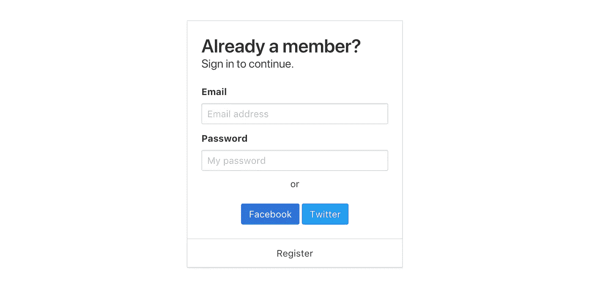
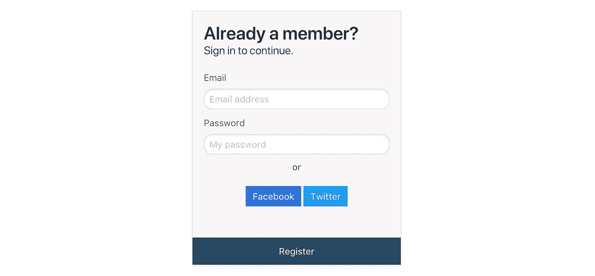

# 如何使用布尔玛设计表单样式

> 原文：<https://medium.com/quick-code/how-to-style-a-form-using-bulma-134b83049272?source=collection_archive---------0----------------------->

在基于 Flexbox 的免费开源 CSS 框架出现之前，你可能见过布尔玛。布尔玛可以使用 **NPM** 下载或安装，只要看一下文档就很容易上手。

我们将创建一个登录面板，供用户使用您网站自己的登录方法或通过 facebook & twitter 等社交登录进行登录。

**首先，我们将使用信用卡。**

```
<div class="card">
 <div class="card-content">
 </div>
</div>
```

这将是我们新登录面板的起点。

**接下来，我们需要开始添加内容。**

```
<div class="card">
 <div class="card-content login">
 <p class="title">
 Already a member?
 </p>
 <p class="subtitle">
 Sign in to continue.
 </p>
 </div>
</div>
```

首先是我们的标题&我们的副标题提示用户它实际上做了什么。

后面是我们的输入字段名称和密码字段

```
<div class="card">
 <div class="card-content">
 <p class="title">
 Already a member?
 </p>
 <p class="subtitle">
 Sign in to continue.
 </p>
 <div class="field">
 <label class="label">Email</label>
 <div class="control">
 <input class="input" type="text" placeholder="Email address">
 </div>
 </div>
 <div class="field">
 <label class="label">Password</label>
 <div class="control">
 <input class="input" type="email" placeholder="My password">
 </div>
 </div>
</div>
```

最后，我们将添加带有社交按钮的第二个子标题。

```
<div class="card">
 <div class="card-content">
 <p class="title">
 Already a member?
 </p>
 <p class="subtitle">
 Sign in to continue.
 </p>
 <div class="field">
 <label class="label">Email</label>
 <div class="control">
 <input class="input" type="text" placeholder="Email address">
 </div>
 </div>
 <div class="field">
 <label class="label">Password</label>
 <div class="control">
 <input class="input" type="email" placeholder="My password">
 </div>
 </div>
 <h6 class="subtitle is-6 has-text-centered">or</h6>
 <div class="has-text-centered">
 <a class="button is-link">Facebook</a>
 <a class="button is-info">Twitter</a>
 </div>
 </div>
 <footer class="card-footer">
 <p class="card-footer-item">
 <span>
 Register
 </span>
 </p>
 </footer>
</div>
```

现在我们已经有了下面的顺序，我们将通过使用卡片页脚在底部创建一个全幅注册按钮来给我们的面板添加一点扭曲。

```
<div class="card">
 <div class="card-content login">
 <p class="title">
 Already a member?
 </p>
 <p class="subtitle">
 Sign in to continue.
 </p>
 <div class="field">
 <label class="label">Email</label>
 <div class="control">
 <input class="input" type="text" placeholder="Email address">
 </div>
 </div>
 <div class="field">
 <label class="label">Password</label>
 <div class="control">
 <input class="input" type="email" placeholder="My password">
 </div>
 </div>
 <h6 class="subtitle is-6 has-text-centered">or</h6>
 <div class="has-text-centered">
 <a class="button is-link">Facebook</a>
 <a class="button is-info">Twitter</a>
 </div>
 </div>
 <footer class="card-footer">
 <p class="card-footer-item register">
 <span>
 Register
 </span>
 </p>
 </footer>
</div>
```

现在我们已经建立了我们的表单:)，现在它看起来很好，因为它遵循了布尔玛默认的颜色等



但是我们希望我们的表单看起来对用户更有吸引力，所以我们将使用自定义类来定制卡片。



下面是我们添加的 CSS。登录到我们的。卡片内容部分可定制高度、颜色和移除边框。

带有注册按钮的页脚部分使用。卡片-页脚-项目和添加一个新的类。注册添加背景填充，使我们的页脚突出！我们的 CSS 中的其余类标签已经移除了样式，或者使用默认值稍微改变了它们的外观。

```
.button {
 border-radius: 0;
 border: none;
}.card-content.login {background-color: #f9f6f6;
 border: none;
 height: 400px;
 padding: 20px;
}
.card-footer-item.register {
 background-color: #284863;
 color: white;
}.input{border-width:1px;
 border-radius:15px;
}.card-footer {border: none;
}
.label {
 font-weight: lighter;
}
```

希望你会发现这种新的表单样式很有用，它也是完全响应的，并且允许你改变大多数表单的外观。

*最初发表于*[*signl . uk*](https://signl.uk/tutorial/index/how-to-style-a-form-using-bulma)*。*