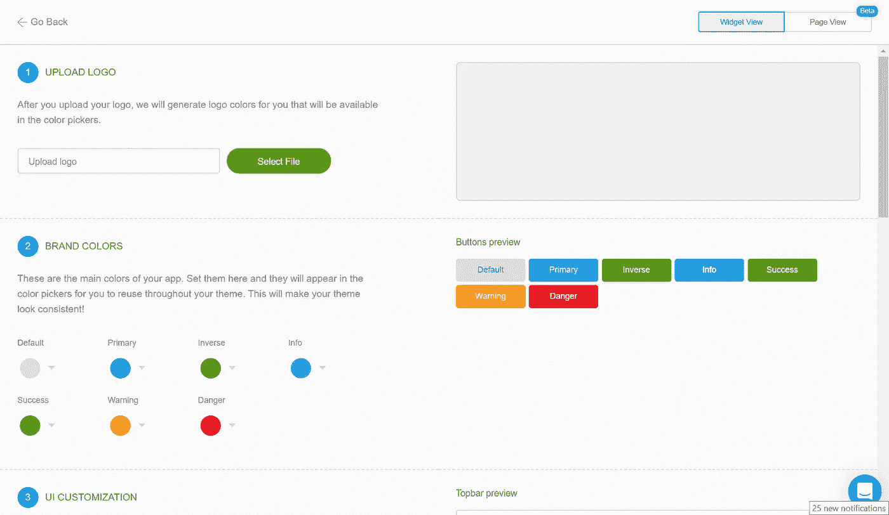
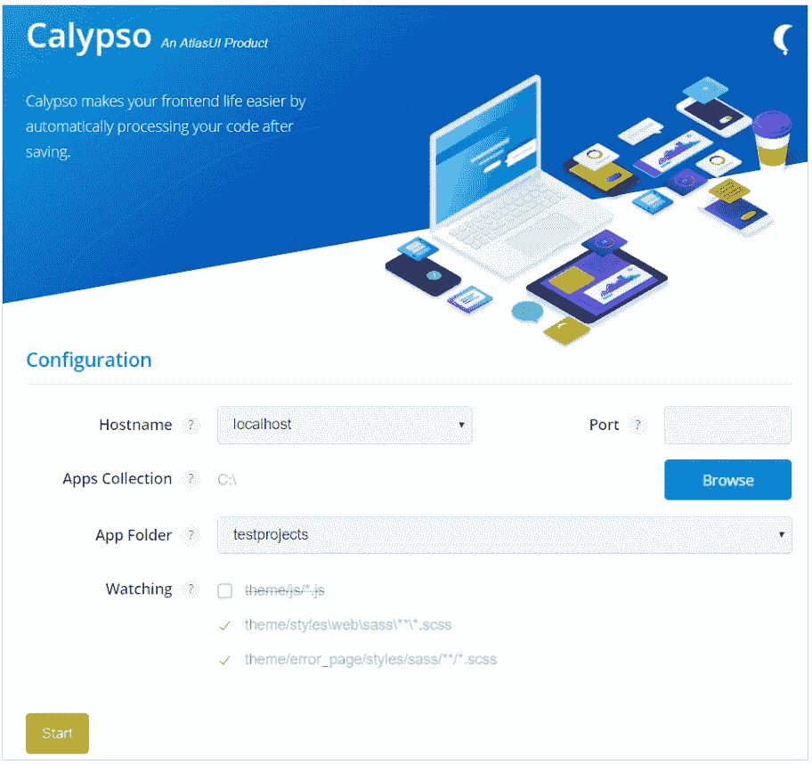

# 如何在 Mendix 中设计风格

> 原文：<https://medium.com/mendix/how-to-style-in-mendix-7717b2b34396?source=collection_archive---------4----------------------->

在 Mendix 中创建应用程序是一件非常简单的事情。甚至你的应用程序的设计也以简单的方式处理——只要你不想与标准的 Atlas UI 不同。如果您正在寻找一些与众不同的东西，这篇文章正适合您:

# 主题定制器

如果你想让你的应用个性化一点，Mendix 主题定制器是一个很好的起点。您可以从 Mendix Studio 访问它，这是一个基于 Mendix 浏览器的低编码环境。只需上传公司徽标，并为应用程序的典型区域分配徽标颜色。

Mendix Theme Customizer

# 树袋熊

如果你正在寻找更多不同的变化，你将不得不改变你的应用程序文件夹中的 css 样式表。要在下一次部署中部署对这些样式表的更改，您可以安装 Koala，在一个自包含的环境中运行 Sass，这样您只需点击几下鼠标就可以轻松管理所有的 Sass 项目。考拉将管理你的样式表的更新，并在下一次部署你的应用时部署它们。

不幸的是，如果你不是像我一样的设计专家，并且习惯于试错，那么重新部署来查看变化就有点笨拙了。Mendix Calypso 是摆脱这种情况的好方法。

# 卡吕普索

Calypso 是一个工具，让你更容易定制你的 Mendix 应用程序的风格，同时看到动态变化。可以免费下载 calypso，只需查看 [Mendix 文档](https://docs.mendix.com/howto/front-end/calypso)即可。

设置 calypso 很容易。

Mendix Calypso Setup

只需输入本地部署环境的主机名和端口，将 Calypso 指向您的应用程序文件夹存储库，并将当前会话与您想要修改的应用程序相关联。然后启动 Calypso。

现在，当您本地部署想要修改样式的 Mendix 应用程序时，将本地部署的端口更改为 1111。这将向您显示应用程序的 Calypso 部署版本。每当你在你的应用程序目录中保存一个 CSS 样式文件时，Calypso 会立即记录并更新你的应用程序的样式。下一次部署会将更改传播到您的普通非 Calypso 部署。用试错法来设计你的应用程序的好方法，快！