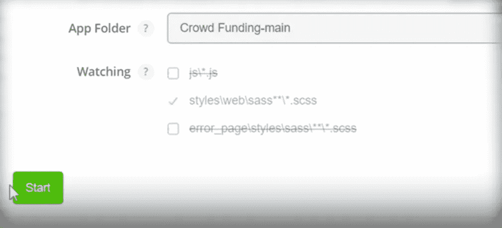

# 如何设计响应式应用

> 原文：<https://medium.com/mendix/how-to-style-responsive-apps-c7ff2241b8d7?source=collection_archive---------4----------------------->

# 经常有人问我如何设计应用程序，通常我的回答是，“你在设计什么样的应用程序？”。在 Mendix 的世界里，响应式 web 应用程序的样式和本地移动应用程序的样式有很大的不同。

例如，响应式应用程序使用内嵌样式、通过使用 SCSS 的样式表(或两者结合)进行样式化，而本地移动应用程序主要使用小部件上的设计属性进行样式化，并使用 javascript 创建任何自定义类。

不要因为有太多东西需要学习而气馁，因为这个系列主要是针对初学者的，对于这篇文章，我将把重点放在响应式应用程序的基本样式上。

所以，系好安全带，让我们踏上探索之旅，学习如何制作漂亮、时尚的应用程序。

## 我需要什么来开始？

为了在 Mendix 8 中开始设计应用程序，您需要安装任何版本的 Mendix Studio Pro 8，以及您首选的 IDE，我更喜欢使用 [VSCode](https://code.visualstudio.com/) 。

我还建议你在你的机器上下载并安装 [Calypso](https://docs.mendix.com/howto8/front-end/calypso) 。Calypso 是 Mendix 使用 [Gulp 和 Sass](https://docs.mendix.com/howto8/front-end/sass-eight) 的替代工具，它通过以下方式简化您的工作:

*   检查 *SCSS* 文件中的错误。
*   将 *SCSS* 文件编译成 *CSS。*
*   显示错误通知。
*   将编译后的文件移动到部署文件夹中。
*   将编译好的 *CSS* 文件注入你的浏览器，这样你就可以立即预览你的修改。

## SCSS vs CSS

Mendix 8 使用 SCSS，它不是完全的 SASS，但它支持 SASS 和 CSS 格式。这意味着如果你不知道 SASS，你仍然可以使用普通 CSS 创建你的常规样式类。使用 SCSS 的一些好处是:

*   SCSS 有更先进的功能。
*   SCSS 包含了 CSS 的所有特性，甚至更多 CSS 没有的特性。
*   SCSS 提供了变量，你可以通过使用变量来缩短你的代码。
*   了解 SCSS 有助于您定制引导。
*   SASS 增加了@import 特性，允许您导入定制的 SCSS 文件。
*   SASS 使开发人员能够在代码中使用嵌套语法。
*   有据可查。

[https://bit.ly/MXW21](https://bit.ly/MXW21)

## 启动 Calypso

一旦你设置好了所有的东西，你需要启动 Calypso，这样它就可以观察你的样式表的变化。只需打开 Calypso，浏览你的 Mendix 应用程序文件夹，确保其观看“styles\web\sass**\*。scss"
并点击“开始”。

## 创建自定义样式类

现在在我使用的代码编辑器中打开你的项目文件夹。
在你的中导航到你的主题文件夹，在 styles - > web- > sass- >应用程序中查找。

在应用程序文件夹中，创建一个文件，并将其命名为 what_ever_you_want.scss

现在，您可以添加任何想要的 css 样式，也可以使用任何想要的 SASS 代码。下图是我创建的几个自定义类的例子

## 导入新文件

在您可以将类名添加到 studio pro 中的任何元素之前，我们需要确保这个新文件正确导入到您的应用程序中。为此，请导航到 app 文件夹中的 _custom.scss。

现在你只需要添加[@导入](http://twitter.com/import)“你的文件名”。这里不需要包括文件扩展名。

请确保保存所有这些更改！

## 向小部件添加类名

现在，您可以将您创建的任何类名添加到任何页面上的任何元素中！有了 Calypso 监听应用程序中的变化，当你保存你的工作时，你应该可以立即在浏览器中看到这些变化，这样就不会浪费时间不断重新运行你的应用程序来测试任何样式的变化。

## 阅读更多

 [## Mendix World 2021 |召集您的应用开发团队 2021 年 9 月 7 日至 9 日

### 好像你需要说服…在一个全球制造商社区，他们想通过探索什么来相互学习…

bit.ly](https://bit.ly/MXW21) 

*   [https://docs . mendix . com/how to 8/front-end/get-started-with-atlasui](https://docs.mendix.com/howto8/front-end/get-started-with-atlasui)
*   [https://docs.mendix.com/studio8/theme-customizer](https://docs.mendix.com/studio8/theme-customizer)
*   [https://docs . mendix . com/how to 8/front-end/extend-design-properties-to-customize](https://docs.mendix.com/howto8/front-end/extend-design-properties-to-customize)
*   [https://docs . mendix . com/how to 8/front-end/migrate-existing-projects-to-atlas ui](https://docs.mendix.com/howto8/front-end/migrate-existing-projects-to-atlasui)

*来自发布者-*

*如果你喜欢这篇文章，你可以在我们的* [*媒体页面*](https://medium.com/mendix) *或者我们自己的* [*社区博客网站*](https://developers.mendix.com/community-blog/) *找到更多喜欢的。*

*对于希望入门的创客，您可以注册一个* [*免费账户*](https://signup.mendix.com/link/signup/?source=direct) *，并通过我们的* [*学院*](https://academy.mendix.com/link/home) *获得即时学习。*

*有兴趣加入我们的社区吗？你可以加入我们的* [*懈怠社区频道*](https://join.slack.com/t/mendixcommunity/shared_invite/zt-hwhwkcxu-~59ywyjqHlUHXmrw5heqpQ) *或者想更多参与的人，看看加入我们的* [*遇见 ups*](https://developers.mendix.com/meetups/#meetupsNearYou) *。*