# 如何测试 UI 代码(iOS、Swift)——第 1 部分

> 原文：<https://medium.com/quick-code/how-to-test-a-ui-code-ios-swift-part-1-f031a4702f61?source=collection_archive---------6----------------------->

问 uick 简介:我正试图自己开发一个伟大的应用程序。但是我以前没有做过，也不知道怎么做。所以，我试着去做和学习。

到目前为止，我一直在测试我的用户界面，完全运行这个应用程序，有时在里面做一点抽动。
但是现在我的应用程序有几十个视图和几千行代码。我真的不想运行整个系统，只测试一小部分。所以，现在我想找出其他的选择:

# 首先，XCode 测试

这些东西我在身边见过，但是忽略了。因为我觉得没必要。但是现在我开始有这种感觉了。

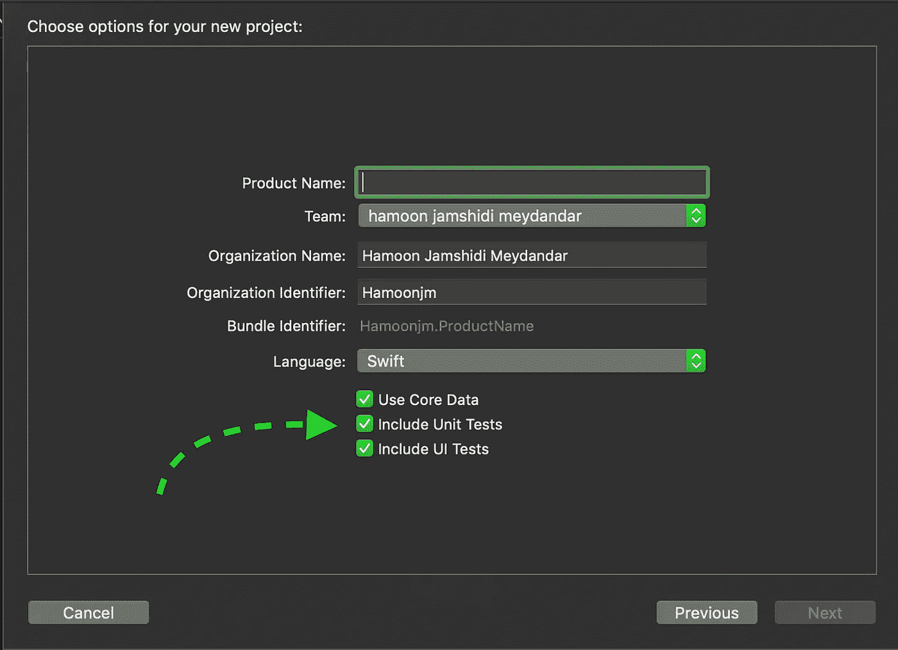

XCode asks you if you want to include them, when you want to start a new project

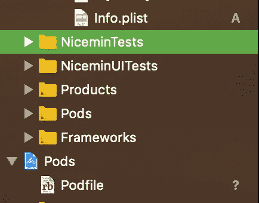

And then, you can see them here. (Nicemin is my app’s name)

经过一番研究，我发现有两种类型的 Xcode 测试:UI 测试和单元测试。UI Test 测试 UI(谁会想到呢？！！).我的意思是你运行测试，像“检查你是否能看到一个叫做开始的按钮”和“点击显示开始的按钮”以及“检查它是否开始了”。Xcode 运行它们并告诉你结果。然而，单元测试是孤立地测试代码的特定部分。你从你的整个项目中取出一个类，并对它本身进行测试，看看它是否按照你期望的方式工作。

但是，这不是我想要的。我有一个 UIViewController，我想自己运行它，而不必运行整个应用程序来查看它是否符合我的要求！

所以，我继续寻找，找到了其他选项，比如谷歌的 [EarlGrey](https://github.com/google/EarlGrey) ，这是一个很棒的 UI 测试自动化工具，但仍然不是我想要的！

然后我想起来…

*鼓卷*

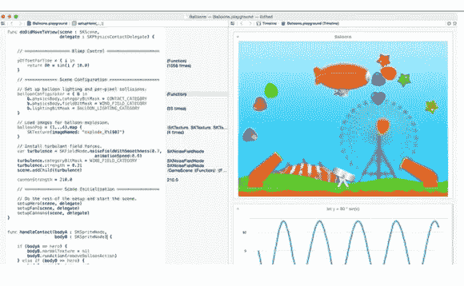

Swift Playground. Where you can play with your code and see the result, right there.

光荣的斯威夫特游乐场！Swift 开发人员的承诺天堂！😍

我记得我们可以在 playground 中测试任何 Swift 代码，我记得我看到一群开发人员发布关于他们如何使用 Playground 来查看他们的 UI 代码在运行中的样子！

开始的最简单的方法，就是创建一个视图，复制粘贴你的代码，然后欣赏它的美丽！

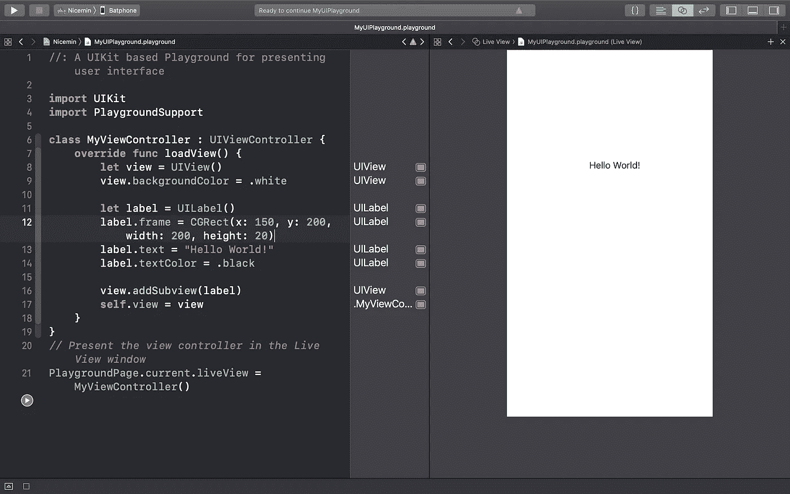

On the left, your code. On the right, the result.

## **但是……**

我的应用程序已经变得比 Hello World 更大，我需要视图来与我的应用程序的许多部分进行交互。复制过去那里的一切是乏味的！我的椰子怎么办？？即使我的项目中有操场，我也无法从我的操场访问其他文件。所以，我在网上搜索解决方案，我找到了这个:

## 步骤 1:将操场添加到项目中

创建一个游乐场，在 Finder 中找到它，拖放到你的工作区，而不是 Xcode 中的项目！您应该可以在工作区的文件中看到它。即使您在工作区的文件夹中创建它(我认为这样做实际上是个好主意),它也不会在您的项目中。所以，你需要拖拽它，转到文件- >添加文件到"<你的项目名>"

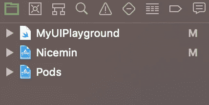

You can see your Playground in your Workspace after adding it.

## 步骤 2:从项目中构建框架

这很容易。进入文件>新建>目标，选择“Cocoa touch 框架”。**重要提示:将嵌入应用程序选择为无。**给它起个名字。我选择了“NiceminFramework”。

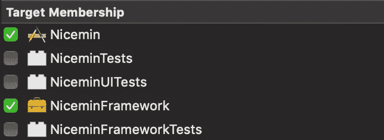

现在，转到你想玩的每个文件，在操场上，右键单击并从文件检查器转到目标成员，并选择框架。保留您的应用程序。

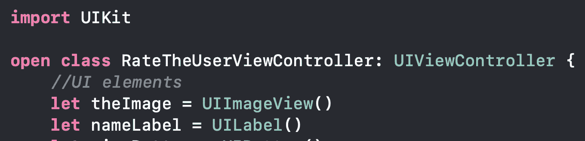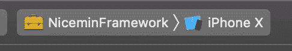

**将任何类、方法或任何东西设置为 public 是很重要的，如果你想访问它们的话。
您也可以将它们设置为打开。Public 意味着你可以读取它们，在声明的框架之外测试它们，但是你不能改变它们。开放意味着你也可以改变它们。**

现在，构建框架。去 Xcode 的左上方，点击你的应用名称，选择你的框架。**并选择一个模拟器作为目标。**如果你选择别的东西做目标，在操场上就不行了！现在用 cmd⌘ + B 构建它。每次你在代码中做了一个改变，你应该重新构建这个框架，如果你想让这个改变在你的游戏场上反映出来的话。

## 第三步:让乐趣开始

选择你的游乐场，在上面写导入<your framework="" name="">。如果没有错误，这意味着您可以使用您选择包含在您的框架中的文件(从每个文件的文件检查器)并且您将它们设置为打开。</your>

在这里，我做了一个 ViewController，我想看看它是什么样子的。我将 MyViewController 作为我想要测试的视图控制器的子类。

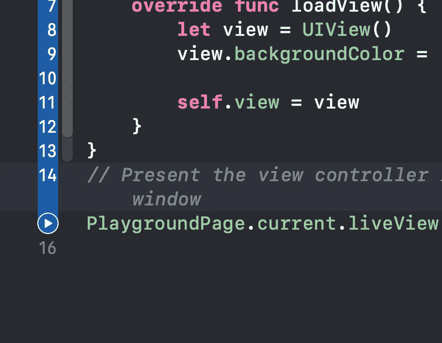

然后单击左侧的开始按钮运行它。

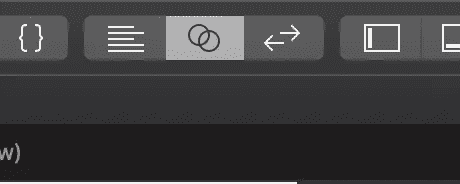

你还想选择右上方的助理编辑(两个圆圈)

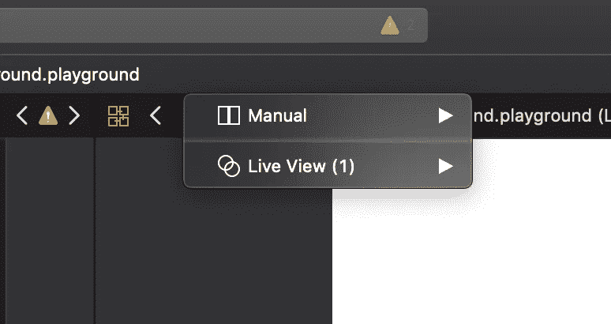

然后点击手动(顶部中间),从菜单中选择实时视图

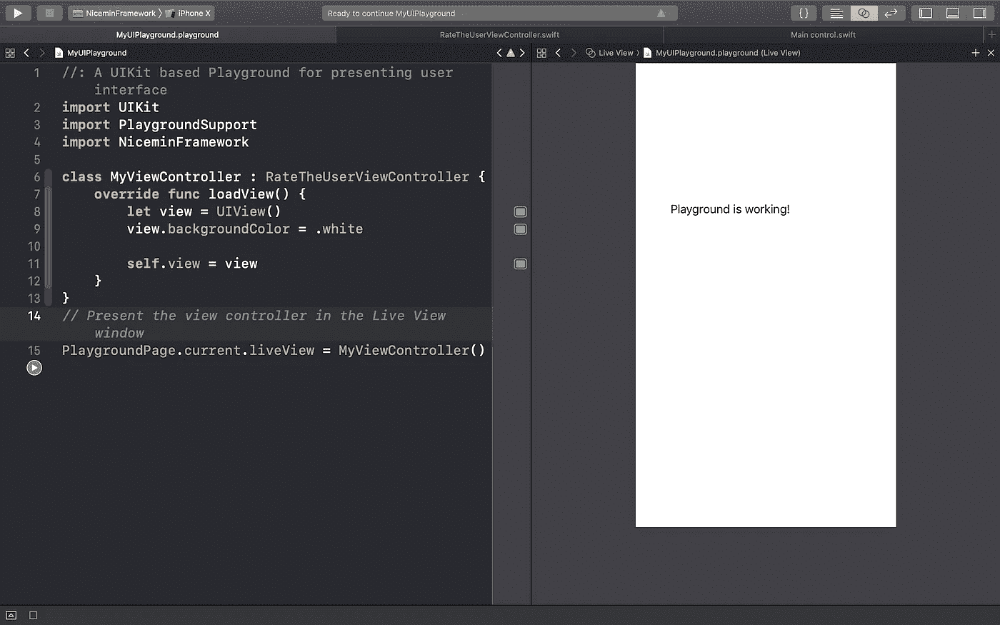

It seems fine!

现在我可以随心所欲地玩代码的每一部分，在上面做实验，看看会发生什么。

但是我还是不能和椰子玩。我也应该为这个问题找到一个解决方案。

## 可选步骤 4:将椰子添加到操场

对我来说，重要的是集成和能够玩豆荚，因为它们是我的应用程序的关键部分。

我在网上找到了这个解决方案:

1.转到 Podfile。添加一个新的目标，这是我们为操场建立的新框架，添加任何你想要的豆荚。

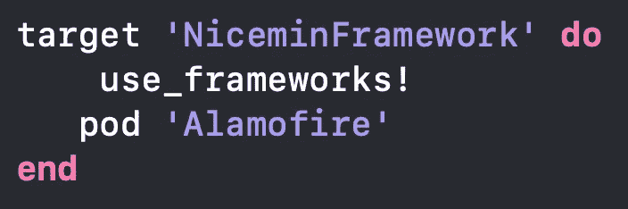

Added Alamofire to the framework in order to access it from playground!

2.Pod 安装。但这里有一个窍门。我运行了 pod install，但它不起作用，然后我运行了 pod deintegrate(它清除了您的工作场所/项目中 pod 的所有痕迹)，然后再次运行 pod install，它起作用了！

3.尝试在你的操场上导入豆荚。如果你没有看到任何错误，这意味着它应该是好的。

为了确定这一点，我做了一个测试，看起来一切正常！

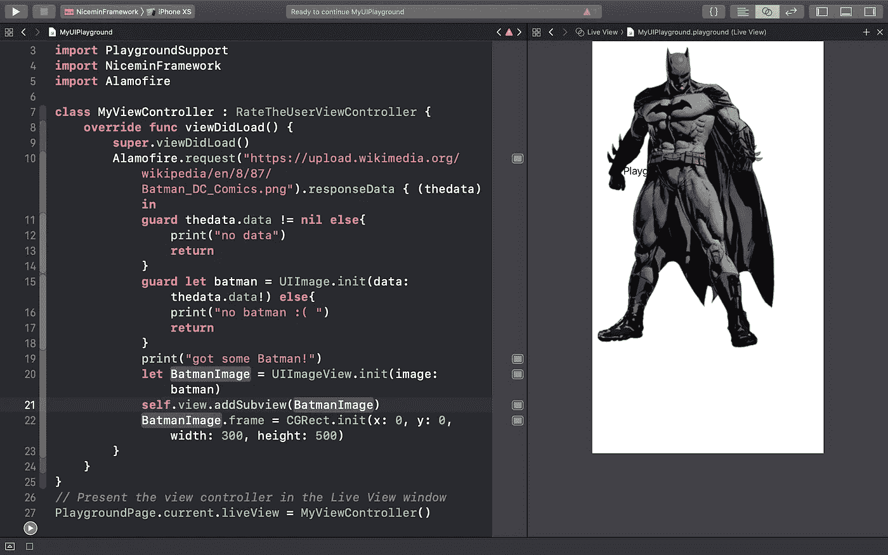

Successfully fetched Batman with Alamofire!

那么，今天就到此为止。

在第二部分，我将尝试 Xcode 测试和其他自动化 UI 测试，但那是以后的事了。