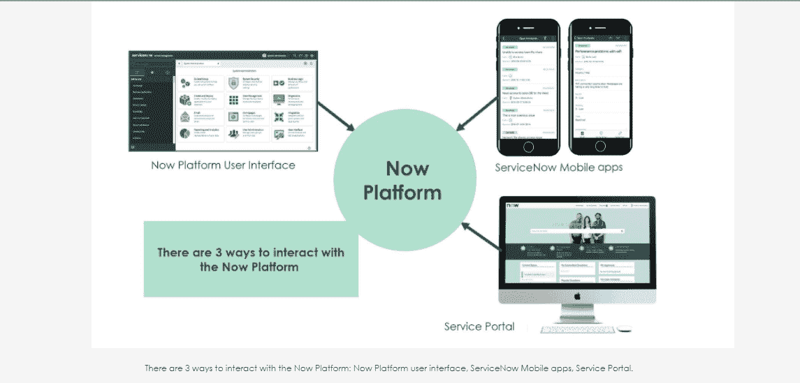
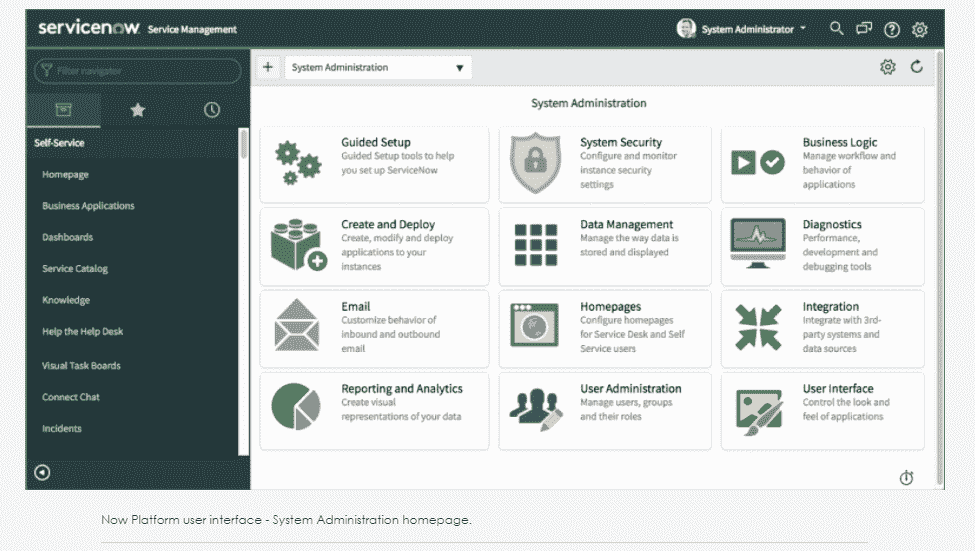
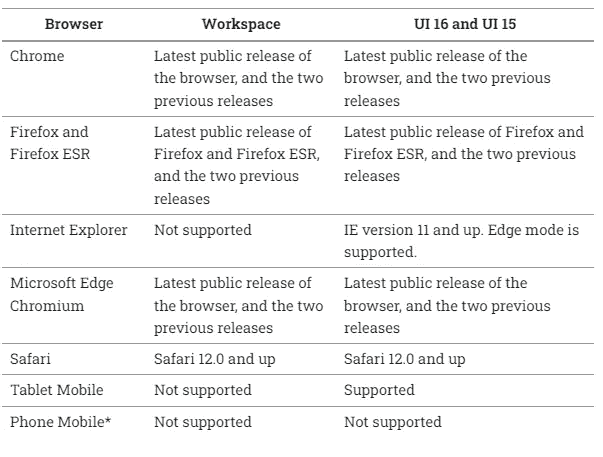
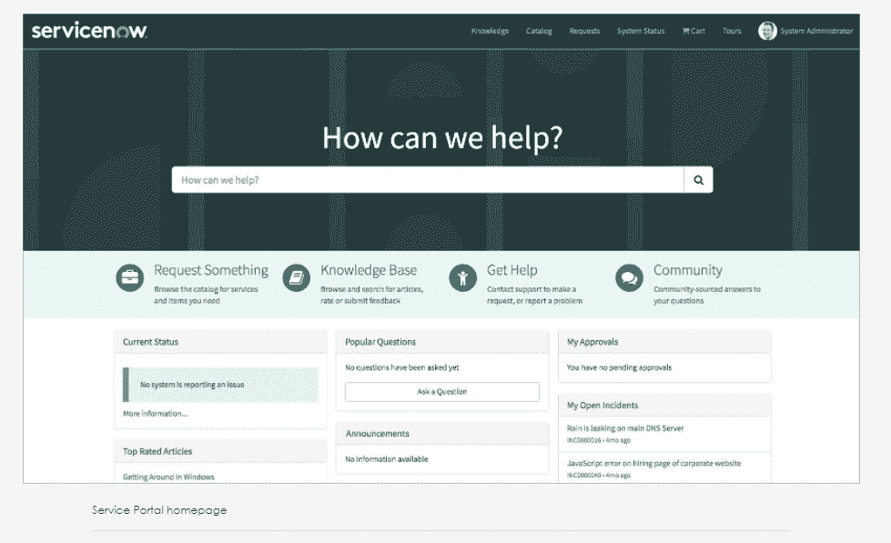
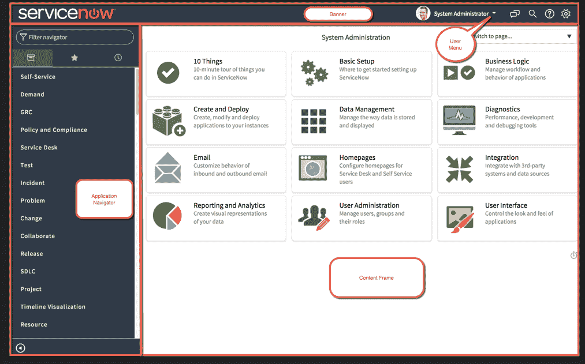
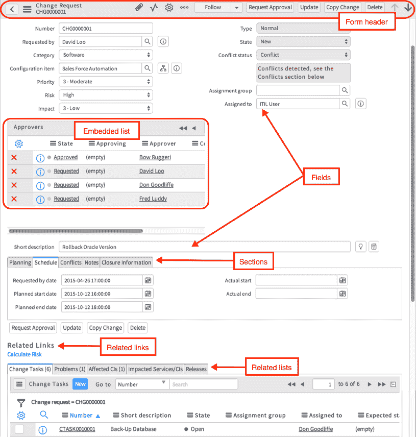
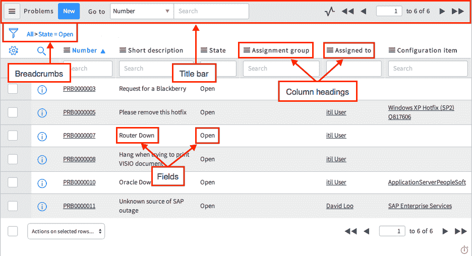
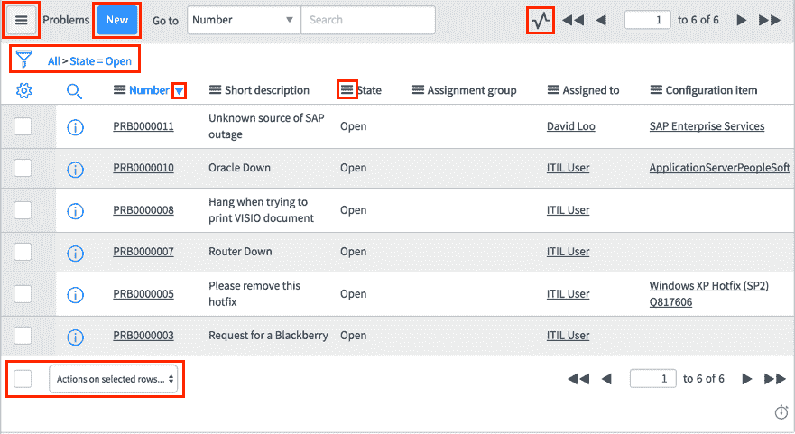
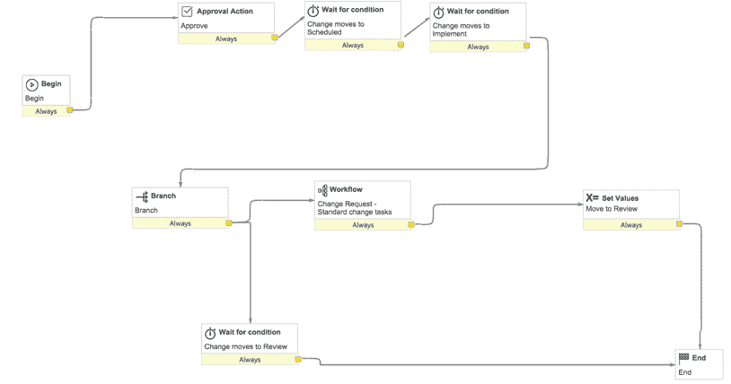
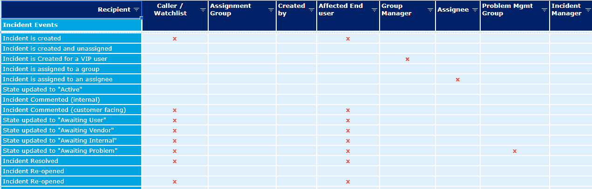

# 如何测试 ServiceNow？

> 原文：<https://medium.com/globant/how-to-test-servicenow-f256e43d3ba9?source=collection_archive---------0----------------------->

**1。简介**

**2。什么是 ServiceNow？**

**3。现在平台接口**

*3.1 现平台用户界面*

*3.1.1 浏览器支持*

*3.2 ServiceNow 移动应用*

*3.3 服务门户*

**4。NOW 平台用户界面的组件**

*4.1 主屏幕元素*

*4.2 表单视图*

*4.3 列表视图*

*4.3.1 列出特性和动作*

**5。工作流程**

6。电子邮件通知

*6.1 邮件和短信通知*

**7。服务水平管理**

**8。用户管理**

**9。用户界面测试**

**10。功能测试**

*10.1 工作流测试*

*10.2 通知测试*

*10.3 服务水平管理测试*

**11。浏览器兼容性测试**

**11。本地化测试**

**12。参考文献**

# **1。简介**

在开始测试 ServiceNow 应用程序之前，我们首先需要了解和学习 ServiceNow 工具。我在下面增加了几个部分，讨论 ServiceNow 工具及其功能。这篇文章有点长，但希望您喜欢学习 ServiceNow 和 ServiceNow 测试。本文肯定会帮助您测试任何 ServiceNow 应用程序。万事如意。

# 2.什么是 ServiceNow？

ServiceNow 的 Now 平台提供了一个应用程序平台即服务(aPaaS)。这意味着它是一个基于云的计算模型，提供了开发、运行和管理应用程序所需的基础架构。它不限于特定的部门或职能，而是涵盖整个企业。

ServiceNow 的 Now 平台在云中提供了一个现代化、易于使用的服务管理解决方案。它使您的组织能够自动化手动、可重复的流程，标准化服务交付，并专注于您的核心业务。

ServiceNow 通过一个基于 web 的可配置用户界面提供所有这些功能，该界面构建在一个灵活的表格模式之上。

ServiceNow 提供的应用程序分为四个不同的工作流:

*   IT 工作流程
*   员工工作流程
*   客户工作流程
*   创建者工作流

# 3.现在平台接口

有三种方式与 Now 平台交互。这三种方法中的每一种都提供了针对不同设备和目的的不同接口。所有这些接口都访问 Now 平台的同一个记录系统和公共数据模型。三个 Now 平台界面是:

1.  现在平台用户界面
2.  ServiceNow 移动应用
3.  服务门户

## *3.1 现平台用户界面*

Now 平台用户界面是与 ServiceNow 实例中的应用程序和信息进行交互的主要方式。值得注意的 Now 平台用户界面功能包括实时表单更新、用户状态、增强的活动流，以及带有收藏夹和历史记录选项卡的应用程序导航器。

理想情况下，您应该使用台式机或笔记本电脑通过 web 浏览器访问 Now 平台用户界面。

***3.1.1 浏览器支持***

浏览器支持因用户界面(UI)的每个版本而异。支持大多数主流浏览器。

*手机浏览器不支持桌面版 UI。

## 3.2 ServiceNow 移动应用

ServiceNow 提供三种以角色为中心的 ServiceNow 移动应用:

1.  *ServiceNow 代理*
2.  *现在移动*
3.  *ServiceNow Onboarding*

这些应用程序帮助代理和员工在旅途中更高效地工作。

***ServiceNow 代理***

ServiceNow 代理应用程序的目标是履行者角色。它支持那些满足整个企业产品和服务需求的人的需求。它也被称为移动代理。

***现在移动***

Now Mobile 应用程序的目标是满足员工的需求。它包括报告损坏项目和查找可用会议室等功能。

***service now on boarding***

ServiceNow Onboarding 应用面向新员工。它有助于在雇佣开始前执行任务。它也被称为移动入职培训。

这三个应用程序可以从 app store 下载，并由应用程序开发人员在 Now 平台中配置您业务所需的特性、功能和详细信息。您对工作之外的所有其他移动应用程序的期望现在也适用于 ServiceNow 移动应用程序。

## 3.3 服务门户

服务门户通过使用小部件提供对特定功能的访问，提供了用户友好的自助服务体验。用户能够:

*   搜索文章、目录项目、记录
*   提交请求
*   浏览公司新闻
*   还有更多！

服务门户主页可通过导航至 https://<instancename>. Service-now . com/sp 进入。您的组织可能有不同的 ServiceNow 实例环境用于开发、测试和生产。因此，<instancename>是您正在连接使用的特定 ServiceNow 实例的名称。</instancename></instancename>

# 4.NOW 平台用户界面的组件

就像任何基于 web 的应用程序一样，我们使用 web 浏览器通过用户界面与 ServiceNow 平台的应用程序和模块进行交互。我们可以访问列表和表单、实时表单更新、用户状态、应用程序、链接、历史记录和活动流。

## 4.1 主屏幕元素

1.  主屏幕元素是横幅框架，它出现在每个页面的顶部，包含徽标、用户菜单、系统设置和工具。
2.  应用程序导航器，提供对应用程序和模块的轻松访问。
3.  以及当前显示系统管理仪表板的内容框架。内容框架中显示的数据可以是多种格式，包括列表和表单。

## 4.2 表单视图

表单显示数据表中一条记录的信息。

表单上的具体信息取决于显示的记录类型。用户可以查看和编辑表单中的记录。管理员可以配置表单上显示的内容。

## 4.3 列表视图

列表显示表格中的一组记录。

用户可以搜索、排序、筛选和编辑列表中的数据。列表可以嵌入到表单中，并且可以是分层的(有子列表)。

列表界面由标题栏、过滤器和面包屑、数据列和页脚组成。列表中的每一列都对应于表上的一个字段。

***4.3.1 列出特性和动作***

列表界面由标题栏、过滤器和面包屑以及数据列组成。这些组件中的每一个都提供了一些功能，并允许您对列表和显示的记录进行操作。有两个列表版本:列表 v2 和列表 v3。

# 5.工作流程

工作流提供了一个拖放界面，用于跨平台自动化多步骤流程。每个工作流都由一系列活动组成，例如生成记录、通知用户等待批准或运行脚本。图形工作流编辑器将工作流直观地表示为一种流程图。它将活动显示为标有该活动信息的方框，并将从一个活动到下一个活动的过渡显示为连接方框的线条。

# 6.电子邮件通知

设置通知以提醒用户可能涉及他们的记录更改。您可以通过电子邮件、短信、推送通知或消息应用程序通知用户。

## 6.1 电子邮件和短信通知

使用电子邮件通知向选定用户发送有关系统中特定活动的电子邮件或 SMS 通知，例如事件更新或变更请求。

电子邮件通知允许管理员指定:

*   何时发送通知
*   谁会收到通知
*   通知中有什么内容
*   通知是否可以通过电子邮件摘要发送，如果可以，摘要内容

还提供了其他电子邮件通知选项。用户可以订阅通知，管理员可以强制发送一些通知。

## **6.2 推送通知**

除了发送电子邮件和 SMS 通知，实例还可以向移动设备发送推送通知。

推送通知是一种出现在用户移动设备上的文本消息，用于提醒他们一些重要的事情或要求他们执行某个操作。您的实例支持推送通知。

## **6.3 基于订阅的通知**

基于订阅的通知使用户能够主动订阅他们感兴趣的项目，并取消订阅非强制性的消息。

## **6.4 信息应用程序中的通知**

使用户能够在 Slack 或 Microsoft Teams 消息应用程序中接收其 ServiceNow 平台通知。使用 Now Actions 应用程序为您的实例配置消息应用程序。

# 7.服务水平管理

ServiceNow 服务水平管理(SLM)应用程序使您能够监控和管理贵组织提供的服务质量。

服务级别经理负责服务提供商和客户之间的一系列协议，这些协议定义了所提供服务的范围、质量和速度。SLM 的目的是向客户提供在已知时间范围内的服务预期，以及在服务水平未达到时进行监控的能力。

SLM 可用于整个组织的各个部门，如人力资源、设施和 IT 部门，以跟踪内部和外部团队根据其商定的服务级别的表现。

SLM 具有以下特点:

*   服务水平协议(SLA)定义
*   任务服务级别协议
*   与其他 ServiceNow 插件的集成

# 8.用户管理

通过将个人定义为系统中的用户来管理可以访问您的实例的个人。创建用户组，并将用户分配给他们。使用角色来指定不同用户和用户组可以查看和执行的操作。

组是一组具有共同目的的用户。组成员执行诸如批准变更请求、解决突发事件、接收电子邮件通知或执行变更请求任务等任务。将每个用户分配到至少一个组。

角色控制对应用程序和模块中特性和功能的访问。管理员角色提供对所有特性和功能的访问。

一个好的做法是将角色分配给组，而不是用户。通过将用户添加到组中，管理员可以快速将角色分配给多个用户。如果用户移动到另一个组，则分配给新组的角色会自动应用。

# 9.用户界面测试

大部分开箱即用的 UI 页面都是由 ServiceNow 开发测试的，所以我们一般不需要做 UI 测试。但是，如果 UI 页面根据业务需求进行修改，那么我们需要遵循标准的 UI 测试清单，以确保流畅的用户交互和最佳的用户体验。以下清单将确保在 ServiceNow 中进行详细的 GUI 测试。

*   检查所有 GUI 元素的大小、位置、宽度、长度以及字符或数字的可接受性。例如，您必须能够向输入字段提供输入。
*   检查您是否可以使用 GUI 执行应用程序的预期功能
*   检查错误信息是否正确显示
*   检查屏幕上不同部分的清晰分界
*   检查应用程序中使用的字体是否可读
*   检查文本的对齐方式是否正确
*   检查字体和警告信息的颜色是否美观
*   检查图像是否清晰
*   检查图像是否正确对齐
*   检查不同屏幕分辨率的 GUI 元素的位置

# 10.功能测试

与所有其他应用程序类似，我们也需要对 ServiceNow 应用程序进行功能测试。在功能测试中，我们根据需求验证应用程序的功能。以下清单将确保在 ServiceNow 中进行详细的功能测试。

*   检查所有 UI 按钮的功能
*   检查不同视图中 UI 元素的可见性
*   在窗体视图中检查功能
*   检查相关字段的功能
*   在列表视图中检查功能
*   检查访问控制列表功能
*   检查相关链接的预期行为
*   检查附件功能，如大小、附件数量、文件格式、重命名、下载和删除功能
*   检查活动流功能(工作笔记、附加注释等)。)
*   检查字段值的自动填充—例如，如果我们从突发事件创建突发事件任务，则突发事件任务上的几个字段应该会自动填充
*   检查两个或更多模块之间的数据传输，例如，如果我们从事件中创建一个问题，那么一些字段值应该从事件模块传输到问题模块
*   检查不同视图中相关列表的可见性
*   检查 UI 按钮、过滤器等的功能。在每个相关列表中

除了上述清单，我们还针对 ServiceNow 中的一些关键功能。我已经将这些功能列为功能测试的子类别。

## 10.1 工作流测试

工作流测试涵盖了端到端的业务流程。以下清单将确保在 ServiceNow 中进行详细的工作流程测试。

*   检查启动或停止任何活动的触发条件
*   基于分支条件检查不同的流
*   检查业务流程的不同阶段
*   检查不同阶段的不同状态
*   检查不同阶段/状态的 UI 元素的可见性
*   检查批准条件
*   检查剔除条件
*   检查通知

## 10.2 通知测试

在通知测试中，我们检查从 ServiceNow 系统发出的电子邮件通知。测试电子邮件通知的最佳实践是创建一个通知矩阵，其中包括通知名称、收件人等。添加了示例通知矩阵的屏幕截图。

以下清单将确保在 ServiceNow 中进行详细的通知测试。

*   检查条件，即何时发送
*   检查收件人，即发送给谁
*   检查电子邮件主题
*   检查电子邮件正文(措辞、格式、变量等。)即它包含什么
*   检查电子邮件通知中的订阅选项
*   检查通知中的事件创建者选项
*   检查电子邮件正文中是否存在 URL 重定向
*   检查状态(发送、发送就绪、发送忽略、发送失败、接收、接收忽略等)。)的电子邮件通知
*   检查活动流中电子邮件通知的可见性
*   检查预览电子邮件用户界面操作

## 10.3 服务水平管理测试

服务水平管理测试涵盖两个主要功能— SLA 定义和任务 SLA。

以下清单将确保在 ServiceNow 中对 **SLA 定义&任务 SLA**进行详细测试。

**SLA 定义 **

*   检查类型是 SLA 还是 OLA。请注意，这仅用于报告目的。
*   检查将应用 SLA 或 OLA 的任务表
*   检查 SLA 流/工作流以确定 SLA 定义何时附加到任务记录
*   检查持续时间类型**用户指定的**持续时间，或相对**的**持续时间
*   检查 SLA 在被标记为违反**之前运行的持续时间**
*   检查时间表，该时间表指示服务提供商交付服务所遵循的有效工作日和非工作日
*   检查时间表以确定违反 SLA 的时间
*   检查时区源
*   检查 SLA 开始条件
*   检查 SLA 暂停条件
*   检查 SLA 停止条件
*   检查 SLA 重置条件

***任务 SLA***

*   检查是否为特定任务附加了任务 SLA 记录，例如事件、问题等。
*   检查 SLA 显示名称、定义
*   检查开始时间、结束时间
*   检查不同阶段
*   检查违规状态
*   检查实际经过的时间，百分比
*   检查实际剩余时间，百分比
*   当取消以前的 SLA 时，检查是否附加了新的 SLA，例如，如果优先级发生变化，则应取消以前的 SLA，并附加更新优先级的新 SLA
*   检查 SLA 通知
*   当附加 SLA 时
*   在指定时间达到 SLA 时，例如 50%、75%、90%等。
*   当 SLA 被违反时
*   检查 SLA 通知的收件人、主题和电子邮件正文

# 11.浏览器兼容性测试

ServiceNow 支持大多数现代浏览器，因此，在所有支持的浏览器中，其功能和用户界面都应该正常工作。但是，当定制应用程序(例如服务门户)时，建议进行浏览器兼容性测试。

以下清单将确保在 ServiceNow 中进行详细的浏览器兼容性测试。

*   检查链接/URL 的功能
*   检查对话框或弹出窗口的功能
*   检查菜单的功能
*   检查所有 UI 操作的基本功能:链接、对话框、菜单等。
*   检查图形用户界面—应用程序的外观和感觉
*   检查页眉或横幅框架
*   检查徽标
*   检查对用户操作的响应
*   检查不同浏览器上的页面加载时间

# 11.本地化测试

ServiceNow 平台支持语言的国际化以及货币和价格的本地化。受本地化测试影响的主要领域包括内容和 UI。

ServiceNow 通过为桌面环境提供 22 种语言和为移动环境提供 21 种语言的 OOTB 国际和本地化功能来支持本地化。

以下清单将确保在 ServiceNow 中进行详细的本地化测试。

*   检查日期、时间和货币等区域设置
*   检查表中的字段名
*   检查表格中的字段标签
*   检查字段的选项
*   检查信息，如信息、警告或错误等。
*   检查服务目录小部件
*   检查知识库文章
*   检查翻译风格，例如，不同语言在阳性和阴性、单数和复数、正式和会话之间存在细微差别。你的风格指南应该为这些细微差别建立指导方针，以确保你的文档有一个一致的基调。
*   检查问候
*   查看品牌指南

系统的某些区域没有翻译，包括以下区域:

*   日记帐字段
*   报告标题
*   存储自由格式文本的任何字段

这些字段保留了创建它们时使用的语言。

此外，下列名称不会被翻译:

*   产品名称
*   商标
*   应用程序名称
*   插件名称
*   发言人姓名

这些名称的英文版本始终保留，即使在其他上下文中使用它们。例如，“服务门户属性”可能被翻译成荷兰语为“服务门户 eigenschappen”但是，功能名称会被翻译。

# 12.参考

1.  [https://docs.servicenow.com/](https://docs.servicenow.com/)
2.  https://developer.servicenow.com/
3.  【https://nowlearning.service-now.com/ 