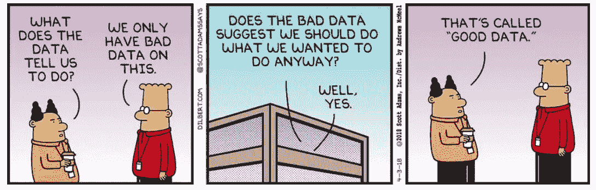
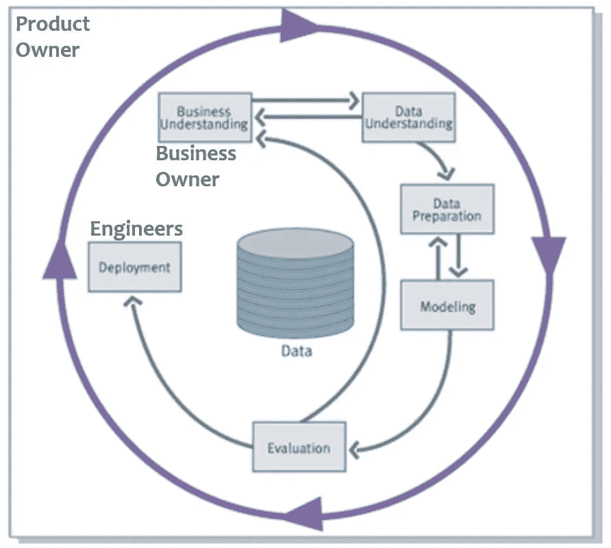

# 如何像数据科学家一样思考？

> 原文：<https://medium.com/walmartglobaltech/how-to-think-like-a-data-scientist-569682c2357f?source=collection_archive---------0----------------------->

Image by [Gerd Altmann](https://pixabay.com/users/geralt-9301/) from [Pixabay](https://pixabay.com/users/geralt-9301/)

为什么要像数据科学家一样思考？

> “所有公司都符合两个条件之一:要么成为软件公司，要么被软件公司颠覆。”Atlassian 首席执行官 Mike Cannon-Brookes

**数据科学是统计学和计算机编程的应用，旨在利用数据的力量为组织决策服务**。随着软件功能的增加，不仅仅是自动化，机器学习和人工智能对智能软件的重要性不亚于软件对破坏性的重要性。因此**像数据科学家一样思考不仅仅是数据科学家所需要的，对于**业务合作伙伴、项目发起人、工程开发人员、经理、产品负责人、项目经理以及**在技术生态系统**工作的每个人来说也同样重要。毕竟，数据科学的用处取决于它所驱动的系统，每个人在构建这些系统中的角色都很重要。

那么，如何像数据科学家一样思考呢？首先，您不必学习数据科学，但基本的熟悉会有所帮助。这里有一个 5 分钟的视频，这是一个很好的开始。但实际上，**像数据科学家一样思考并不意味着了解算法和统计，而是改变你看待世界的方式**。以下三个重要方面可以帮助您磨练数据科学思维，从而从数据科学项目中获得最大收益

## 1.我为什么要使用数据科学？

> "一个人做事总是有两个原因——一个好的，一个真正的。"约翰·皮尔庞特·摩根

数据科学既不是魔术，也不是度量标准。这是使用数据解决问题的艺术和科学。**当(a)问题被很好地指定，并且(b)不频繁地改变目标时，数据科学工作得很好。**

Image by [Gerd Altmann](https://pixabay.com/users/geralt-9301/) from [Pixabay](https://pixabay.com/)

一个明确指定的问题旨在实现一组明确指定的可统计的(最好是可测量的)结果。向客户提供优惠以提高客户满意度并不是一个明确的问题。提供更多的推荐是。(因为客户满意度是无形的。)

同样，问题的目标也不应该经常改变。这并不是说数据科学开发不敏捷。事实上，**迭代交付和持续反馈是数据科学交付的基础**。然而，目的地不应该改变。例如，如果我从增加客户推荐开始，转向增加客户保持率作为客户满意度的衡量标准，那么我实际上是要求从零开始。

这与数据科学家的工作方式无关，而是内置于分析设计和底层数学的过程中。**数据科学能够适应的是不断变化的数据可用性、质量和业务限制。数据科学无法适应的是改变分析的目的。**

或者，使用典型的例子，如果我们想要一架飞机而不是一辆汽车，那么我们不能在建模过程中从摩托车进行旋转！

Image from [Agile Bicyle: dotdev.co](https://m.dotdev.co/the-agile-bicycle-829a83b18e7)

同样重要的是要知道，尽管大肆宣传，数据科学仍然是一个遵循指令的计算机程序。因此，它不能解决伦理困境，仲裁战略优先事项，并取代领域专家在该领域的多年经验。**建立在主观决策基础上的商业伙伴关系，以及做出果断决定并继续前进的能力，是摆脱永无休止的分析——瘫痪或从假设情景中永久分支——的重要要求。**这并不是说不应该探索替代方案，但你会惊讶地发现，在实践中，这种做法会延迟价值交付，弊大于利。

## 2.我对数据科学有什么期望？

> "大致正确比精确错误要好。"约翰·梅纳德·凯恩斯

因为数据科学利用数据，所以任何关于数据可用性、完整性和质量的限制都会影响结果。从表面上看，这似乎很合理，但是数据科学家必须达到企业预期的准确性标准的次数太多了，而这种准确性显然没有数据支持。**符合数据质量的现实并降低期望值，同时规划改进的数据收集和标记是为成功做准备的方法。**

Image by [Dilbert.com](https://dilbert.com/strip/2018-04-03)

因为数据科学的核心是建立在统计基础上的，所以所有数据科学的结果都是概率性的结果，即使它们有时并没有表现出来。对概率结果和置信区间感到满意有助于避免对甚至现实世界都没有显示的任意确定性水平的需求。

概率思维的另一个方面是理解没有一个模型在现实世界的用例中对所有场景都是完全正确的。没有一个模型可以，也不应该被期望在任何地方、任何时候都是正确的。关注利润是陷入僵局的秘诀，类似于把婴儿和洗澡水一起扔掉。数据科学家的思维方式侧重于接受比现状更好的方法，即如果没有数据科学的投入，组织会做些什么，然后在此基础上追求持续改进。期望解决方案在第一个版本中是完美的，本质上是默认了更糟糕的现状。

## 3.我如何充分利用数据科学？

> "如果你不知道你要去哪里，任何一条路都会把你带到那里。"——刘易斯·卡罗尔

当希望构建模型或开始分析时，数据科学家通常会考虑如何使用结果。这在两个方面有所帮助:第一，它有助于指导分析，第二，它有助于关注什么是重要的。

Image by [Oberholster Venita](https://pixabay.com/users/artsybee-462611/) from [Pixabay](https://pixabay.com/)

如果我希望通过客户来识别顶级产品，如果结果预期用于自动填充客户的购物车，而如果结果预期用于提供折扣，那么基本的 ML 方法将会不同。**在缺乏结果和可操作性驱动的思考的情况下，注意力转移到可以理解和容易的事情上，而不是正确和有用的事情上**，并且经常陷入无休止的讨论中，讨论进行特征工程的这种或那种方式，选择模型参数的这种或那种方式，等等。但是，如果产品、工程、业务和数据科学功能在结果上是一致的，那么这些争论自然会找到解决方案。

保持对结果的关注的一个方法是通过一些明确定义的可测量的度量标准来定义结果。在机器学习的掩盖下，**所有的数据科学分析都有一个它们正在优化的底层衡量标准。**技术上称为“成本函数”，监督和非监督算法都致力于优化某些指标。如果业务结果没有按照度量标准来指定，那么您就无法逃避指定一个度量标准，您只是将您的想法交给了模型的默认值。**明确思考反映数据驱动的决策的预期影响的指标，对于从数据科学产品中获得最大价值，同时减轻分析瘫痪和假设循环非常重要。**

Image by [XKCD](https://xkcd.com/1838/)

分析设计过程需要尽可能长的时间来考虑一组正确的指标，但是一旦指定了指标，我们必须相信他们会做好自己的工作，并提供对结果有积极影响的解决方案。在实践中，讨论经常偏离到解决方案和建议的可口性，如果不调整数据或结果指标，就不能调整解决方案和建议本身。机器学习中的“学习”意味着该方法不能从外部修补，除非通过数据和成本函数的杠杆。如果建议的质量导致了度量标准的缺陷，当然，继续改变，但是重复的改变周期只是暗示了对获得期望结果的偏好，而不管数据告诉了什么，在这一点上，人们还不如在决策过程中抛弃数据科学。

虽然显而易见，但仍然值得谨慎的是**指定的指标必须反映期望的现实结果，因为指标朝着正确方向的变化应该激励业务结果的期望方向**。例如，如果我通过被拒绝的费用的美元价值来衡量机器学习模型发现费用欺诈的能力，那么我本质上是在激励模型拒绝所有费用，而不是真正发现欺诈。再比如，衡量客户推荐的指标不应关注新客户(因为还有其他营销渠道)，也不应关注新推荐(不断增长的客户群可能会增加推荐数量)，而应关注每个现有客户的推荐。当然，你怎么知道这些推荐的客户会不会自己来(想要=推荐，需要=客户增长)？因此有了实验！

CRISP-DM process from [Wikipedia](https://en.wikipedia.org/wiki/Cross-industry_standard_process_for_data_mining)

鉴于数据质量在机器学习预测的准确性中发挥着重要作用，鉴于等待完美是一个无法实现的目标，我们如何决定何时准备好进行生产部署？**数据科学家的思维方式是通过正确的衡量标准关注结果，并致力于使流程做得更好。**只要模型能够做到这一点，并且对现状的精确度进行有差别的改进值得进行技术投资，以使模型输出取得成果，数据科学就已经完成了它的工作，并准备好投入使用。并为下一次迭代做好准备。

熟悉实验、试用、A/B 测试对于仲裁我们上面概述的一些主观决定以及将 ML 组件的附加值与产品和业务流程的其余部分区分开来是很重要的。

## 离别赠言

业务需求需要解决方案。产品需要功能。它们是否是机器学习驱动的功能并不重要。因此，数据科学在产品中的应用必须是固有的，并且从一开始就紧密集成到产品的设计、架构和 UX 中。**一个好的机器学习解决方案是看不见的。**

在业务和产品利益相关者不精通数据科学能力的情况下，产品“需求”可能是指他们可以预见的功能。**询问一系列“是什么”和“为什么”会给数据科学带来潜在的增值机会，即使这不是最初询问的内容。**如果一名汽车修理工正在寻找一款具有基于机油油位的报警功能的产品，这可能是一个简单的实施规则。但是，深入挖掘可能会发现，如果发动机机油油位偏离基于汽车维护历史的预期行为，这实际上是所期望的。它可以帮助**超越想要的东西，并确定实际产生影响和推动创新的需求**。

像数据科学家一样思考并不意味着理解算法和统计数据，而是一种看待世界的范式转变，这是值得的。

*你能分享一下像数据科学家一样思考的经验吗？我错过了什么？评论一下，让我知道！*