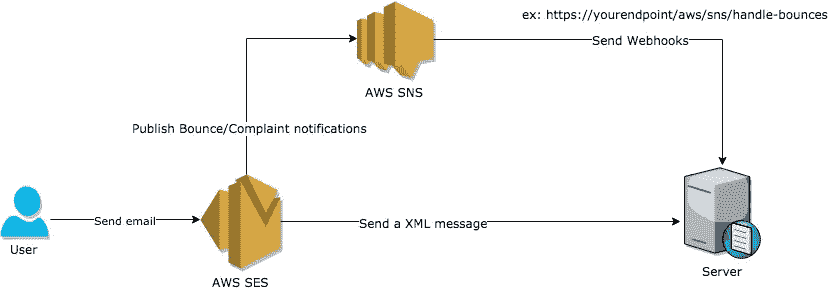
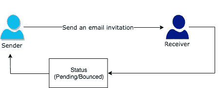
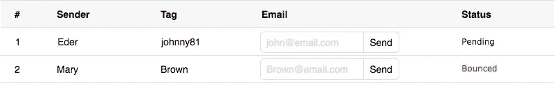

# 用户使用 Laravel 发送邮件后，如何跟踪退回的电子邮件

> 原文：<https://medium.com/quick-code/how-to-track-bounced-email-messages-after-user-sending-a-mail-4c79e96e8bf0?source=collection_archive---------3----------------------->

> 使用 Laravel 处理来自 AWS 的电子邮件退回通知



# 介绍

在前面的故事( [**如何在 15 分钟内处理 AWS 中的退回和投诉通知**](/quick-code/how-to-handling-bounced-and-complaint-notification-in-aws-within-15-minutes-827972207484) )中，解释了如何在 AWS 中配置通知。

您将从这个主题中学习如何实现带有通知的代码。

# 方案



一个当前用户想通过邮件邀请一个新用户 B，成为你的连接圈。



这是一个简单的模型。发件人需要知道电子邮件邀请已成功发送的状态。因此，我们将在 AWS 触发 Webhook 后向发件人显示电子邮件状态。

# 定义

**Webhook:** 是一个 HTTP 回调，当它得到一个通知时发生一个 HTTP POST。

**查询响应和 Amazon SES:** 为了响应查询请求，Amazon SES 返回一个包含请求结果的 XML 数据结构。

# 流动

从 AWS 接收**消息 ID** ，将其存储到数据库(通知表)。我们可以使用邮件 ID 来识别哪一封是退回邮件。

# 让我们编码吧

## 发送电子邮件

## 创建 SendNotificationEmail 作业实例。

消息 ID 必须存储在您的数据库中。您将需要邮件 ID 来识别您发送的任何有问题的电子邮件。

> 此路由处理来自 AWS SNS 的通知。
> 
> 如果邮件被拒绝或退回，邮件 ID 将出现在您收到的任何投诉或退回通知中。

## 安装 SNS 消息验证器

> [**Amazon SNS Message Validator for PHP**](https://github.com/aws/aws-php-sns-message-validator)允许您验证传入的 HTTP(S) POST 消息是否是有效的 Amazon SNS 通知。

```
$ composer require aws/aws-php-sns-message-validator
```

我希望这能帮助你更好地理解退回邮件:)

## 参考

*   [https://docs . AWS . Amazon . com/ses/latest/developer guide/query-interface-responses . html](https://docs.aws.amazon.com/ses/latest/DeveloperGuide/query-interface-responses.html)