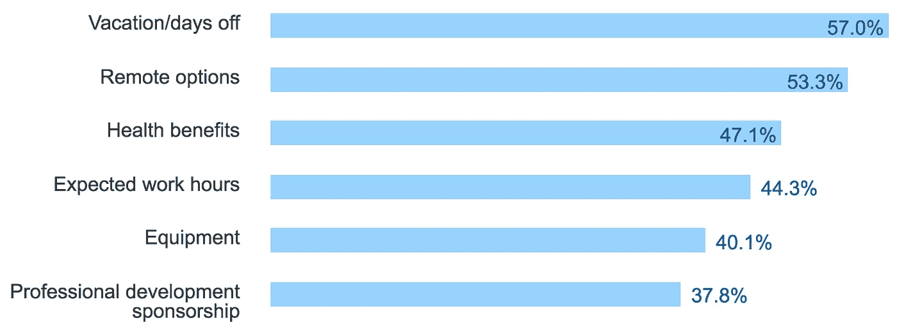

# 如何将一个职位空缺变成顶尖科技人才的梦想工作

> 原文：<https://medium.com/javascript-scene/how-to-turn-a-job-opening-into-a-dream-job-for-top-talent-14b63f03146d?source=collection_archive---------1----------------------->

很少有投资可以与建立一个真正有效的团队的投资回报率相媲美，但是找到合适的人可能是一个具有挑战性的过程。

争夺最佳开发人才的竞争非常激烈，因此我们需要更加努力地寻找和留住优秀的人才。如果你对寻找优秀的开发人员感到沮丧，很可能是因为你没有建立合适的环境来吸引和鼓励他们。

> 如果你抄袭，你可能会失败。

不要盲目追随别人的做法。很少有公司做对了这一点，这意味着如果你照搬，你可能会失败。

# 为什么重要？

**你已经为一个高质量的团队付出了成本** —你只是以不同的方式付出了成本:

*   [低效的开发流程](/javascript-scene/the-outrageous-cost-of-skipping-tdd-code-reviews-57887064c412)
*   缺乏经验的开发人员犯下的昂贵的、可避免的错误
*   技术债务
*   生产力崩溃和耗尽
*   员工流失

问题是，所有这些费用都有负的投资回报率(T4，T5)。你可以**把同样的钱**投资到**最有投资回报的地方**，而不是**你的团队。**

> 如果你没有在人身上投资，你就是在选择浪费金钱。

有缺陷的逻辑是这样的:

我可以花 12 万美元雇佣一名中级开发人员，或者花 16 万美元雇佣一名高级开发人员(4 万美元是美国初级和高级开发人员技能的平均成本差*【Indeed.com】*)。你认为你节省了 4 万美元，但是…

研究的优势表明开发者之间的表现存在数量级的差异。引用史蒂夫·麦康奈尔(作者，[“代码完成”](https://www.amazon.com/Code-Complete-Practical-Handbook-Construction/dp/0735619670//ref=as_li_ss_tl?ie=UTF8&linkCode=ll1&tag=eejs-20&linkId=952cde4bfe49dde0dba31a960f2c8acb))的话:

> “程序员之间存在数量级差异”这一普遍发现已经被许多其他对职业程序员的研究所证实(Curtis 1981，Mills 1983，DeMarco 和 Lister 1985，Curtis 等人 1986，Card 1987，Boehm 和 Papaccio 1988，Valett 和 McGarry 1989，Boehm 等人 2000)。

这并不意味着一个优秀的开发人员会写出 10 倍多的代码或 10 倍多的功能。这意味着他们将交付 10 倍的组织价值。

一旦您的产品达到一定规模，一个聪明的个体开发人员可以进行过程改进，每月为您的组织节省数万或数十万美元的开发成本，或者防止可能每年为您的组织花费数百万美元的 bug 或 UI 错误。

你能通过你的开发团队传递多少价值很大程度上取决于你的组织创造力和收入，但是据我所知，这个数字是无限的。当 Instagram 以**【1B】**的价格被收购时，团队只有 13 个人——这意味着每个团队成员平均为公司的估值贡献了**7700 万美元**。

像这样的收购很少见，但极端的异常价值贡献在科技行业很常见。我个人曾多次看到个人开发者以数百万美元的方式移动指针，多到无法列举。不服气？参见[“一张吉拉门票如何让我的雇主每月赚 100 万美元:7 个真正重要的指标”](/javascript-scene/how-one-jira-ticket-made-my-employer-1mm-month-7-metrics-that-actually-matter-ffb5b2376a6b)。

精明的、有经验的开发人员经常看到经验不足的开发人员错过的机会。

好消息是，更好的开发者不需要花费你更多的钱。更高的报酬是吸引更好的开发人员加入你的团队的几个因素之一。

# 开发者关心的是什么？

根据 stack overflow 2017 年的调查:

这可以归结为:

*   生存需求(如健康)
*   时间的自由
*   位置自由
*   增长机会
*   工作影响

生存第一。开发人员希望得到公平的报酬，但是一旦我们进入典型的 9 万美元+软件开发人员工资，其他需求就变得更重要了。

你的竞争对手往往无法在其他方面脱颖而出，这意味着你有机会让你的公司脱颖而出。

除了基本的生存和完成工作所需的设备之外，开发人员还希望在他们希望的时间和地点工作，他们希望他们的工作有所作为或产生一些社会影响。

## 敢于与众不同

普通公司提供公平的市场工资、假期、健康福利和设备。大多数软件开发人员认为所有这些都是理所当然的。

让自己脱颖而出的最好方法是什么？这里有一些大多数开发者想要的东西，但是很少有公司提供。这就是如何把一份工作变成一份梦寐以求的工作:

1.  **远程工作**
2.  **弹性工作时间**
3.  **职业发展/学习机会**
4.  **金手铐赔偿**

# 远程工作和弹性工作时间

超过一半的开发人员希望远程工作和灵活的工作时间，并将这些好处列在清单的顶部。

不要半途而废。采用远程优先的文化。如果一个人通过电脑参加会议，每个人都应该定期参加。

尽你所能，采用软件来促进会议，如 scrum 和回顾。这些工具不仅让远程工作人员受益，还能帮助您保持有序，并提供行动项目的记录，供您将来实际查看，而不像指定的记录员那样草草记下。

将办公室团队转变为高性能远程操作需要一点时间，但这是值得的，因为远程工作会带来:

*   [更好的软件设计](http://www.hbs.edu/faculty/Publication%20Files/08-039_1861e507-1dc1-4602-85b8-90d71559d85b.pdf)
*   高效工作(办公室是干扰工厂)
*   降低工资成本和通勤福利(见下文)

# 金色手铐

你不必拿出金手铐来竞争，但你应该意识到，像脸书、谷歌和网飞这样的公司利用这种策略来吸引专业的、稀有的人才。

多了多少？使用金手铐策略的公司通常会支付 150%-300%的市场价格，甚至是彩票金额，来选择在机器学习、AR、VR、区块链或无人机等热门研究领域拥有成熟技能的人才。不知道上限。一些资深开发人员每年从股票和薪水中获得数百万美元。

# 如何在薪水上省钱

> 这个想法是让你的投资价值最大化，而不是投资越少越好。

幸运的是，只要你公平地补偿，开发者通常会用相当多的现金来换取更多的自由。但不要以此为借口来逃避。这个想法是让你的投资价值最大化，而不是投资越少越好。

为了让你的钱发挥最大价值，你需要支付高于市场的价格，我不是指市场平均价格的 110%。你的竞争对手已经在这么做了。120%+将帮助您吸引顶级高级人才。

在薪水上省钱的方法是成对雇用；一名高级开发人员与一名初级开发人员配对。将他们放在同一个项目中，练习代码审查和专门的结对编程。

随着时间的推移，工资会有很大变化，但截至 2017 年 7 月，预计支付:

*   **高级:**14 万美元——23 万美元
*   **初级—中级:** $10 万— $14 万

这些数字可能听起来很高，但那是因为我们有意击败市场一点点，以吸引更好的开发商，他们可以很容易地获得竞争报价。

你可能会因为所在地区的生活成本而下调这些费率，但最好是保持在这个范围内，而不是通过雇佣远程工程师来节省办公空间。

如果你雇佣远程办公，你可以节省办公空间、通勤福利、食物、办公用品、建筑保险和其他一千多项小开支，这些加起来就是一大笔钱。如果你雇佣远程员工，你也可以不用支付这些范围的低端，因为员工愿意用一点现金换取一点自由，他们可以利用生活成本套利，在成本较低的地方获得更高的生活水平。

> 通过雇佣远程工程师来节省办公空间。

如果你在旧金山、纽约市或洛杉矶雇佣需要通勤到办公室的员工，那么最好的人才的薪酬应该接近这些范围的上限，例如，顶级高级开发人员的薪酬为 18 万美元以上。顶级初级开发人员 12 万美元以上。

假设你雇佣了一个 6 人团队。我们假设你已经选择建立一个远程团队，这样你就可以在这些范围的低端附近付款。假设你雇佣了一个全高级团队:

*   6 名高级开发人员 @ $15 万美元
*   总计: **$90 万***($ 7.5 万/月)*

现在让我们将招聘分为初级和高级:

*   3 名高级开发人员 @ $15 万美元
*   3 名初级开发人员 @ $11 万美元
*   总计: **$78 万***(6.5 万美元/月)*

通过将初级和高级人员配对，你将节省足够的钱来雇用另外一两个员工——如果你正在雇用训练有素的顶级初级开发人员，他们将带着中级技能进入团队，并在几个月内，开始以或接近你最好的高级开发人员的水平做出贡献。

> 警告:不要试图通过雇佣所有初级开发人员来省钱。

老实说，你可以付给初级开发人员比高级开发人员少得多的报酬，因为你必须让他们和高级开发人员配对，以确保他们的效率。不要试图通过雇佣所有初级开发人员来省钱。在灾难、重构和其他隐性支出方面，这将比雇佣相同数量的资深员工花费更多。

## 采访

大多数公司都面试错了。没有亲眼看着他们编码，我永远不会雇佣一个开发人员。一般来说，这意味着面试官应该和他们一起面对挑战。预先选择几个有代表性的挑战，让面试官从中选择。

在真实的电脑上做，而不是在白板上。最好是远程的，在花任何钱或花大量时间在候选人身上之前。

**永远不要让应聘者在白板上写代码。**应聘者会觉得你不懂面试开发者，你的公司还停留在黑暗时代。

**千万不要问考生随机 CS 算法问题。应聘者会认为你刚从计算机科学专业毕业，不知道现实世界中有什么挑战等着你。**

了解常见数据结构和算法的要点具有巨大的价值。把它们都背得滚瓜烂熟，然后在白板上一笔带过。这就是谷歌的用途。我见过的大多数在 CS 面试中表现出色的候选人都是没有实际工作经验的应届大学毕业生。

Max Howell 写了 Homebrew，这款软件被很多谷歌员工(以及几乎所有其他拥有 Mac 的开发者)使用，但是谷歌拒绝了他，因为他不能在白板上反转二叉树。

哎呀。

## 高级开发人员需要什么

一般来说，您希望高级开发人员拥有广泛的经验，并对应用程序架构和技术堆栈有深刻的理解，就像您一样。

*   成熟的问题解决技能，可大规模处理多个真实生产应用
*   在问题领域或技术堆栈(理想情况下两者都有)方面的深度专业化
*   优秀的指导/教学技能(记住:你将让他们与初级开发人员配对，目的是培训初级开发人员)
*   优秀的学习技能(研究和学习新技术和问题解决方案的能力)
*   对软件开发的热情&解决他们在你的团队中会遇到的具体问题的兴奋
*   奖金:指导、写作、公开演讲或 OSS 贡献的公开记录

**经历:**

*   至少 3 年以上。
*   6+年，理想。

## 初级开发人员需要什么

雇用初级开发人员完全是为了了解他们的学习轨迹。你要用一些技术和软件架构问题来难倒他们。寻找那些不怕说“我不知道，但我很想学”的人

以下是要寻找的内容:

*   他们对你的技术有多少了解？
*   他们知道正确的东西吗，或者仅仅是在 API 文档中对 google 来说显而易见的东西？
*   最重要的是:他们认真学了多久？他们的学习速度是否令人印象深刻？他们对它的热情很明显吗？

优秀的初级开发人员想要了解这个团队，他们会寻找机会与优秀的导师合作。这是一个很好的机会向他们提及他们将与一位资深开发人员配对，这位开发人员将给予他们持续的支持和反馈。

初级开发人员正在寻找学习和职业发展的快速通道。给他们，他们会欣然接受。

# 职业发展和学习

在美国，我们倾向于忽视工作场所所有形式的指导、培训和学徒。在其他国家，学徒制是历史悠久的传统，有着可追溯到几个世纪的良好记录，人们将它应用于大多数技术行业，包括软件开发。

美国需要向世界其他国家学习，因为如果实施得好，导师制比高级大学学位、集训营、证书或在线课程更能带来高薪。

## 什么是师徒制？

导师制通常采取一对一的形式，由资深专家提供长期指导。理想情况下，师徒关系会持续数月或数年，甚至可能比雇佣关系更长久。导师制不仅仅适用于初级开发人员。资深开发者也需要。

马克·扎克伯格(脸书)得到了史蒂夫·乔布斯(苹果公司)的指导。谢尔盖·布林(Sergey Brin)和拉里·佩奇(Larry Page )(谷歌创始人)的导师是大卫·查里顿。弗雷德里克·埃蒙斯·特曼曾指导过戴维·帕卡德和比尔·休利特(惠普公司的创始人)。

理想情况下，你的所有员工(无论技能或经验如何)都应该有导师。将高级开发人员与中级和初级开发人员结成导师关系。根据职业目标，高级开发人员也可能希望与工程经理、首席技术官、其他高级开发人员或感兴趣领域(如机器学习、AR/VR 等)的专家建立学员关系

如果你的团队没有资深开发人员的合格导师，积极寻找机会从公司以外的人那里寻求指导。这一领域的一些专家将会愿意建立师徒关系。如果你找不到免费做这件事的人，试着出钱(由雇主支付)。对于高度成功的人才来说，导师制正日益成为一个可行的职业机会。

有一些为导师和学员牵线搭桥的平台，但当我深入了解这些平台时，我感到非常失望。它们大多是按分钟付费的开发人员帮助服务，而不是提供真正的长期指导。导师和学员的质量都很糟糕。

于是我联合创立了一个新平台: [DevAnywhere.io](https://devanywhere.io)

这是一个在你的开发团队中启动导师文化的好方法，并且为你团队中最资深的开发人员提供一个导师——那些你没有足够资深的角色模型与之配对的人。

## 付费培训

最好的公司给员工提供培训预算。要真正脱颖而出，为培训资源，如书籍、在线内容和会议，提供慷慨的预算。每年花费 1000 到 5000 美元，你就可以提供顶级人才喜欢的非常强大的福利。

你还应该指望将开发者工资的 30%-50%投入到导师项目中。这听起来可能很多，但它有极高的投资回报率。投资额呈线性增长，而投资回报率呈指数增长。(参见:[“努力寻找优秀的高级 JavaScript 开发人员？师友就是答案"](/javascript-scene/struggling-to-find-great-senior-javascript-developers-mentorship-is-the-answer-d352ea3574eb))

如果你的团队中有开发人员可以作为更多初级成员的好榜样/导师，那么成本将会是导师的薪水。你需要让他们每周至少有一两天脱离个人贡献者的职责，让他们承担倍增的职责。

对于最资深的开发人员，你需要在组织之外寻找一个导师。因为大多数合格的导师不能或不愿意为你的事业贡献他们的时间——你需要付给他们报酬。

需要帮助寻找合格的导师？试试 [DevAnywhere.io](https://devanywhere.io) 。

# TL；速度三角形定位法(dead reckoning)

如果你想把你无聊的工作清单变成一个开发者的梦想，以吸引更好的人才，这里有一个诀窍:

*   充裕的假期
*   远程工作
*   巨大的健康益处
*   弹性工时
*   很棒的设备
*   师徒制
*   培训预算
*   跳过白板/CS 测验(而是观看他们在真实计算机上编写代码)

# 通过实时 1:1 辅导提升您的技能

DevAnywhere 是达到高级 JavaScript 技能的最快方法:

*   现场课程
*   弹性工时
*   一对一指导
*   构建真正的生产应用

[https://devanywhere.io/](https://devanywhere.io/)

***Eric Elliott*** *是* [*【编程 JavaScript 应用】*](http://pjabook.com) *(O'Reilly)的作者，也是*[*devanywhere . io*](https://devanywhere.io/)*的联合创始人。他为****Adobe Systems*******Zumba Fitness*******【华尔街日报】*******【ESPN*******BBC****等顶级录音师贡献了软件经验*****

**他和世界上最美丽的女人一起在任何他想去的地方工作。**