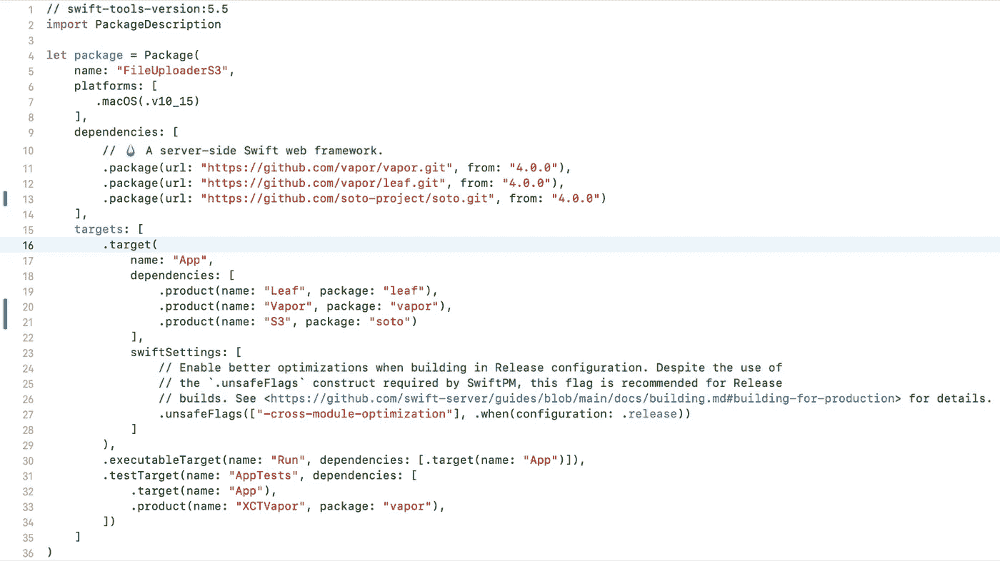
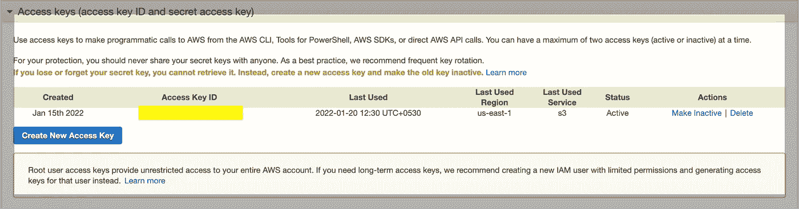
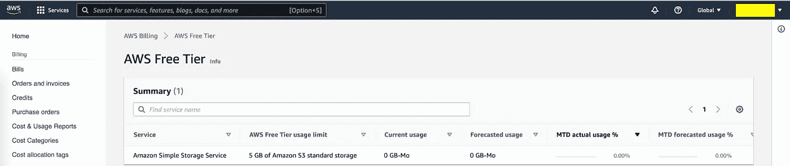
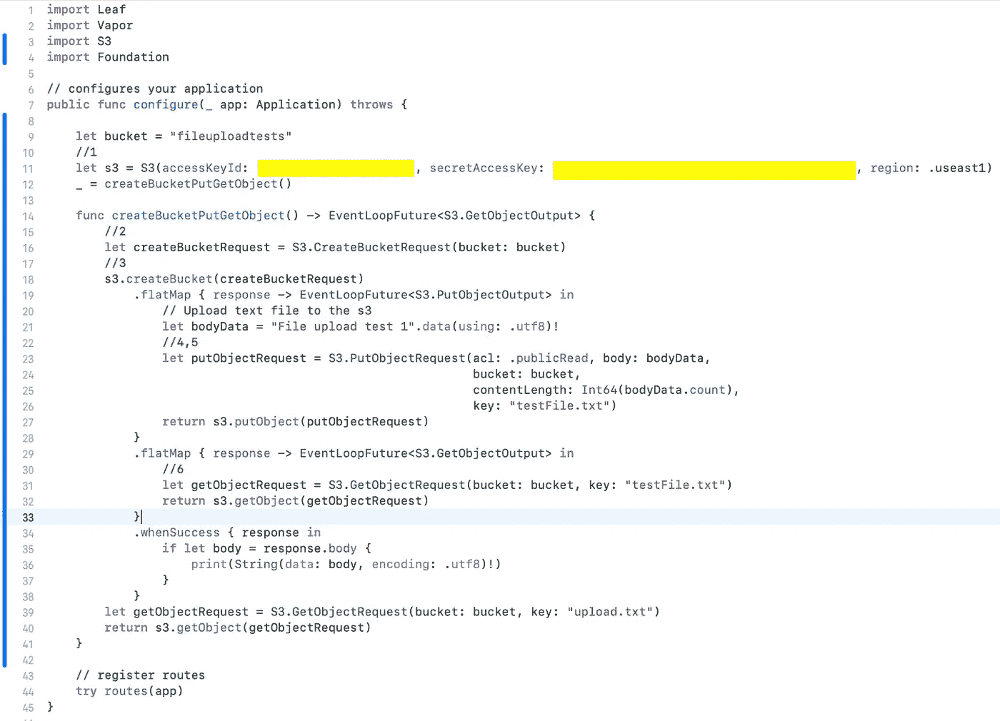
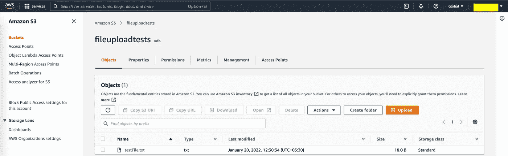
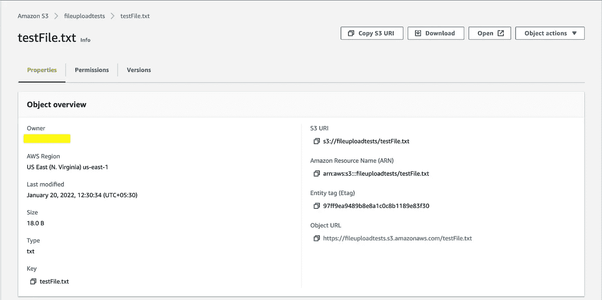

# 如何使用服务器端 Swift 在 AWS 服务器上上传文件

> 原文：<https://medium.com/globant/how-to-upload-file-on-aws-server-using-server-side-swift-ede0f75e1c5f?source=collection_archive---------5----------------------->

今天，我们将学习如何使用服务器端 Swift 和 Vapor 框架上传文件。我们可以使用名为 Soto 的库将文件直接上传到云服务。SPM 工具已经在 Soto 中用于代码依赖。将 soto 依赖项添加到 Package.swift 文件中的包，如下所示。

要使用 Soto，我们需要为 AWS 服务创建一个 AWSClient 和一个 service 对象。AWSClient 与 AWS 通信，服务对象提供与 AWS 服务通信的配置和 API。

首先，我们需要 AWS 凭证来签署您的所有请求。可以通过以下方式向库提供凭据。

*   环境变量 AWS_ACCESS_KEY_ID 和 AWS_SECRET_ACCESS_KEY
*   ECS 容器 IAM 策略
*   EC2 IAM 实例配置文件
*   主目录中的共享凭据文件
*   运行时提供的静态凭据

访问密钥由一个访问密钥 ID 和一个秘密访问密钥组成，它们用于对您向 AWS 发出的编程请求进行签名。

**AWS 中的用户类型**

AWS 中有两种不同类型的用户。您要么是帐户所有者(root 用户)，要么是 IAM 用户。当使用创建帐户时使用的电子邮件地址和密码创建 AWS 帐户时，就会创建 root 用户。IAM 用户由根用户或 AWS 帐户中的 IAM 管理员创建。

**使用 root 用户获取访问密钥 ID 和秘密访问密钥。**

1.  通过选择**根用户**并输入您的 AWS 帐户电子邮件地址，以帐户所有者的身份登录到 [IAM 控制台](https://console.aws.amazon.com/iam/)。在下一页上，输入您的密码。
2.  在导航栏中选择您的帐户名称，然后选择**我的安全凭证**。如果您看到有关访问 AWS 帐户的安全凭据的警告，请选择继续访问安全凭据。
3.  展开访问密钥(访问密钥 ID 和秘密访问密钥)部分。
4.  选择创建新的访问密钥。如果禁用此功能，则必须删除一个现有的访问键，然后才能创建新的键。更多信息，请参见 *IAM 用户* [*指南*](https://docs.aws.amazon.com/IAM/latest/UserGuide/introduction.html) 中的 [IAM 实体对象限制](https://docs.aws.amazon.com/IAM/latest/UserGuide/reference_iam-quotas.html#reference_iam-quotas-entities)。
    警告说明您只有一次机会查看或下载密钥。以后就无法检索了。

*   如果选择“显示访问密钥”,可以从浏览器窗口中复制访问密钥 ID 和密钥，并将其粘贴到其他地方。
*   如果选择下载密钥文件，您将收到一个名为 rootkey.csv 的文件，其中包含访问密钥 ID 和密钥。将文件保存在安全的地方。

**使用 IAM 用户获取访问密钥 ID 和秘密访问密钥。**

1.  打开 [IAM 控制台。](https://docs.aws.amazon.com/IAM/latest/UserGuide/console.html)
2.  在导航菜单中，选择用户。
3.  选择您的 IAM 用户名(不是复选框)。
4.  打开安全凭证选项卡，然后选择创建访问密钥。
5.  若要查看新的访问密钥，请选择“显示”。您的凭据如下所示:

*   访问密钥 ID: **您的访问密钥 ID**
*   秘密访问密钥:**你的秘密访问密钥**

6.要下载密钥对，请选择下载。csv 文件并存储密钥。

**AWS 数据存储**

您可以存储的数据总量和对象数量是无限的。对于自由层，单个亚马逊 S3 对象的大小可以从最小 0 字节到最大 5 GB 不等。

使用[此](https://aws.amazon.com/s3/pricing/)链接查找有关 S3 定价的更多信息。

我们将在运行时使用静态凭证。下面的函数返回一个 EventLoopFuture，该函数创建一个 S3 桶，将一个文件放入桶中，从桶中读回文件，最后打印文件的内容。

1.  我们需要通过提供 accesskey、accessId 和 region 值来创建 S3 对象。默认区域将被选择为使用 1。
2.  其次，我们需要发出一个带有 bucket 名称的 bucket 请求。存储桶名称应该是唯一的。在本例中，我们使用了 fileUploadTests。
3.  然后，我们需要用一个 Bucket 请求调用 createBucket API。
4.  因为我们将把文件上传到服务器，所以我们必须使用带有上述参数的 PutObjectRequest。
5.  在这个例子中，我们上传了一个文本文件，键名为 testFile。
6.  使用 GetObjectRequest API，我们可以获取提供 bucket 名称和上传文件名的相同文件。

一旦上面的代码没有任何错误地执行，您将能够看到您上传到 s3 存储桶的文件，如下所示。

通过点击 testFile，我们可以看到上传文件的完整 URL、文件大小、时间戳和其他属性。

我希望这篇文章对你有所帮助。感谢您的阅读。