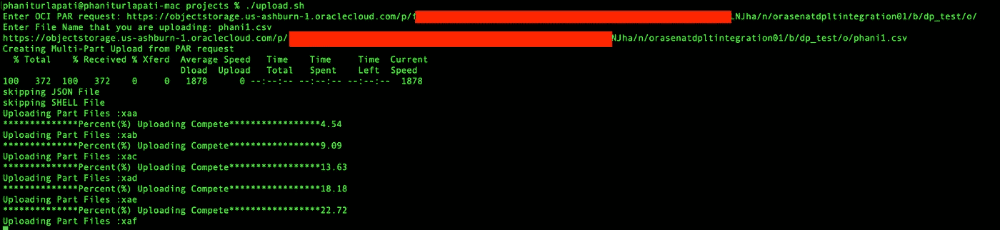

# 如何将大文件上传到 OCI OSS

> 原文：<https://medium.com/oracledevs/how-to-upload-large-files-to-oci-oss-63b58ad7d5e0?source=collection_archive---------0----------------------->

很多时候，您必须将大文件上传到 Oracle 云基础架构(OCI)对象存储(OS)。尤其是对于大型数据库转储文件。OS 提供了一个多部分上传 API，允许你上传大文件作为小块，并在对象存储中组合它们。

我遇到的一个相关用例是，一个客户试图将一个大文件放入 OCI 对象存储中。在我深入研究这个特定问题的定制解决方案之前，我想指出将大文件上传到 OCI 的最佳实践:

1.  OCI 公司:上传大文件的最佳选择。但这是一个需要安装的工具，有些客户可以接受，但有些则不行。
2.  Oracle 云控制台:基于 GUI 的云帐户工具，客户可以利用它来上传文件。但是它不能处理大文件上传。

*注意:如果您还没有注册，您可以今天就* [*注册甲骨文云免费层账户*](https://signup.cloud.oracle.com/?language=en&sourceType=:ow:de:te::::RC_WWMK220210P00062:Medium_uploadLargeFilesOCIandOS&intcmp=:ow:de:te::::RC_WWMK220210P00062:Medium_uploadLargeFilesOCIandOS) *。*

如果客户无法使用上述选项，他们可以利用 Oracle OS APIs。让我们看看他们如何做到这一点。


1.使用 Linux split 命令将大文件分割成较小的块。我建议将前缀保留为默认值。

```
split -b <file_size>[k|m|g] file_to_be_split prefix(default 'x')
```


2.在 OCI 操作系统存储桶上生成 [PAR](https://docs.oracle.com/en-us/iaas/Content/Object/Tasks/usingpreauthenticatedrequests.htm) 请求。

3.使用上传脚本(要点如下)并根据需要输入变量。

```
Enter the PAR Request: <Generated_PAR>
Enter the File Name that you are uploading: <File_Name>
```



4.您应该会看到零件正在上传。提交多部分上传后，您将在那里看到您的文件


我在这里添加了一个脚本，可以让你上传一个大文件到操作系统。请相应修改和使用。

如果你有问题，请联系我。

这是一种使用 OCI 操作系统 API 和 PAR 请求安全上传文件的安全方法。上传文件后，请确保 PAR 请求到期。

# 加入对话！

如果你对 Oracle 开发人员在他们的自然环境中发生的事情感到好奇，来[加入我们的公共休闲频道](https://join.slack.com/t/oracledevrel/shared_invite/zt-uffjmwh3-ksmv2ii9YxSkc6IpbokL1g?customTrackingParam=:ex:tb:::::RC_WWMK220210P00062:Medium_uploadlargeOCIandOSfiles)！我们不介意成为你的鱼缸🐠

参考资料:

1.  Oracle 对象存储[预认证请求](https://docs.oracle.com/en-us/iaas/Content/Object/Tasks/usingpreauthenticatedrequests.htm)(解析)
2.  Oracle 对象存储[多部分上传](https://docs.oracle.com/en-us/iaas/Content/Object/Tasks/usingmultipartuploads.htm)
3.  甲骨文云基础设施- [免费层](https://www.oracle.com/cloud/free/)

**关于作者:**

Phani Turlapati 是 Oracle Inc .的云工程师，他已经在 Oracle 工作了 4 年多。他最初在甲骨文公司的解决方案工程中心工作，专注于各种设计解决方案，以帮助客户为其业务增值。他是数据库团队的一员，专注于数据库的所有事情。在加入 Oracle 之前，他是一名软件工程师，在 Java 平台上开发应用程序。

这篇博客是我的观点，与甲骨文毫无关系

请随意评论上面的帖子。您的反馈很有价值！