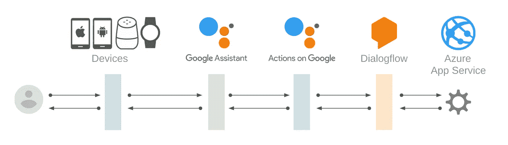

# 如何在 Azure App Service 上使用 Google 客户端库上的操作

> 原文：<https://medium.com/google-developer-experts/how-to-use-actions-on-google-client-library-on-azure-app-service-44257ea33d84?source=collection_archive---------7----------------------->

我在下面的故事中介绍了如何在 Azure Functions Node.js 上的 Google 客户端库上使用[动作:](https://github.com/actions-on-google/actions-on-google-nodejs)

[](/@yoichiro/how-to-use-actions-on-google-client-library-on-azure-functions-node-js-178d5ecd04e3) [## 如何在 Azure Functions Node.js 上使用 Google 客户端库上的操作

### 如果你是一个经常使用 Azure Functions Node.js 的开发者，你可以为 Google Assistant 构建你的动作…

medium.com](/@yoichiro/how-to-use-actions-on-google-client-library-on-azure-functions-node-js-178d5ecd04e3) 

事实上，我们有另一种方法来在 Azure 上构建您的操作。就是使用 [Azure App 服务](https://docs.microsoft.com/en-us/azure/app-service/)。

[](https://docs.microsoft.com/en-us/azure/app-service/) [## Azure 应用服务文档-教程、API 参考

### Azure App Service 使您能够在编程中构建和托管 web 应用、移动后端和 RESTful APIs

docs.microsoft.com](https://docs.microsoft.com/en-us/azure/app-service/) 

基本上，你可以将你的 [express](https://www.npmjs.com/package/express) 应用程序部署到 Azure 应用程序服务中，而无需任何操作。Google Client Library 上的操作可以与 express 一起使用。

[](https://www.npmjs.com/package/express) [## 表达

### 快速、非个性化、极简主义的 web 框架

www.npmjs.com](https://www.npmjs.com/package/express) [](https://github.com/actions-on-google/actions-on-google-nodejs) [## 谷歌上的操作/谷歌节点上的操作

### 用于 Google 上操作的 Node.js 客户端库。通过以下方式为 actions-on-Google/actions-on-Google-nodejs 开发做出贡献…

github.com](https://github.com/actions-on-google/actions-on-google-nodejs) 

在这个故事中，我介绍了如何在 Azure App Service 上使用 Google 客户端库上的操作。

# 体系结构

我假设您想要在 Azure App Service 上实现您的实现代码，以处理来自 Dialogflow 的请求，如下所示:



# 先决条件

您需要准备以下内容:

*   您已经在 Azure 上注册了您的帐户。
*   您已经安装了 [Azure CLI](https://docs.microsoft.com/en-us/cli/azure/install-azure-cli?view=azure-cli-latest) 并登录到 Azure。
*   你已经了解了如何在谷歌云平台或亚马逊网络服务上为谷歌助手构建动作。
*   您已经在 Google project 上有了您的操作，并且您的 Dialogflow 代理已经连接到 AoG 项目。

如果你不知道如何构建动作，你可以用 codelabs 来研究一下:

[](https://codelabs.developers.google.com/codelabs/actions-1/index.html#0) [## 为 Google Assistant 构建操作(第 1 级)

### 这个 codelab 是多模块教程的一部分。每个模块可以单独学习，也可以按照学习顺序学习…

codelabs.developers.google.com](https://codelabs.developers.google.com/codelabs/actions-1/index.html#0) [](https://codelabs.developers.google.com/codelabs/actions-2/index.html#0) [## 为 Google Assistant 构建操作(第 2 级)

### 此 codelab 模块是多模块教程的一部分。每个模块可以单独学习，也可以按学习顺序学习…

codelabs.developers.google.com](https://codelabs.developers.google.com/codelabs/actions-2/index.html#0) 

# 创建您的应用服务

让我们开始在 Azure 上创建您的应用服务。如果您没有资源组，请使用以下命令创建它们:

```
$ az group create --name <RESOURCE_GROUP_NAME> --location <LOCATION_NAME>
```

接下来，使用下面的命令创建您的应用服务。在这里，我们使用免费计划。

```
$ az appservice plan create --name <PLAN_NAME> --resource-group <RESOURCE_GROUP_NAME> --sku FREE
$ az webapp create --resource-group <RESOURCE_GROUP_NAME> --plan <PLAN_NAME> --name <APP_NAME>
```

要在 Google Client Library 上执行操作，您需要准备一个 Node.js 环境。请使用以下命令将 Node.js 版本设置为您的应用程序服务:

```
$ az webapp config appsettings set --resource-group <RESOURCE_GROUP_NAME> --name <APP_NAME> --settings WEBSITE_NODE_DEFAULT_VERSION=8.11.1
```

# 创建 Node.js 项目并安装依赖项

您可以使用 Google 客户端库上的操作来构建您的操作。要将其部署为 Azure App 服务，需要使用 express 来处理 HTTP 请求和响应。

首先，用`npm`命令创建 Node.js 项目:

```
$ mkdir <APP_NAME>
$ cd <APP_NAME>
$ npm init
```

您将从命令中询问一些问题，但基本上您可以通过按回车键来回答所有问题。然后，通过以下命令安装依赖项:

```
$ npm install --save actions-on-google express
```

将创建`node_modules`,并将依赖项安装到目录中。

# 编写履行代码

让我们开始编写您的实现代码。创建一个名为`index.js`的新文件，并写入以下内容:

```
const express = require('express');
const bodyParser = require('body-parser');
const {dialogflow} = require('actions-on-google');const port = process.env.PORT || 4567;const app = dialogflow();app.intent('Default Welcome Intent', conv => {
    conv.close('Hello, Azure!');
});const expressApp = express().use(bodyParser.json());
expressApp.post('/', app);expressApp.listen(port);
```

# 创建 Web 配置文件

App Service 有一个名为“微软互联网信息服务(IIS)”的 Web 服务器。而且，您的实现代码在 Node.js 上工作。IIS 必须将请求委托给节点流程。也就是说，您需要创建一个名为`web.config`的 Web 配置文件。这是一个用 XML 格式写的 IIS 配置文件。

创建一个名为“web.config”的新文件，并写入以下内容:

```
<?xml version="1.0" encoding="utf-8"?>
<configuration>
  <system.webServer>
    <webSocket enabled="false" />
    <handlers>
      <add name="iisnode" path="index.js" verb="*" modules="iisnode" />
    </handlers>
    <rewrite>
      <rules>
        <rule name="DynamicContent">
          <conditions>
            <add input="{REQUEST_FILENAME}" matchType="IsFile" negate="True" />
          </conditions>
          <action type="Rewrite" url="index.js" />
        </rule>
      </rules>
    </rewrite>
    <security>
      <requestFiltering>
        <hiddenSegments>
          <remove segment="bin" />
        </hiddenSegments>
      </requestFiltering>
    </security>
    <httpErrors existingResponse="PassThrough" />
  </system.webServer>
</configuration>
```

# 打包、部署和测试

现在你可以打包你的代码并将其部署到 Azure 应用服务。首先，执行以下命令来打包文件:

```
$ zip -r files.zip .
```

然后，将 zip 文件部署到 Azure 应用服务:

```
$ az webapp deployment source config-zip --resource-group <RESOURCE_GROUP_NAME> --name <APP_NAME> --src <ZIP_FILE_PATH>
```

如果部署成功，您的 fulfillment webhook 端点的 URL 如下:

```
https://<APP_NAME>.azurewebsites.net/
```

在您的 Dialogflow 代理上将该 URL 注册为 fulfillment webhook URL。然后，在动作模拟器上调用您的动作。

# 结论

在这个故事中，我介绍了如何在 Azure App Service 上使用 Google 客户端库上的操作。如果你正在使用 Azure 应用服务，尝试在 Azure 上为谷歌助手构建你的动作！