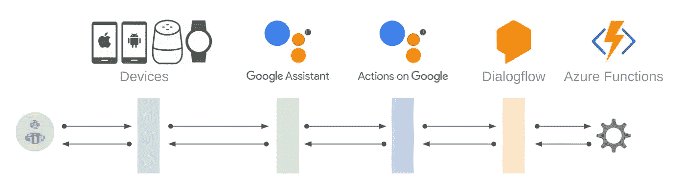

# 如何在 Azure Functions Node.js 上使用 Google 客户端库上的操作

> 原文：<https://medium.com/google-developer-experts/how-to-use-actions-on-google-client-library-on-azure-functions-node-js-178d5ecd04e3?source=collection_archive---------4----------------------->

如果你是一个经常使用 Azure Functions Node.js 的开发者，你可以用 Azure Functions Node.js 为谷歌助手构建你的动作，谷歌一直在为 Node.js 提供谷歌客户端库上的动作。

[](https://github.com/actions-on-google/actions-on-google-nodejs) [## 谷歌上的操作/谷歌节点上的操作

### 用于 Google 上操作的 Node.js 客户端库。通过以下方式为 actions-on-Google/actions-on-Google-nodejs 开发做出贡献…

github.com](https://github.com/actions-on-google/actions-on-google-nodejs) 

你可以用 Azure Functions 上的客户端库实现你的实现代码。但是，你需要使用一些技巧。在这个故事中，我打算介绍如何在 Azure Functions Node.js 环境中使用 Google 客户端库上的操作。

# 体系结构

我假设您想要在 Azure 函数上实现您的实现代码，以处理来自 Dialogflow 的请求，如下所示:



不幸的是，Azure Functions Node.js 与 [express](https://www.npmjs.com/package/express) 不兼容。有必要在 Google 客户端库的 express 和 Actions 之间使用一些桥梁。但是，我可以给你提供一个好消息。你可以使用 azure-function-express 库来连接它们。

[](https://github.com/yvele/azure-function-express) [## 伊夫勒/天蓝色-功能-快捷

### ⚡️Allows Express.js 使用 Azure 函数。为 yvele/azure-function-express 开发做出贡献，创建一个…

github.com](https://github.com/yvele/azure-function-express) 

# 先决条件

您需要准备以下内容:

*   您已经在 Azure 上注册了您的帐户。
*   您已经安装了 [Azure CLI](https://docs.microsoft.com/en-us/cli/azure/install-azure-cli?view=azure-cli-latest) 并登录到 Azure。
*   您已经安装了 [Azure 功能核心工具](https://docs.microsoft.com/en-us/azure/azure-functions/functions-run-local#install-the-azure-functions-core-tools)。
*   你已经了解了如何在谷歌云平台或亚马逊网络服务上为谷歌助手构建动作。
*   您已经在 Google project 上有了您的操作，并且您的 Dialogflow 代理已经连接到 AoG 项目。

如果你不知道如何构建动作，你可以用 codelabs 来研究一下:

[](https://codelabs.developers.google.com/codelabs/actions-1/index.html#0) [## 为 Google Assistant 构建操作(第 1 级)

### 这个 codelab 是多模块教程的一部分。每个模块可以单独学习，也可以按照学习顺序学习…

codelabs.developers.google.com](https://codelabs.developers.google.com/codelabs/actions-1/index.html#0) [](https://codelabs.developers.google.com/codelabs/actions-2/index.html#0) [## 为 Google Assistant 构建操作(第 2 级)

### 此 codelab 模块是多模块教程的一部分。每个模块可以单独学习，也可以按学习顺序学习…

codelabs.developers.google.com](https://codelabs.developers.google.com/codelabs/actions-2/index.html#0) 

# 创建您的功能

让我们开始在 Azure 上创建你的函数。如果您没有资源组和存储帐户，请使用以下命令创建它们:

```
$ az group create --name <RESOURCE_GROUP_NAME> --location <LOCATION_NAME>
$ az storage account create --name <STORAGE_ACCOUNT_NAME> --resource-group <RESOURCE_GROUP_NAME> --location <LOCATION_NAME> --sku Standard_LRS
```

接下来，用下面的命令创建您的函数:

```
$ az functionapp create --resource-group <RESOURCE_GROUP_NAME> --consumption-plan-location <LOCATION_NAME> --name <FUNCTION_NAME> --storage-account <STORAGE_ACCOUNT_NAME> --runtime node
$ func init <FUNCTIONAPP_NAME>
$ cd <FUNCTIONAPP_NAME>
$ func new --name <FUNCTION_NAME> --template "HttpTrigger"
```

# 安装依赖项

创建函数后，执行以下命令创建您的`package.json`文件:

```
$ cd <FUNCTION_NAME>
$ npm init
```

您将从命令中询问一些问题，但基本上您可以通过按回车键来回答所有问题。然后，通过以下命令安装依赖项:

```
$ npm install --save actions-on-google express azure-function-express
```

将创建`node_modules`,并将依赖项安装到目录中。

# 编写履行代码

通过上面的命令，已经在`<FUNCTION_NAME>`目录下创建了`index.js`文件。用以下代码替换`index.js`文件的内容:

```
const {dialogflow} = require('actions-on-google');
const express = require('express');
const {createHandler} = require('azure-function-express');const app = dialogflow();app.intent('Default Welcome Intent', conv => {
    conv.close('Hello, Azure!');
});// Put other intent handlers here.const expressApp = express();
expressApp.post('/api/<FUNCTION_NAME>', app);module.exports = createHandler(expressApp);
```

此外，您需要将认证模式更改为`anonymous`进行测试。用`function.json`文件中的`anonymous`替换`authLevel`值。

```
{
  ...
  "bindings": [
    {
      "authLevel": "anonymous",
      ...
    }
  ]
}
```

# 设置代理以避免问题

不幸的是，当前的 Azure 函数有一个关于处理字符集的问题。因此，上面的代码不起作用。

[](https://github.com/Azure/azure-functions-nodejs-worker/issues/168) [## 内容类型请求头的字符集被忽略问题#168 …

### 内容类型响应头的字符集在特定情况下似乎被忽略了。如果请求有一个…

github.com](https://github.com/Azure/azure-functions-nodejs-worker/issues/168) 

作为解决上述问题的方法，设置一个代理来强制覆盖一个`Accept-Charset`请求头。为此，在`<FUNCTIONAPP_NAME>`目录中创建一个新的`proxies.json`文件，并在该文件中编写以下代码:

```
{
  "$schema": "http://json.schemastore.org/proxies",
  "proxies": {
    "proxy1": {
      "matchCondition": {
        "methods": [
          "POST"
        ],
        "route": "/api/<FUNCTION_NAME>"
      },
      "backendUri": "https://localhost/api/<FUNCTION_NAME>",
      "requestOverrides": {
        "backend.request.headers.Accept-Charset": "utf-8"
      }
    }
  }
}
```

该代理仅将 Accept-Charset 请求头值覆盖为“utf-8”。因此，您的函数可以将响应作为 UTF-8 字符串返回。

当然，如果问题得到解决，这个代理就没有必要了。

# 部署和测试

最后，使用以下命令将您的实现部署到 Azure:

```
$ func azure functionapp publish <FUNCTIONAPP_NAME>
```

部署后，该命令显示函数的端点 URL。在您的 Dialogflow 代理上将该 URL 注册为 fulfillment webhook URL。然后，在动作模拟器上调用您的动作。

# 结论

在这个故事中，我介绍了如何在 Azure Functions Node.js 上使用 Google Client Library 上的操作。不幸的是，有一个问题，您需要通过变通方法(即使用代理)来避免这个问题。但是，您可以在简单地解决问题后删除代理。

如果你正在使用 Azure 函数，试着在 Azure 上为 Google Assistant 构建你的动作！