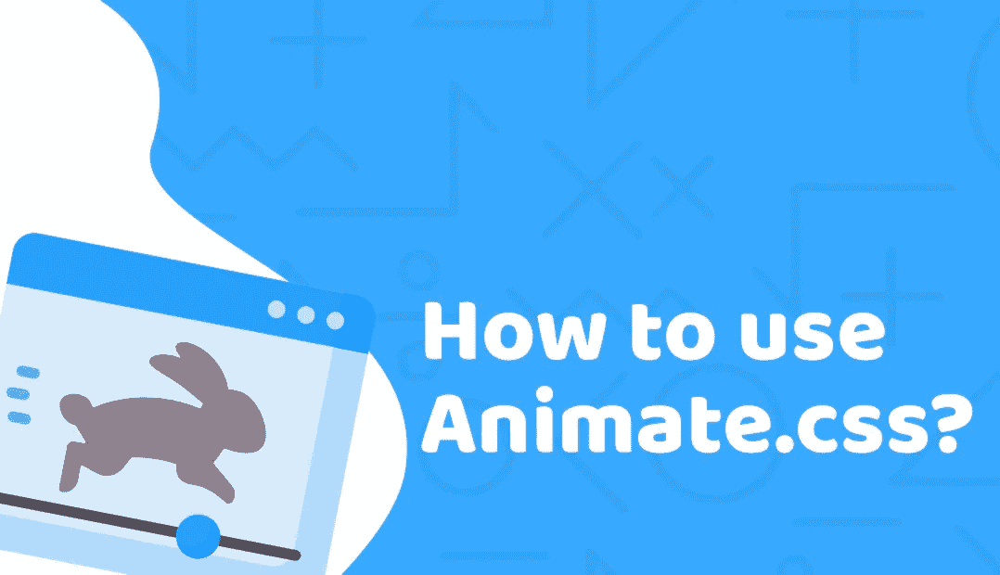
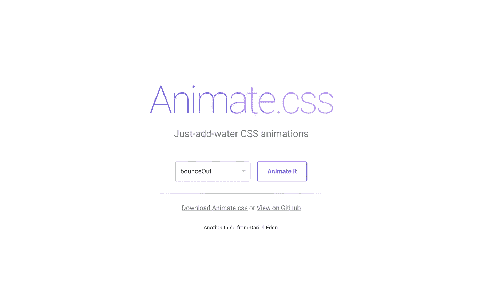
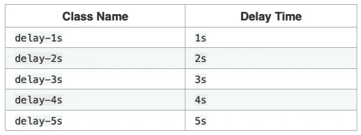
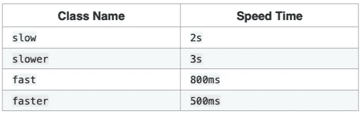

# 如何使用动画 css-一个将永远改变你的 CSS 动画库！

> 原文：<https://medium.com/duomly-blockchain-online-courses/how-to-use-animate-css-a-library-that-will-change-your-css-animations-forever-b1e07adcbe65?source=collection_archive---------1----------------------->



[Duomly — Programming Online Courses](https://www.duomly.com)

本文原载于[https://www . blog . duomly . com/how-to-use-animate-CSS-tutorial-with-examples/](https://www.blog.duomly.com/how-to-use-animate-css-tutorial-with-examples/)

几年前，我在做一个移动应用项目，其中的用户界面非常先进，加载了大量的运动和渐变。这就像每一个现代移动应用程序一样，希望为用户提供最佳的视觉体验。

我花了很多时间来创建 CSS 中的所有动画，并根据设计师的指示使它们平滑好看。然后，我开始寻找一些解决方案，使这项任务更舒适，并给我所需的结果，没有任何惊喜。

我就是这样找到 Animate.css 库的，从一开始，我就认定这就是我需要的。我个人认为，许多前端开发人员真的很喜欢这个库，因为它让我们可以让 UI 变得非常漂亮。

今天我想给你一个简单的教程，一步一步地教你如何使用 Animate.css 库，帮助你进入这个了不起的资源。

附:如果你喜欢看而不是读，加入我们的 youtube 频道，我们会把所有的教程以视频的形式发布。

How to use Animate.css — tutorial with 3 projects

我们开始吧！

# 1.什么是 animation.css 库？



[animate.css](https://daneden.github.io/animate.css/)

正如该库的创建者在网站上写的那样，这是“加水的 CSS 动画”。使用一个库非常简单，它可以作为一个 CSS 文件下载，并添加到您的项目中，通过向元素添加一个类来使用许多预定义的动画之一。

您可以通过设置效果的延迟和速度来自定义选定的动画。可以在纯 HTML 和 CSS 项目中使用动画，但是也可以实现 Javascript。

# 2.装置

有两种方法可以开始使用 Animate.css 库。如果您正在使用 npm 或 yarn，使用以下命令之一安装它就足够了:

`$ npm install animate.css --save`
或
`$ yarn add animate.css`

但是如果你没有使用它们，就下载一个迷你的。css 文件或获取一个 CDN，并将其加载到主文件的 head 部分，如下面的代码所示:

```
<head>
  <link rel="stylesheet" href="animate.min.css">
</head>
```

或使用 CDN:

```
<head>
  <link rel="stylesheet" href="https://cdnjs.cloudflare.com/ajax/libs/animate.css/3.7.2/animate.min.css">
</head>
```

除了非常容易安装之外，Animate.css 只包含一个文件，所以它不会真正影响加载时间，并且页面的性能仍然是安全的。

# 3.如何给页面上的元素添加动画？

现在，我将一步一步地向您解释如何将任何可用的动画添加到页面元素中。

假设您的页面上有一个 h1 元素，您想添加一个反弹动画。在每个元素中，添加`animated`类是必要的，如果你希望它是无限的，那么，当然，添加`infinite`类。

之后，你必须指定你选择的动画类型作为另一个类，在我们的例子中是`bounce`。让我们来看看这个例子:

瞧啊。它非常好用。您还可以设置更多的参数，并且可以根据下表手动设置样式或添加其他类:



Delay Time — Animate.css



Speed Time — Animate.css

或者你可以像 CSS 中的其他动画一样手动设置它的样式，请看下面的例子:

```
h1 {
  animation-duration: 2s;
  animation-delay: 1s;
  animation-iteration-count: 5;
}
```

现在，当更清楚如何使用它时，让我们了解动画给出的动画的不同用法。CSS 库上三个不同的例子。

# 4.加载动画

每个布局都需要一个加载器来吸引等待数据的用户。css 可以帮助我们为任何布局创建漂亮的动画。我们试试吧！

我决定对三个嵌套元素使用`flip`动画。两个最内部的元素有一个延迟，所以这意味着这些元素上的动画开始 1 或 2 秒后。每个元素都有一个设置为`slower`的速度，根据表格，这意味着 3s。

# 5.航行

几乎每个页面都需要导航，有些页面有典型的横向导航，但是现在，使用切换菜单非常普遍。它是现代的，反应灵敏的，用户友好的，当然，它会帮助客户记住你的网站。

下面是一个纯 Javascript 在切换菜单中使用 Animate.css 效果的例子。

# 6.形式

本文中我想展示的最后一个使用 Animate.css 库的项目是一个带有简单验证的表单。

我想为输入元素添加一个摇动效果，而该字段是必填的，但没有填写。

实现如下:

# 结论

正如你在上面几个例子中所看到的，动画可以给用户界面带来很多活力和美感。
这也让用户体验变得更好，因为还有什么比晃动的字段显示这是一个没有价值的字段更好的呢？

在 CSS 中从头开始创建许多漂亮和高级的动画是可能的，你可以在我们以前的[文章](https://www.blog.duomly.com/css-animations-cheatsheet/)中查看动画的简短备忘单，但是使用像 Animate.css 这样的专用库更容易和舒适。特别是它非常小，不会影响网站的性能。

如果您尝试使用 Animate.css 或任何其他库在您的布局上创建漂亮的动画，请在评论中告诉我们。如果是，请分享您的观点。如果没有，也许是时候试试了？

感谢您的阅读，
来自 Duomly 的安娜


[Duomly — Programming Online Courses](https://www.duomly.com)